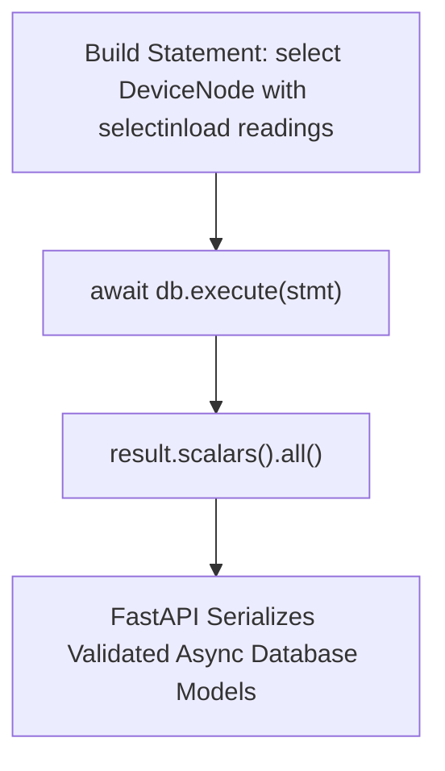

# Async Crud Operations And Asyncsession

> **Course**: Git Version Control | **Module**: Introduction | **Difficulty**: beginner

---

- **Estimated Time**: 55 Minutes (20m Reading | 25m Practice | 10m Quiz)
- **Difficulty Level**: ⭐⭐⭐ Advanced
- **Prerequisites**: [Lesson 4.1 Async Engine](file:///d:/My%20Drive/all%20files/PROJECT%20FILES/notes/docs/curriculum/_05_fastapi/_05_07_sqlalchemy_20_async_engine_and_asyncpg.md)
- **XP Reward**: +70 XP

### Learning Objectives
By the end of this lesson, you will be able to:
1. Execute asynchronous SELECT, INSERT, UPDATE, and DELETE queries using `select()` and `await db.execute()`.
2. Apply async relationship eager loading strategies using **`selectinload()`**.
3. Initialize database tables asynchronously using **`await conn.run_sync(Base.metadata.create_all)`**.
4. Construct non-blocking REST API CRUD endpoints.

---

---

Open Python REPL or VS Code.

---

---

### 3.1 SQLAlchemy 2.0 Async Query Style
SQLAlchemy 2.0 replaced legacy `Model.query` calls with explicit `select(Model)` constructs. In async mode, all database interactions must be explicitly awaited using `await db.execute(stmt)` or `await db.commit()`:

```
┌─────────────────────────────────────────────────────────────────────────────┐
│                      SQLALCHEMY 2.0 ASYNC QUERY STATEMENTS                  │
├─────────────────┬───────────────────────────────────────────────────────────┤
│ Operation       │ Async Syntax Example                                      │
├─────────────────┼───────────────────────────────────────────────────────────┤
│ SELECT List     │ `result = await db.execute(select(DeviceNode))`           │
│                 │ `nodes = result.scalars().all()`                          │
│ SELECT Single   │ `result = await db.execute(select(Node).where(Node.id==1))`│
│                 │ `node = result.scalar_one_or_none()`                      │
│ Eager Loading   │ `select(Node).options(selectinload(Node.readings))`       │
└─────────────────┴───────────────────────────────────────────────────────────┘
```

---

---



---

---

### File 1: `models.py` (Async SQLAlchemy Models)

```python
from datetime import datetime
from sqlalchemy import String, Float, ForeignKey, DateTime
from sqlalchemy.orm import Mapped, mapped_column, relationship
from database import Base

class DeviceNode(Base):
    __tablename__ = "device_nodes"

    id: Mapped[int] = mapped_column(primary_key=True)
    code: Mapped[str] = mapped_column(String(50), unique=True, index=True)
    location: Mapped[str] = mapped_column(String(100))

    readings: Mapped[list["TelemetryReading"]] = relationship(
        back_populates="device",
        cascade="all, delete-orphan"
    )

class TelemetryReading(Base):
    __tablename__ = "telemetry_readings"

    id: Mapped[int] = mapped_column(primary_key=True)
    temp: Mapped[float] = mapped_column(Float)
    node_id: Mapped[int] = mapped_column(ForeignKey("device_nodes.id"))

    device: Mapped["DeviceNode"] = relationship(back_populates="readings")
```

### File 2: `main.py` (Async CRUD Routes)

```python
from contextlib import asynccontextmanager
from fastapi import FastAPI, Depends, HTTPException, status
from sqlalchemy import select
from sqlalchemy.ext.asyncio import AsyncSession
from sqlalchemy.orm import selectinload
from database import engine, Base, get_async_db
from models import DeviceNode, TelemetryReading

# Lifespan Context Manager to initialize DB tables asynchronously!
@asynccontextmanager
async def lifespan(app: FastAPI):
    async with engine.begin() as conn:
        await conn.run_sync(Base.metadata.create_all)
    yield

app = FastAPI(title="Async CRUD API", lifespan=lifespan)

# 1. CREATE Operation
@app.post("/api/v1/nodes", status_code=status.HTTP_201_CREATED)
async def create_node(code: str, location: str, db: AsyncSession = Depends(get_async_db)):
    new_node = DeviceNode(code=code, location=location)
    db.add(new_node)
    await db.commit()
    await db.refresh(new_node)
    return {"id": new_node.id, "code": new_node.code, "location": new_node.location}

# 2. READ Operation with Eager Loading (selectinload)
@app.get("/api/v1/nodes/{node_id}")
async def get_node_with_readings(node_id: int, db: AsyncSession = Depends(get_async_db)):
    # Eagerly load readings relationship asynchronously!
    stmt = select(DeviceNode).options(selectinload(DeviceNode.readings)).where(DeviceNode.id == node_id)
    result = await db.execute(stmt)
    node = result.scalar_one_or_none()

    if not node:
        raise HTTPException(status_code=404, detail="Node not found")

    return {
        "id": node.id,
        "code": node.code,
        "location": node.location,
        "readings": [{"id": r.id, "temp": r.temp} for r in node.readings]
    }
```

---

---

- **Time-Series Data Ingestion**: High-performance FastAPI endpoints use `await db.execute(insert(TelemetryReading)...)` batch inserts to persist thousands of sensor readings into PostgreSQL tables per second.

---

---

1. Save `models.py` and `main.py`.
2. Run `uvicorn main:app --reload`.
3. Send POST to `/api/v1/nodes?code=ESP32-A1&location=Lab1` $\to$ Inspect database record creation!

---

---

| Bug / Error | Root Cause | Engineering Solution |
| :--- | :--- | :--- |
| **`MissingGreenlet: lazy load operation cannot be used in async`** | Accessing un-loaded relational properties (`node.readings`) in async mode without `selectinload()`. | Always include `.options(selectinload(Model.relation))` in `select()` queries. |

---

---

- **Use `selectinload()` for One-to-Many**: Performs a fast secondary SELECT query to load related child objects in async mode.

---

---

### Q1: Why is lazy loading problematic in asynchronous SQLAlchemy and how does `selectinload()` solve it?
**Answer**: In synchronous SQLAlchemy, accessing an un-loaded relationship property (`node.readings`) triggers a blocking SQL query implicitly. In async mode, triggering implicit blocking I/O is impossible, raising a `MissingGreenlet` exception. `selectinload()` eagerly fetches related objects in a second non-blocking async query during the initial `await db.execute()` call.

---

---

```json
{
  "quiz_title": "Lesson 4.2 Async CRUD Assessment",
  "questions": [
    {
      "question_id": "Q1",
      "type": "multiple_choice",
      "question_text": "Which SQLAlchemy option eagerly loads One-to-Many relationships in async queries without throwing MissingGreenlet errors?",
      "options": ["lazyload()", "selectinload()", "deferred()", "noload()"],
      "correct_answer_index": 1,
      "explanation": "selectinload() eagerly loads relationships asynchronously."
    }
  ]
}
```

---

---

Build an async CRUD endpoint creating child records with `selectinload()` responses.

---

---

**Front**: How do you create database tables asynchronously in a FastAPI lifespan context manager?
**Back**: `await conn.run_sync(Base.metadata.create_all)`.
<!-- flashcard:end -->

---

---

```python
stmt = select(Node).options(selectinload(Node.readings))
res = await db.execute(stmt)
node = res.scalar_one_or_none()
```

---
