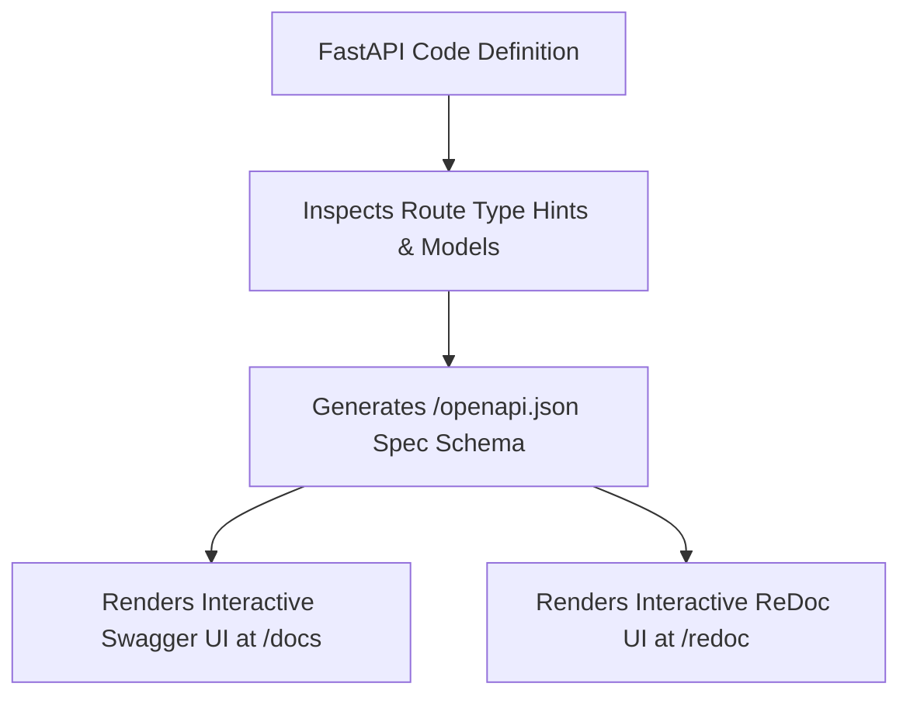

# Fastapi App Instantiation Routing And Openapi

> **Course**: Git Version Control | **Module**: Introduction | **Difficulty**: beginner

---

- **Estimated Time**: 45 Minutes (15m Reading | 20m Practice | 10m Quiz)
- **Difficulty Level**: ⭐ Beginner
- **Prerequisites**: [Lesson 1.1 ASGI Architecture](file:///d:/My%20Drive/all%20files/PROJECT%20FILES/notes/docs/curriculum/_05_fastapi/_05_01_asgi_architecture_uvicorn_and_fastapi_basics.md)
- **XP Reward**: +50 XP

### Learning Objectives
By the end of this lesson, you will be able to:
1. Configure metadata parameters on the **`FastAPI()`** app instance.
2. Explore automatically generated interactive **Swagger UI (`/docs`)** and **ReDoc (`/redoc`)**.
3. Use operation decorators (`@app.get()`, `@app.post()`, `@app.delete()`).
4. Set default response status codes using `status_code=status.HTTP_201_CREATED`.

---

---

Open Python REPL or VS Code.

---

---

### 3.1 Zero-Configuration Automatic OpenAPI Generation
One of FastAPI's most powerful enterprise features is its native integration with the **OpenAPI** specification (formerly Swagger). FastAPI inspects Python type hints and Pydantic models to generate an interactive, live-testing documentation portal at runtime—requiring zero external configuration.

```
┌─────────────────────────────────────────────────────────────────────────────┐
│                          FASTAPI AUTOMATIC DOCUMENTATION                    │
├─────────────────┬───────────────────────────────┬───────────────────────────┤
│ Portal Endpoint │ Documentation Engine          │ Primary Purpose           │
├─────────────────┼───────────────────────────────┼───────────────────────────┤
│ `/docs`         │ Swagger UI                    │ Interactive API testing   │
│ `/redoc`        │ ReDoc                         │ Clean, searchable docs    │
│ `/openapi.json` │ Raw OpenAPI Specification     │ Client SDK generation     │
└─────────────────┴───────────────────────────────┴───────────────────────────┘
```

---

---



---

---

```python
# FastAPI App Instantiation & Operations (openapi_demo.py)
from fastapi import FastAPI, status

# 1. Custom Metadata App Instantiation
app = FastAPI(
    title="Industrial IoT Gateway API",
    description="Enterprise RESTful microservice for sensor node orchestration.",
    version="2.1.0",
    docs_url="/docs",   # Swagger UI URL
    redoc_url="/redoc"  # ReDoc URL
)

# In-Memory Datastore
DEVICES_DB = [{"id": 1, "name": "ESP32-Lab"}]

# 2. HTTP GET Collection Endpoint
@app.get("/api/v1/devices", tags=["Device Inventory"], summary="List all active devices")
def get_devices():
    return {"data": DEVICES_DB, "count": len(DEVICES_DB)}

# 3. HTTP POST Endpoint with custom status code
@app.post(
    "/api/v1/devices",
    status_code=status.HTTP_201_CREATED,
    tags=["Device Inventory"],
    summary="Register new hardware device"
)
def create_device(device_name: str):
    new_device = {"id": len(DEVICES_DB) + 1, "name": device_name}
    DEVICES_DB.append(new_device)
    return new_device
```

---

---

- **API SDK Generation**: Engineering teams export `/openapi.json` schemas to auto-generate client SDK libraries in TypeScript, Swift, Kotlin, and Go using OpenAPI Generator tools.

---

---

1. Save code as `openapi_demo.py`.
2. Run `uvicorn openapi_demo:app --reload` $\to$ Open `http://127.0.0.1:8000/docs` in browser and execute an interactive POST test request!

---

---

| Bug / Error | Root Cause | Engineering Solution |
| :--- | :--- | :--- |
| **Missing `/docs` UI in Production** | Setting `docs_url=None` or running in production mode without enabling docs. | Set `docs_url="/docs"` explicitly if docs are required. |

---

---

- **Use `tags` and `summary`**: Add `tags=["Group"]` and `summary="..."` to route decorators to group endpoints neatly in Swagger UI.

---

---

### Q1: How does FastAPI generate Swagger UI documentation automatically without third-party plugins?
**Answer**: FastAPI parses Python type hints, route path parameters, and Pydantic schema models at application startup to construct an in-memory JSON schema adhering to the OpenAPI standard (`/openapi.json`), which it serves to embedded Swagger UI (`/docs`) and ReDoc (`/redoc`) HTML templates.

---

---

```json
{
  "quiz_title": "Lesson 1.2 OpenAPI Assessment",
  "questions": [
    {
      "question_id": "Q1",
      "type": "multiple_choice",
      "question_text": "What URL path serves the interactive Swagger UI testing portal in FastAPI by default?",
      "options": ["/swagger", "/docs", "/api/docs", "/redoc"],
      "correct_answer_index": 1,
      "explanation": "/docs serves the interactive Swagger UI portal."
    }
  ]
}
```

---

---

Build a FastAPI app with customized title, tags, and summary decorators for a product API.

---

---

**Front**: What URL path serves the ReDoc documentation portal in FastAPI by default?
**Back**: `/redoc`.
<!-- flashcard:end -->

---

---

```python
app = FastAPI(title="My API")
@app.post("/items", status_code=201, tags=["Items"])
def create(): return {"status": "created"}
```

---
