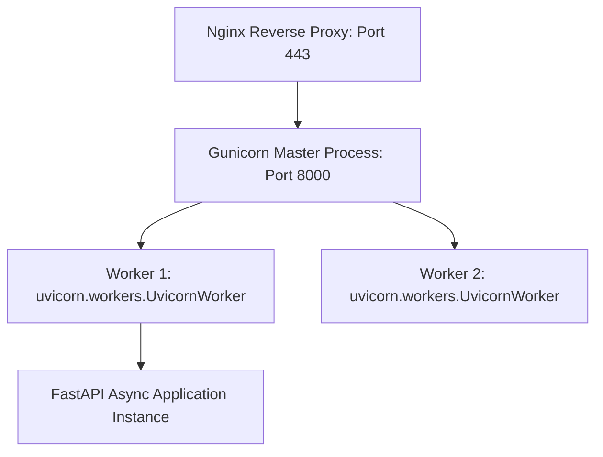

# Production Deployment Gunicorn Uvicorn Docker

> **Course**: Git Version Control | **Module**: Introduction | **Difficulty**: beginner

---

- **Estimated Time**: 65 Minutes (25m Reading | 30m Practice | 10m Quiz)
- **Difficulty Level**: ⭐⭐⭐ Advanced
- **Prerequisites**: [Lesson 10.1 Async Testing](file:///d:/My%20Drive/all%20files/PROJECT%20FILES/notes/docs/curriculum/_05_fastapi/_05_19_async_testing_with_pytest_and_httpx.md)
- **XP Reward**: +80 XP

### Learning Objectives
By the end of this lesson, you will be able to:
1. Understand the production **Gunicorn + Uvicorn Worker** architecture.
2. Execute Gunicorn using the `uvicorn.workers.UvicornWorker` class.
3. Construct a multi-stage production **`Dockerfile`**.
4. Orchestrate FastAPI microservices with PostgreSQL using **Docker Compose**.

---

---

Install `gunicorn` and `uvicorn`:

```bash
pip install gunicorn uvicorn
```

---

---

### 3.1 Production Process Management: Gunicorn + Uvicorn
While `uvicorn main:app` is ideal for development, running Uvicorn alone in production lacks process management capabilities (auto-restarting dead workers, handling process signals).

In enterprise production environments, **Gunicorn** acts as the process manager, spawning and supervising multiple worker processes running the high-performance **Uvicorn worker class (`uvicorn.workers.UvicornWorker`)**:

```
┌─────────────────────────────────────────────────────────────────────────────┐
│                    PRODUCTION GUNICORN + UVICORN ARCHITECTURE               │
├─────────────────────────────────────────────────────────────────────────────┤
│ Web Browser ──► Nginx Reverse Proxy (HTTPS Port 443)                        │
│                    │                                                        │
│                    ▼                                                        │
│                 Gunicorn Master Process (Manages process lifecycle & signals)│
│                    ├── Worker 1 (UvicornWorker Async Event Loop)            │
│                    ├── Worker 2 (UvicornWorker Async Event Loop)            │
│                    ├── Worker 3 (UvicornWorker Async Event Loop)            │
│                    └── Worker 4 (UvicornWorker Async Event Loop)            │
└─────────────────────────────────────────────────────────────────────────────┘
```

---

---



---

---

### File 1: `gunicorn_conf.py` (Gunicorn Configuration)

```python
import multiprocessing

# Gunicorn Production Configuration
bind = "0.0.0.0:8000"
workers = (multiprocessing.cpu_count() * 2) + 1
worker_class = "uvicorn.workers.UvicornWorker"

# Timeout & Logging
timeout = 120
keepalive = 5
loglevel = "info"
accesslog = "-"  # Log to stdout
errorlog = "-"
```

### File 2: `Dockerfile` (Production Container Definition)

```dockerfile
# Multi-Stage Production Dockerfile
FROM python:3.12-slim as builder

ENV PYTHONUNBUFFERED=1 \
    PYTHONDONTWRITEBYTECODE=1

WORKDIR /app

# Install build dependencies
RUN apt-get update && apt-get install -y --no-install-recommends \
    gcc libpq-dev && \
    rm -rf /var/lib/apt/lists/*

COPY requirements.txt .
RUN pip install --no-cache-dir -r requirements.txt

# Final Stage
FROM python:3.12-slim

WORKDIR /app

COPY --from=builder /usr/local/lib/python3.12/site-packages /usr/local/lib/python3.12/site-packages
COPY --from=builder /usr/local/bin /usr/local/bin
COPY . .

EXPOSE 8000

# Run Gunicorn with Uvicorn Worker Class
CMD ["gunicorn", "-c", "gunicorn_conf.py", "main:app"]
```

### File 3: `docker-compose.yml` (Multi-Container Deployment)

```yaml
version: '3.8'

services:
  api:
    build: .
    container_name: fastapi_microservice
    restart: always
    ports:
      - "8000:8000"
    environment:
      - DATABASE_URL=postgresql+asyncpg://postgres:secret@db:5432/telemetry_db
    depends_on:
      - db

  db:
    image: postgres:16-alpine
    container_name: postgres_async_db
    restart: always
    environment:
      - POSTGRES_USER=postgres
      - POSTGRES_PASSWORD=secret
      - POSTGRES_DB=telemetry_db
    volumes:
      - postgres_async_data:/var/lib/postgresql/data

volumes:
  postgres_async_data:
```

---

---

- **Cloud Microservice Clusters**: Enterprise teams deploy dockerized FastAPI containers running Gunicorn `UvicornWorker` across AWS EKS or Kubernetes, utilizing Nginx Ingress Controllers for SSL termination.

---

---

1. Save `gunicorn_conf.py`, `Dockerfile`, and `docker-compose.yml`.
2. Execute production command: `gunicorn -w 4 -k uvicorn.workers.UvicornWorker main:app` $\to$ Inspect worker process startup in terminal!

---

---

| Bug / Error | Root Cause | Engineering Solution |
| :--- | :--- | :--- |
| **`ImportError: Class uvicorn.workers.UvicornWorker not found`** | Forgetting to specify `-k uvicorn.workers.UvicornWorker` when running Gunicorn with FastAPI. | Pass `-k uvicorn.workers.UvicornWorker` explicitly to Gunicorn. |

---

---

- **Always Specify Worker Class**: Always pass `-k uvicorn.workers.UvicornWorker` when running Gunicorn with FastAPI.

---

---

### Q1: Why do we use Gunicorn together with Uvicorn in production rather than running Uvicorn alone?
**Answer**: Uvicorn is a high-performance ASGI server implementation, but it is not a full-featured process manager. Gunicorn acts as a process manager, spawning multiple Uvicorn worker processes (`UvicornWorker`), monitoring worker health, restarting dead processes automatically, and managing OS signals during zero-downtime reloads.

---

---

```json
{
  "quiz_title": "Lesson 10.2 Production Deployment Assessment",
  "questions": [
    {
      "question_id": "Q1",
      "type": "multiple_choice",
      "question_text": "Which worker class must be specified when running Gunicorn with FastAPI applications?",
      "options": ["sync", "gevent", "uvicorn.workers.UvicornWorker", "eventlet"],
      "correct_answer_index": 2,
      "explanation": "uvicorn.workers.UvicornWorker provides ASGI support in Gunicorn."
    }
  ]
}
```

---

---

Containerize a FastAPI application with Gunicorn, Uvicorn Workers, and Docker Compose.

---

---

**Front**: What CLI command runs Gunicorn with 4 Uvicorn async worker processes?
**Back**: `gunicorn -w 4 -k uvicorn.workers.UvicornWorker main:app`.
<!-- flashcard:end -->

---

---

```bash
gunicorn -w 4 -k uvicorn.workers.UvicornWorker main:app
docker-compose up -d --build
```

---
