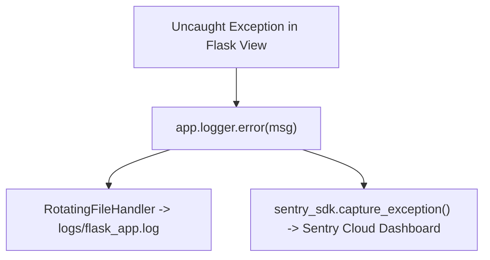

# Application Logging And Sentry

> **Course**: Git Version Control | **Module**: Introduction | **Difficulty**: beginner

---

- **Estimated Time**: 45 Minutes (15m Reading | 20m Practice | 10m Quiz)
- **Difficulty Level**: ⭐⭐ Intermediate
- **Prerequisites**: [Lesson 11.1 Custom Error Pages](file:///d:/My%20Drive/all%20files/PROJECT%20FILES/notes/docs/curriculum/_04_flask/_04_25_custom_error_pages_and_handlers.md)
- **XP Reward**: +50 XP

### Learning Objectives
By the end of this lesson, you will be able to:
1. Utilize Flask's built-in `app.logger` (`INFO`, `WARNING`, `ERROR`).
2. Configure production file logging using **`RotatingFileHandler`**.
3. Implement structured JSON logging for log aggregation tools.
4. Integrate real-time exception monitoring using the **Sentry SDK** (`sentry_sdk.init()`).

---

---

Install `sentry-sdk`:

```bash
pip install sentry-sdk[flask]
```

---

---

### 3.1 Production Logging Architecture
Relying on `print()` statements in production code is anti-pattern: output is lost on process restart and lacks timestamp metadata.

**Production Logging Architecture**:
- **`app.logger`**: Wraps Python's standard `logging.Logger` class.
- **`RotatingFileHandler`**: Automatically rotates log files when they reach a max byte size limit (e.g., 10MB), keeping log storage bounded.
- **Sentry SDK**: Captures uncaught exceptions in real time, emailing developers with exact stack traces, environment vars, and user context.

```
┌─────────────────────────────────────────────────────────────────────────────┐
│                       FLASK PRODUCTION LOGGING PIPELINE                     │
├─────────────────────────────────────────────────────────────────────────────┤
│ Application Event ──► `app.logger.error("Database connection lost")`        │
│                         │                                                   │
│                         ├──► Writes to `logs/app.log` (RotatingFileHandler)  │
│                         └──► Pushes alert to Sentry Dashboard (Sentry SDK)  │
└─────────────────────────────────────────────────────────────────────────────┘
```

---

---



---

---

```python
# Production Logging & Sentry SDK Setup (logging_demo.py)
import os
import logging
from logging.handlers import RotatingFileHandler
from flask import Flask
import sentry_sdk
from sentry_sdk.integrations.flask import FlaskIntegration

# 1. Initialize Sentry Error Monitoring (If DSN provided in environment)
SENTRY_DSN = os.environ.get("SENTRY_DSN")
if SENTRY_DSN:
    sentry_sdk.init(
        dsn=SENTRY_DSN,
        integrations=[FlaskIntegration()],
        traces_sample_rate=1.0, # Performance monitoring trace rate
    )

def create_app():
    app = Flask(__name__)

    # 2. Configure Production Rotating File Logging Handler
    if not os.path.exists("logs"):
        os.mkdir("logs")

    file_handler = RotatingFileHandler(
        "logs/iot_flask.log",
        maxBytes=10_240_000, # 10MB file limit
        backupCount=5        # Keep 5 backup log files
    )
    file_handler.setFormatter(logging.Formatter(
        "[%(asctime)s] %(levelname)s in %(module)s: %(message)s"
    ))
    file_handler.setLevel(logging.INFO)

    app.logger.addHandler(file_handler)
    app.logger.setLevel(logging.INFO)
    app.logger.info("[Server Startup]: IoT Flask Microservice Initialized")

    @app.route("/api/v1/log-test")
    def log_test():
        app.logger.info("Informational log triggered")
        app.logger.warning("Low memory warning triggered")
        app.logger.error("Database socket timeout error triggered")
        return {"status": "LOGGED"}

    return app

if __name__ == "__main__":
    app = create_app()
    app.run(debug=True)
```

---

---

- **Cloud Microservice Observability**: Production Flask services emit structured JSON logs to Datadog/Elasticsearch and push error alerts to Sentry/PagerDuty for 24/7 incident response.

---

---

1. Save code as `logging_demo.py`.
2. Run app and navigate to `/api/v1/log-test` $\to$ Inspect generated log file in `logs/iot_flask.log`!

---

---

| Bug / Error | Root Cause | Engineering Solution |
| :--- | :--- | :--- |
| **Disk Space Exhaustion** | Using basic file logging without setting maximum size rotation limits. | Always use `RotatingFileHandler(maxBytes=..., backupCount=...)`. |

---

---

- **Use `RotatingFileHandler`**: Automatically rotates log files to prevent infinite disk storage growth.

---

---

### Q1: Why is `RotatingFileHandler` critical for production Python applications?
**Answer**: `RotatingFileHandler` limits disk space consumption by automatically rotating active log files when they reach a specified maximum byte size limit (e.g., 10MB) and keeping only a fixed number of historical backup files (e.g., 5 backups), preventing web servers from crashing due to disk space exhaustion.

---

---

```json
{
  "quiz_title": "Lesson 11.2 Logging Assessment",
  "questions": [
    {
      "question_id": "Q1",
      "type": "multiple_choice",
      "question_text": "Which Python logging handler automatically rotates log files when they reach a maximum byte size?",
      "options": ["FileHandler", "RotatingFileHandler", "StreamHandler", "TimedRotatingFileHandler"],
      "correct_answer_index": 1,
      "explanation": "RotatingFileHandler rotates log files based on maxBytes limits."
    }
  ]
}
```

---

---

Set up a production logging handler writing formatted warning/error logs to `logs/app.log`.

---

---

**Front**: What Sentry SDK integration automatically captures Flask exceptions?
**Back**: `FlaskIntegration()`.
<!-- flashcard:end -->

---

---

```python
handler = RotatingFileHandler("app.log", maxBytes=1000000, backupCount=5)
app.logger.addHandler(handler)
```

---
