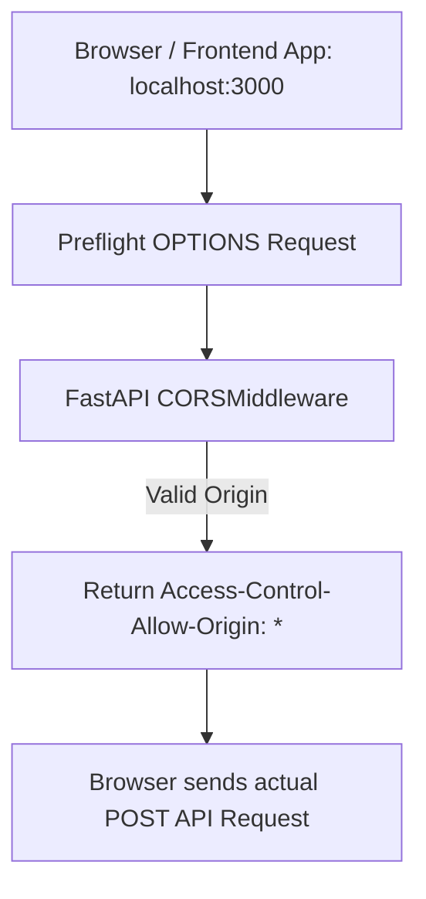

# Asynchronous Middleware And Cors

> **Course**: Git Version Control | **Module**: Introduction | **Difficulty**: beginner

---

- **Estimated Time**: 45 Minutes (15m Reading | 20m Practice | 10m Quiz)
- **Difficulty Level**: ⭐⭐ Intermediate
- **Prerequisites**: [Lesson 6.2 Modular Directory Layout](file:///d:/My%20Drive/all%20files/PROJECT%20FILES/notes/docs/curriculum/_05_fastapi/_05_12_modular_directory_structure_and_big_applications.md)
- **XP Reward**: +50 XP

### Learning Objectives
By the end of this lesson, you will be able to:
1. Construct custom async middleware using **`@app.middleware("http")`**.
2. Intercept incoming `Request` and outgoing `Response` objects.
3. Understand Cross-Origin Resource Sharing (CORS) security risks.
4. Configure **`CORSMiddleware`** to allow cross-origin requests securely.

---

---

Open Python REPL or VS Code.

---

---

### 3.1 What is FastAPI Middleware?
A **Middleware** is a function that executes on every HTTP request before it reaches a route handler, and on every HTTP response before it is sent back to the client.

In FastAPI, middleware is written asynchronously using `@app.middleware("http")`. It receives the incoming `request` and a `call_next` function:

```
┌─────────────────────────────────────────────────────────────────────────────┐
│                          FASTAPI MIDDLEWARE PIPELINE                        │
├─────────────────────────────────────────────────────────────────────────────┤
│ 1. Incoming Request ──► Executes Pre-Processing (Log IP, Check Headers)     │
│                     ──► `response = await call_next(request)`               │
│ 2. Route Handler    ──► Processes business logic & returns Response        │
│ 3. Outgoing Response ──► Executes Post-Processing (Attach custom headers)   │
└─────────────────────────────────────────────────────────────────────────────┘
```

### 3.2 Cross-Origin Resource Sharing (CORS)
Browsers enforce the Same-Origin Policy, blocking frontend web applications (e.g., React on `http://localhost:3000`) from making HTTP API requests to backends on different origins (`http://localhost:8000`). `CORSMiddleware` attaches appropriate `Access-Control-Allow-Origin` headers to authorize cross-origin requests.

---

---



---

---

```python
# FastAPI Middleware & CORS Configuration (middleware_demo.py)
import time
from fastapi import FastAPI, Request
from fastapi.middleware.cors import CORSMiddleware

app = FastAPI(title="Middleware & CORS API")

# 1. Configure CORSMiddleware (MUST be added before custom middleware!)
origins = [
    "http://localhost:3000",       # React Dev Server
    "http://127.0.0.1:3000",
    "https://telemetry.example.com" # Production Frontend Domain
]

app.add_middleware(
    CORSMiddleware,
    allow_origins=origins,       # Allowed cross-origin domains
    allow_credentials=True,     # Allow cookies & authorization headers
    allow_methods=["*"],         # Allowed HTTP verbs (GET, POST, PUT, DELETE)
    allow_headers=["*"],         # Allowed HTTP headers
)

# 2. Custom Async HTTP Middleware
@app.middleware("http")
def add_process_time_header(request: Request, call_next):
    # Pre-processing execution (Before route handler)
    start_time = time.perf_counter()

    # Forward request to view handler
    response = call_next(request)

    # Post-processing execution (After route handler finishes)
    process_time = time.perf_counter() - start_time
    response.headers["X-Process-Time-Sec"] = f"{process_time:.6f}"
    
    return response

@app.get("/api/v1/sensors")
def get_sensors():
    return {"data": ["ESP32-A1", "ESP32-B2"]}
```

---

---

- **Multi-Origin Single-Page Applications (SPAs)**: Production microservice APIs configure `CORSMiddleware` to allow cross-origin requests strictly from authorized frontend dashboard domains (`https://dashboard.company.com`).

---

---

1. Save code as `middleware_demo.py`.
2. Run `uvicorn middleware_demo:app --reload`.
3. Send GET request via curl: `curl -i http://127.0.0.1:8000/api/v1/sensors` $\to$ Inspect `X-Process-Time-Sec` header in response!

---

---

| Bug / Error | Root Cause | Engineering Solution |
| :--- | :--- | :--- |
| **`CORS Error: No 'Access-Control-Allow-Origin' header`** | Front-end domain missing from `allow_origins` list or using `allow_origins=["*"]` with `allow_credentials=True`. | Specify exact frontend origin URL in `allow_origins` when `allow_credentials=True`. |

---

---

- **Avoid Wildcards in Production**: Never use `allow_origins=["*"]` when supporting authentication cookies or authorization headers.

---

---

### Q1: What is a CORS preflight request and how does FastAPI handle it?
**Answer**: When a web browser makes a cross-origin HTTP request containing non-simple headers or verbs (like `POST` with JSON or `Authorization` headers), it sends an automatic `OPTIONS` preflight request first to check if the server permits the operation. FastAPI's `CORSMiddleware` intercepts `OPTIONS` requests automatically and responds with matching `Access-Control-Allow-*` headers.

---

---

```json
{
  "quiz_title": "Lesson 7.1 Middleware & CORS Assessment",
  "questions": [
    {
      "question_id": "Q1",
      "type": "multiple_choice",
      "question_text": "Which FastAPI decorator registers a custom HTTP request/response middleware function?",
      "options": ["@app.middleware('http')", "@app.use_middleware()", "@app.http_interceptor()", "@app.before_request"],
      "correct_answer_index": 0,
      "explanation": "@app.middleware('http') registers HTTP middleware."
    }
  ]
}
```

---

---

Build a custom middleware attaching `X-Request-ID` headers to all API responses.

---

---

**Front**: What function in custom FastAPI middleware forwards the request to the route handler?
**Back**: `response = await call_next(request)`.
<!-- flashcard:end -->

---

---

```python
app.add_middleware(CORSMiddleware, allow_origins=["http://localhost:3000"])
@app.middleware("http")
async def log(request: Request, call_next): return await call_next(request)
```

---
