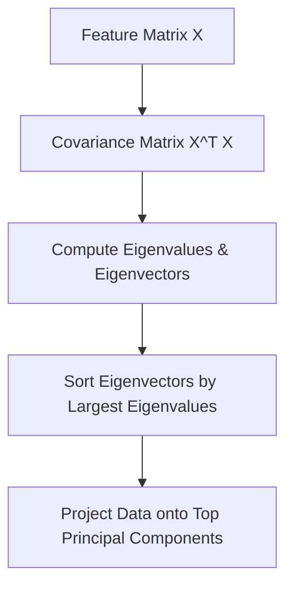

# Eigenvalues Eigenvectors And Decompositions

> **Course**: Git Version Control | **Module**: Introduction | **Difficulty**: beginner

---

- **Estimated Time**: 55 Minutes (20m Reading | 25m Practice | 10m Quiz)
- **Difficulty Level**: ⭐⭐⭐ Advanced
- **Prerequisites**: [Lesson 1.1.2 Matrix Inversion & Systems](file:///d:/My%20Drive/all%20files/PROJECT%20FILES/notes/docs/curriculum/_08_ds_math/_01_02_matrix_inversion_determinants_and_systems.md)
- **XP Reward**: +70 XP

### Learning Objectives
By the end of this lesson, you will be able to:
1. Compute Eigenvalues ($\lambda$) and Eigenvectors ($\mathbf{v}$) ($A\mathbf{v} = \lambda\mathbf{v}$).
2. Perform Eigendecomposition ($A = V \Lambda V^{-1}$) on symmetric matrices.
3. Factorize rectangular matrices using **Singular Value Decomposition (SVD)** ($A = U \Sigma V^T$).
4. Trace how Covariance Matrix Eigendecomposition underpins **Principal Component Analysis (PCA)**.

---

---

Open VS Code and install NumPy/SciPy.

---

---

### 3.1 Eigenvalues & Eigenvectors
An Eigenvector $\mathbf{v}$ of matrix $A$ is a non-zero vector whose direction remains unchanged when transformed by $A$, only scaled by Eigenvalue $\lambda$:

$$A\mathbf{v} = \lambda\mathbf{v} \implies (A - \lambda I)\mathbf{v} = \mathbf{0}$$

Eigenvalues are found by solving the **Characteristic Equation**: $\det(A - \lambda I) = 0$.

### 3.2 Singular Value Decomposition (SVD)
SVD generalizes eigendecomposition to ANY rectangular $m \times n$ matrix $A$:

$$A = U \Sigma V^T$$

- $U \in \mathbb{R}^{m \times m}$: Left singular vectors (Orthonormal).
- $\Sigma \in \mathbb{R}^{m \times n}$: Singular values (Diagonal).
- $V^T \in \mathbb{R}^{n \times n}$: Right singular vectors (Orthonormal).

### 3.3 PCA & Covariance Matrix Connection
PCA finds principal directions of maximum variance by calculating the eigenvectors of the data **Covariance Matrix** $\Sigma_X = \frac{1}{N-1} X^T X$.

---

---



---

---

```python
import numpy as np

# Covariance Matrix Example
A = np.array([[4, 2], [2, 3]], dtype=float)

# 1. Eigendecomposition
eigenvalues, eigenvectors = np.linalg.eig(A)
print("Eigenvalues:", eigenvalues)
print("Eigenvectors:\n", eigenvectors)

# 2. Singular Value Decomposition (SVD)
U, S, Vt = np.linalg.svd(A)
print("Singular Values (S):", S)
```

---

---

- **Dimensionality Reduction**: SVD powers TruncatedSVD in Scikit-Learn for sparse text TF-IDF dimensionality reduction (Latent Semantic Analysis).

---

---

1. Save code as `eig_demo.py`.
2. Run `python eig_demo.py` $\to$ Verify $A \mathbf{v} = \lambda \mathbf{v}$ holds for the output eigenvector!

---

---

| Bug / Error | Root Cause | Engineering Solution |
| :--- | :--- | :--- |
| **Complex Eigenvalues** | Matrix is non-symmetric. | Use `np.linalg.eigh()` for real symmetric covariance matrices. |

---

---

- **Use `np.linalg.eigh()`**: Optimized for real symmetric matrices.

---

---

### Q1: What is the relationship between SVD and PCA?
**Answer**: PCA on zero-centered data matrix $X$ is equivalent to performing SVD $X = U \Sigma V^T$, where right singular vectors $V$ are the Principal Components, and singular values $S$ relate to explained variances.

---

---

```json
{
  "quiz_title": "Lesson 1.1.3 Eigendecomposition Assessment",
  "questions": [
    {
      "question_id": "Q1",
      "type": "multiple_choice",
      "question_text": "What equation defines an eigenvalue $\\lambda$ and eigenvector $\\mathbf{v}$ for matrix $A$?",
      "options": ["A + v = \\lambda", "Av = \\lambda v", "A \\lambda = v", "det(A) = \\lambda"],
      "correct_answer_index": 1,
      "explanation": "Av = \\lambda v defines eigenvectors and eigenvalues."
    }
  ]
}
```

---

---

Build a PCA dimensionality reduction class from scratch using `np.linalg.eigh()`.

---

---

**Front**: What NumPy function computes eigenvalues for symmetric matrices?
**Back**: `np.linalg.eigh()`
<!-- flashcard:end -->

---

---

```python
import numpy as np
vals, vecs = np.linalg.eigh(cov_matrix)
```

---
