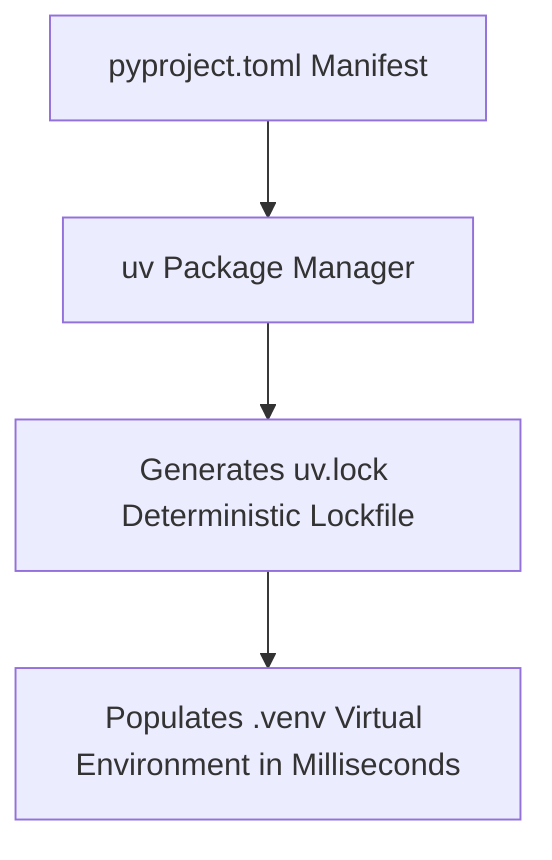

# Modern Python Packaging Pyproject And Uv

> **Course**: Git Version Control | **Module**: Introduction | **Difficulty**: beginner

---

- **Estimated Time**: 45 Minutes (15m Reading | 20m Practice | 10m Quiz)
- **Difficulty Level**: ⭐⭐ Intermediate
- **Prerequisites**: Python Package Management
- **XP Reward**: +50 XP

### Learning Objectives
By the end of this lesson, you will be able to:
1. Write standardized project metadata in **`pyproject.toml`** (PEP 621).
2. Utilize **`uv`**, the ultra-fast Rust-based Python package manager (10–100x faster than `pip`).
3. Manage virtual environments and lockfiles (`uv lock`) for reproducible production builds.

---

---

Install `uv`:
- Run `pip install uv` or `curl -LsSf https://astral.sh/uv/install.sh | sh`.

---

---

### 3.1 Legacy `setup.py` vs Modern `pyproject.toml`
Legacy Python setups relied on executing arbitrary `setup.py` code during installation. **PEP 518 / PEP 621** unified all Python tooling configuration (build backends, dependencies, linter settings) into a single declarative file: **`pyproject.toml`**.

```
┌─────────────────────────────────────────────────────────────────────────────┐
│                          MODERN PYTHON TOOLING (`uv`)                       │
├─────────────────┬───────────────────────────────────────────────────────────┤
│ Feature         │ Capability                                                │
├─────────────────┼───────────────────────────────────────────────────────────┤
│ Speed           │ Written in Rust; installs packages 10–100x faster than pip│
│ Management      │ Handles Python version management, venvs, and lockfiles   │
│ Compatibility   │ Drop-in replacement for `pip`, `pip-tools`, and `virtualenv`│
└─────────────────┴───────────────────────────────────────────────────────────┘
```

---

---



---

---

### Modern `pyproject.toml` Manifest Specification

```toml
[project]
name = "enterprise-ai-service"
version = "0.1.0"
description = "High-performance AI telemetry microservice"
readme = "README.md"
requires-python = ">=3.11"
dependencies = [
    "fastapi>=0.110.0",
    "pydantic>=2.6.0",
    "httpx>=0.27.0",
]

[build-system]
requires = ["hatchling"]
build-backend = "hatchling.build"

[tool.mypy]
python_version = "3.12"
strict = true
```

### High-Speed `uv` CLI Commands

```bash
# 1. Create Virtual Environment
uv venv

# 2. Activate Virtual Environment
source .venv/bin/activate  # On Windows: .venv\Scripts\activate

# 3. Install Dependencies at Lightning Speed
uv pip install -r pyproject.toml
```

---

---

- **Production Docker Builds**: Enterprise CI/CD pipelines use `uv` inside Docker containers to drop image build times from 5 minutes down to 10 seconds.

---

---

1. Create a folder and initialize `uv`: `uv init`.
2. Run `uv add fastapi pydantic` $\to$ Inspect auto-generated `pyproject.toml` and lightning-fast installation!

---

---

| Bug / Error | Root Cause | Engineering Solution |
| :--- | :--- | :--- |
| **`setup.py` Deprecation Warnings** | Building packages using legacy `setup.py` scripts. | Migrate project metadata into standard `pyproject.toml`. |

---

---

- **Adopt `pyproject.toml`**: Use it for all modern Python project configurations.

---

---

### Q1: What is `pyproject.toml` and why is it preferred over `requirements.txt`?
**Answer**: `pyproject.toml` is the PEP 621 standardized declarative configuration file for Python projects. Unlike `requirements.txt` which only lists dependencies, `pyproject.toml` unifies project metadata, build system requirements (Hatch, Flit, Poetry), dependencies, and tool settings (Mypy, Ruff, Black) in one file.

---

---

```json
{
  "quiz_title": "Lesson 5.3 Modern Packaging Assessment",
  "questions": [
    {
      "question_id": "Q1",
      "type": "multiple_choice",
      "question_text": "Which standard specifies project metadata inside pyproject.toml?",
      "options": ["PEP 8", "PEP 621", "PEP 484", "PEP 257"],
      "correct_answer_index": 1,
      "explanation": "PEP 621 defines project metadata fields in pyproject.toml."
    }
  ]
}
```

---

---

Migrate a legacy `requirements.txt` project to `pyproject.toml` managed via `uv`.

---

---

**Front**: What Rust-based package manager replaces `pip` with 100x faster speeds?
**Back**: `uv` (developed by Astral).
<!-- flashcard:end -->

---

---

```bash
uv pip install -r pyproject.toml
```

---
