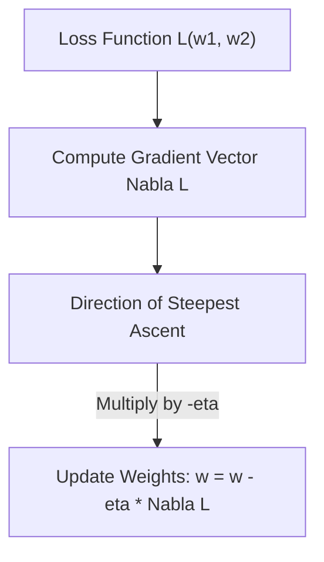

# Multivariable Calculus And Gradient Vectors

> **Course**: Git Version Control | **Module**: Introduction | **Difficulty**: beginner

---

- **Estimated Time**: 55 Minutes (20m Reading | 25m Practice | 10m Quiz)
- **Difficulty Level**: ⭐⭐⭐ Advanced
- **Prerequisites**: [Lesson 1.1.1 Vectors & Matrices](file:///d:/My%20Drive/all%20files/PROJECT%20FILES/notes/docs/curriculum/_08_ds_math/_01_01_vectors_matrices_and_vector_spaces.md)
- **XP Reward**: +70 XP

### Learning Objectives
By the end of this lesson, you will be able to:
1. Compute Partial Derivatives $\frac{\partial f}{\partial x_i}$ for multi-input cost functions.
2. Construct the **Gradient Vector** $\nabla f = \left[ \frac{\partial f}{\partial x_1}, \dots, \frac{\partial f}{\partial x_n} \right]^T$.
3. Compute the **Hessian Matrix** $H$ of second-order partial derivatives to evaluate curvature and saddle points.
4. Construct the **Jacobian Matrix** $J$ for vector-valued transformations.
5. Apply the Multivariable Chain Rule used by automatic differentiation engines in PyTorch and TensorFlow.

---

---

Install SymPy for symbolic differentiation:
- Run `pip install sympy`.

---

---

### 3.1 The Gradient Vector ($\nabla f$)
The Gradient Vector $\nabla f$ points in the direction of **steepest ascent** of function $f$:

$$\nabla f(\mathbf{x}) = \begin{bmatrix} \frac{\partial f}{\partial x_1} \\ \frac{\partial f}{\partial x_2} \\ \vdots \\ \frac{\partial f}{\partial x_n} \end{bmatrix}$$

In Gradient Descent optimization, we step in the opposite direction ($-\nabla f$) to minimize loss:

$$\mathbf{x}^{(t+1)} = \mathbf{x}^{(t)} - \eta \nabla f(\mathbf{x}^{(t)})$$

### 3.2 The Hessian Matrix ($H$)
The Hessian contains all pairwise second-order partial derivatives:

$$H_{i,j} = \frac{\partial^2 f}{\partial x_i \partial x_j}$$

- Positive Definite Hessian ($H \succ 0$): Local Minimum.
- Negative Definite Hessian ($H \prec 0$): Local Maximum.
- Indefinite Hessian: **Saddle Point** (common in deep learning loss surfaces!).

---

---



---

---

```python
import sympy as sp

# Define symbolic variables
x, y = sp.symbols('x y')
f = x**2 + 3*x*y + y**2  # Cost function L(x, y)

# 1. Gradient Vector (First Partial Derivatives)
grad_x = sp.diff(f, x)
grad_y = sp.diff(f, y)

print(f"Gradient wrt x: {grad_x}")
print(f"Gradient wrt y: {grad_y}")

# 2. Hessian Matrix (Second Partial Derivatives)
H = sp.Matrix([
    [sp.diff(f, x, x), sp.diff(f, x, y)],
    [sp.diff(f, y, x), sp.diff(f, y, y)]
])
print("Hessian Matrix:\n", H)
```

---

---

- **Second-Order Optimizers**: Algorithms like L-BFGS and Newton-Raphson use the Hessian matrix (or its approximation) to compute optimal step sizes during optimization.

---

---

1. Save code as `calculus_demo.py`.
2. Run `python calculus_demo.py` $\to$ Inspect symbolic gradient vector and Hessian matrix!

---

---

| Bug / Error | Root Cause | Engineering Solution |
| :--- | :--- | :--- |
| **Vanishing / Exploding Gradients** | Gradient magnitude shrinks to near 0 or explodes during deep Chain Rule multiplications. | Apply Batch Normalization and Gradient Clipping. |

---

---

- **Use Symbolic/Autograd Tools**: Use SymPy for math verification, PyTorch `autograd` for deep learning.

---

---

### Q1: What does the Gradient Vector $\nabla f$ represent geometrically?
**Answer**: Geometrically, $\nabla f$ points in the direction of the steepest rate of increase (ascent) of the function at a given point, with its magnitude equal to the rate of increase.

---

---

```json
{
  "quiz_title": "Lesson 1.1.4 Multivariable Calculus Assessment",
  "questions": [
    {
      "question_id": "Q1",
      "type": "multiple_choice",
      "question_text": "What direction does the negative gradient vector $-\\nabla f$ point toward?",
      "options": ["Steepest Ascent", "Steepest Descent (Minimum)", "Saddle Point", "Tangent Plane"],
      "correct_answer_index": 1,
      "explanation": "-Nabla f points toward the direction of steepest descent."
    }
  ]
}
```

---

---

Implement a 2D Gradient Descent visualizer using SymPy and NumPy.

---

---

**Front**: What matrix contains all second-order partial derivatives of a scalar function?
**Back**: The Hessian Matrix ($H$).
<!-- flashcard:end -->

---

---

```python
import sympy as sp
grad_x = sp.diff(f, x) # Partial derivative
```

---
