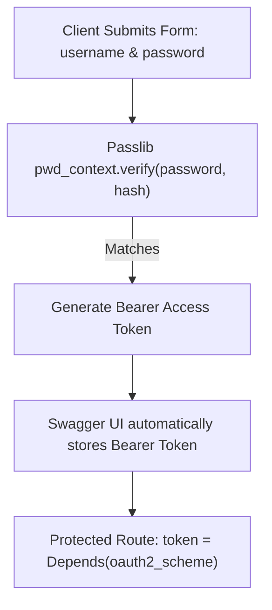

# Oauth2 Password Bearer And Hashing

> **Course**: Git Version Control | **Module**: Introduction | **Difficulty**: beginner

---

- **Estimated Time**: 55 Minutes (20m Reading | 25m Practice | 10m Quiz)
- **Difficulty Level**: ⭐⭐ Intermediate
- **Prerequisites**: [Lesson 4.2 Async CRUD](file:///d:/My%20Drive/all%20files/PROJECT%20FILES/notes/docs/curriculum/_05_fastapi/_05_08_async_crud_operations_and_asyncsession.md)
- **XP Reward**: +60 XP

### Learning Objectives
By the end of this lesson, you will be able to:
1. Understand the **OAuth2 Password Bearer** specification.
2. Parse form-based login submissions using **`OAuth2PasswordRequestForm`**.
3. Hash and verify user passwords using **Passlib** with **Bcrypt**.
4. Enable the interactive **Authorize** lock button in Swagger UI (`/docs`).

---

---

Install `passlib[bcrypt]` and `python-multipart`:

```bash
pip install "passlib[bcrypt]" python-multipart
```

---

---

### 3.1 OAuth2 Password Bearer Flow
**OAuth2** is an industry-standard authorization framework. In FastAPI, the **Password Bearer** flow accepts user credentials (`username` and `password`) via `application/x-www-form-urlencoded` form POST requests and returns a Bearer token string.

FastAPI's **`OAuth2PasswordBearer`** class integrates directly with OpenAPI: when instantiated, it adds a green **Authorize 🔓** button to Swagger UI (`/docs`), allowing developers to test protected routes directly in the browser:

```
┌─────────────────────────────────────────────────────────────────────────────┐
│                      OAUTH2 PASSWORD BEARER FLOW IN FASTAPI                 │
├─────────────────────────────────────────────────────────────────────────────┤
│ 1. Client POST `/token` form data ──► `OAuth2PasswordRequestForm`           │
│                                   ──► Verifies Passlib Bcrypt hash          │
│ 2. Server Returns JSON            ──► `{"access_token": "...", "token_type": "bearer"}`│
│ 3. Swagger UI Stores Token        ──► Sends `Authorization: Bearer <token>` │
└─────────────────────────────────────────────────────────────────────────────┘
```

---

---



---

---

```python
# OAuth2 Password Bearer & Passlib Hashing (oauth2_demo.py)
from fastapi import FastAPI, Depends, HTTPException, status
from fastapi.security import OAuth2PasswordBearer, OAuth2PasswordRequestForm
from passlib.context import CryptContext

app = FastAPI(title="OAuth2 Security API")

# 1. Configure Passlib CryptContext for Bcrypt Hashing
pwd_context = CryptContext(schemes=["bcrypt"], deprecated="auto")

# 2. Define OAuth2 Scheme pointing to token URL endpoint
oauth2_scheme = OAuth2PasswordBearer(tokenUrl="token")

# Mock In-Memory User Database with Bcrypt Hash
HASHED_PASSWORD = pwd_context.hash("SuperSecretPass123")
USERS_DB = {
    "admin_dev": {
        "username": "admin_dev",
        "hashed_password": HASHED_PASSWORD,
        "email": "admin@telemetry.io"
    }
}

# Helper Password Verification Functions
def verify_password(plain_password: str, hashed_password: str) -> bool:
    return pwd_context.verify(plain_password, hashed_password)

# 3. Token Generation Endpoint (Accepts OAuth2PasswordRequestForm data!)
@app.post("/token")
def login_for_access_token(form_data: OAuth2PasswordRequestForm = Depends()):
    user = USERS_DB.get(form_data.username)
    if not user or not verify_password(form_data.password, user["hashed_password"]):
        raise HTTPException(
            status_code=status.HTTP_401_UNAUTHORIZED,
            detail="Incorrect username or password",
            headers={"WWW-Authenticate": "Bearer"}
        )

    # Return standard OAuth2 token response schema
    return {"access_token": f"token_for_{user['username']}", "token_type": "bearer"}

# 4. Protected Route Dependency Injection
@app.get("/api/v1/protected-data")
def read_protected_data(token: str = Depends(oauth2_scheme)):
    # token is automatically extracted from Authorization: Bearer <token> header!
    return {"status": "AUTHORIZED", "extracted_token": token}
```

---

---

- **Interactive API Documentation & Security**: Production FastAPI microservices expose OAuth2 token endpoints to allow developers and QA teams to authenticate and test protected routes effortlessly via Swagger UI.

---

---

1. Save code as `oauth2_demo.py`.
2. Run `uvicorn oauth2_demo:app --reload`.
3. Open `http://127.0.0.1:8000/docs` $\to$ Click green **Authorize 🔓** button $\to$ Enter `username: admin_dev` and `password: SuperSecretPass123` $\to$ Test `/api/v1/protected-data` route!

---

---

| Bug / Error | Root Cause | Engineering Solution |
| :--- | :--- | :--- |
| **`HTTP 422 Unprocessable Entity` on `/token`** | Sending raw JSON payload instead of `application/x-www-form-urlencoded` form data. | `OAuth2PasswordRequestForm` expects form-data fields (`username` & `password`). Install `python-multipart`. |

---

---

- **Install `python-multipart`**: Mandatory for FastAPI to parse `OAuth2PasswordRequestForm` form data.

---

---

### Q1: What does `OAuth2PasswordBearer` do under the hood in FastAPI?
**Answer**: `OAuth2PasswordBearer` acts as both a dependency and OpenAPI documentation builder. When passed into a route using `Depends(oauth2_scheme)`, it extracts the `Authorization: Bearer <token>` string from incoming HTTP headers (raising HTTP 401 if missing) and registers the token endpoint path in OpenAPI metadata so Swagger UI renders the Authorize button.

---

---

```json
{
  "quiz_title": "Lesson 5.1 OAuth2 Assessment",
  "questions": [
    {
      "question_id": "Q1",
      "type": "multiple_choice",
      "question_text": "Which dependency class parses OAuth2 form submissions containing username and password fields?",
      "options": ["OAuth2PasswordBearer", "OAuth2PasswordRequestForm", "LoginForm", "PydanticForm"],
      "correct_answer_index": 1,
      "explanation": "OAuth2PasswordRequestForm parses OAuth2 form-data."
    }
  ]
}
```

---

---

Set up Passlib Bcrypt hashing and an `/token` endpoint enabling Swagger UI authorization.

---

---

**Front**: What package must be installed in Python to enable `OAuth2PasswordRequestForm` parsing in FastAPI?
**Back**: `python-multipart`.
<!-- flashcard:end -->

---

---

```python
oauth2_scheme = OAuth2PasswordBearer(tokenUrl="token")
@app.get("/items")
def items(token: str = Depends(oauth2_scheme)): return token
```

---
