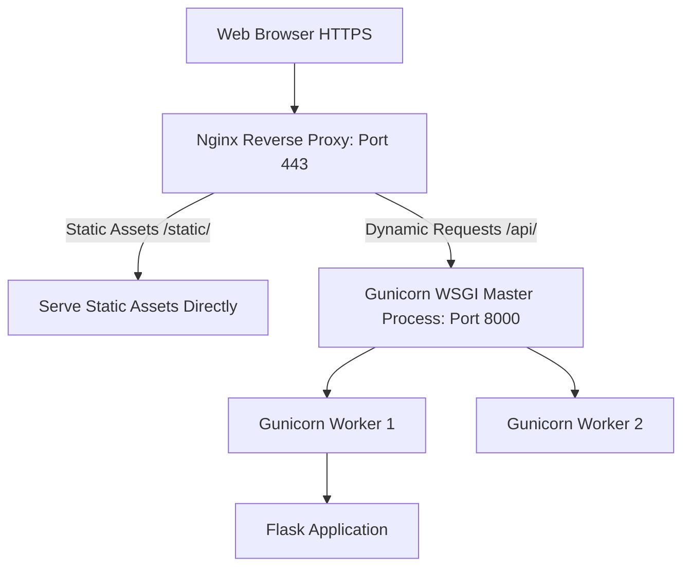

# Production Deployment Gunicorn Nginx Docker

> **Course**: Git Version Control | **Module**: Introduction | **Difficulty**: beginner

---

- **Estimated Time**: 65 Minutes (25m Reading | 30m Practice | 10m Quiz)
- **Difficulty Level**: ⭐⭐⭐ Advanced
- **Prerequisites**: [Lesson 12.1 Automated Testing](file:///d:/My%20Drive/all%20files/PROJECT%20FILES/notes/docs/curriculum/_04_flask/_04_27_automated_testing_with_pytest.md)
- **XP Reward**: +80 XP

### Learning Objectives
By the end of this lesson, you will be able to:
1. Explain why Flask's built-in development server must **NEVER** be used in production.
2. Configure **Gunicorn** as a production WSGI HTTP application server.
3. Configure **Nginx** as a reverse proxy for SSL termination and static asset serving.
4. Containerize a modular Flask application using **Dockerfile** and **Docker Compose**.

---

---

Install `gunicorn` and Docker Desktop:

```bash
pip install gunicorn
```

---

---

### 3.1 Enterprise Production Deployment Architecture
Flask's built-in server (`app.run()`) is single-threaded and unsafe for production. Production web architecture requires 3 distinct layers:

1. **Nginx (Reverse Proxy & TLS)**: Handles SSL/TLS encryption, static asset serving (`/static/`), rate limiting, and DDoS protection.
2. **Gunicorn (WSGI Server)**: Pre-fork worker process model (`gunicorn -w 4 wsgi:app`) that manages Python worker processes to process HTTP requests concurrently.
3. **Flask Application (Application Code)**: Executes business logic inside containerized Docker environments.

```
┌─────────────────────────────────────────────────────────────────────────────┐
│                    PRODUCTION THREE-TIER WEB ARCHITECTURE                   │
├─────────────────────────────────────────────────────────────────────────────┤
│ Web Browser ──► Nginx (Port 443 HTTPS / Reverse Proxy & Static Files)      │
│                    │                                                        │
│                    ▼ (UNIX Socket / Local HTTP)                             │
│                 Gunicorn (WSGI Server: 4 Worker Processes)                  │
│                    │                                                        │
│                    ▼                                                        │
│                 Flask Application (Application Factory)                     │
└─────────────────────────────────────────────────────────────────────────────┘
```

---

---



---

---

### File 1: `wsgi.py` (Production Entrypoint)

```python
from app import create_app

# WSGI Application Entrypoint instance
app = create_app()

if __name__ == "__main__":
    app.run()
```

### File 2: `Dockerfile` (Production Multi-Stage Container)

```dockerfile
# Step 1: Base Image
FROM python:3.12-slim

# Set environment variables
ENV PYTHONUNBUFFERED=1 \
    PYTHONDONTWRITEBYTECODE=1 \
    APP_HOME=/app

WORKDIR $APP_HOME

# Install system dependencies
RUN apt-get update && apt-get install -y --no-install-recommends \
    gcc libpq-dev && \
    rm -rf /var/lib/apt/lists/*

# Install Python dependencies
COPY requirements.txt .
RUN pip install --no-cache-dir -r requirements.txt

# Copy application source code
COPY . .

# Expose Gunicorn port
EXPOSE 8000

# Run Gunicorn with 4 worker processes bound to 0.0.0.0:8000
CMD ["gunicorn", "--workers=4", "--bind=0.0.0.0:8000", "wsgi:app"]
```

### File 3: `docker-compose.yml` (Multi-Container Orchestration)

```yaml
version: '3.8'

services:
  web:
    build: .
    container_name: flask_iot_app
    restart: always
    environment:
      - FLASK_ENV=production
      - DATABASE_URL=postgresql://postgres:secret@db:5432/iot_db
    ports:
      - "8000:8000"
    depends_on:
      - db

  db:
    image: postgres:16-alpine
    container_name: postgres_db
    restart: always
    environment:
      - POSTGRES_USER=postgres
      - POSTGRES_PASSWORD=secret
      - POSTGRES_DB=iot_db
    volumes:
      - postgres_data:/var/lib/postgresql/data

volumes:
  postgres_data:
```

### File 4: `nginx.conf` (Nginx Reverse Proxy Configuration)

```nginx
server {
    listen 80;
    server_name telemetry.example.com;

    location /static/ {
        alias /app/app/static/;
        expires 30d;
    }

    location / {
        proxy_pass http://127.0.0.1:8000;
        proxy_set_header Host $host;
        proxy_set_header X-Real-IP $remote_addr;
        proxy_set_header X-Forwarded-For $proxy_add_x_forwarded_for;
        proxy_set_header X-Forwarded-Proto $scheme;
    }
}
```

---

---

- **Cloud Container Orchestration (Kubernetes / AWS ECS)**: Dockerized Flask applications run in autoscaling Kubernetes clusters, receiving traffic through Nginx Ingress Controllers and Gunicorn WSGI processes.

---

---

1. Save `wsgi.py`, `Dockerfile`, and `docker-compose.yml`.
2. Run `docker-compose up --build` $\to$ Inspect running web application and PostgreSQL database containers!

---

---

| Bug / Error | Root Cause | Engineering Solution |
| :--- | :--- | :--- |
| **`WARNING: This is a development server`** | Using `flask run` or `app.run()` in production environments. | Always use a production WSGI server like Gunicorn: `gunicorn -w 4 wsgi:app`. |

---

---

- **Gunicorn Worker Formula**: Set worker process count to `(2 * $num_cores) + 1` for optimal CPU utilization.

---

---

### Q1: Why must Flask's built-in development server never be used in production environments, and what roles do Gunicorn and Nginx play?
**Answer**: Flask's built-in server is single-threaded, lacks security hardening, and crashes easily under concurrent load. In production, Gunicorn acts as the WSGI application server, spawning multiple worker processes to handle concurrent requests. Nginx sits in front as a reverse proxy, handling SSL termination, static asset caching, rate limiting, and forwarding dynamic requests to Gunicorn.

---

---

```json
{
  "quiz_title": "Lesson 12.2 Production Deployment Assessment",
  "questions": [
    {
      "question_id": "Q1",
      "type": "multiple_choice",
      "question_text": "What is the recommended rule of thumb for calculating Gunicorn worker processes?",
      "options": ["(2 * CPU cores) + 1", "1 worker per 100 users", "CPU cores / 2", "Always 1 worker"],
      "correct_answer_index": 0,
      "explanation": "(2 * CPU cores) + 1 optimizes CPU utilization."
    }
  ]
}
```

---

---

Containerize a Flask application with Gunicorn, PostgreSQL, and Docker Compose.

---

---

**Front**: What tool acts as a reverse proxy for Gunicorn in production Flask deployments?
**Back**: Nginx.
<!-- flashcard:end -->

---

---

```bash
gunicorn --workers=4 --bind=0.0.0.0:8000 wsgi:app
docker-compose up -d --build
```

---
