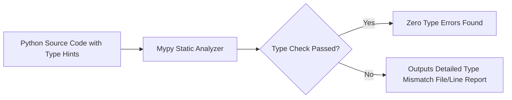

# Static Type Hinting And Mypy Validation

> **Course**: Git Version Control | **Module**: Introduction | **Difficulty**: beginner

---

- **Estimated Time**: 45 Minutes (15m Reading | 20m Practice | 10m Quiz)
- **Difficulty Level**: ⭐⭐ Intermediate
- **Prerequisites**: Python Functions & Types
- **XP Reward**: +50 XP

### Learning Objectives
By the end of this lesson, you will be able to:
1. Annotate Python functions, parameters, and variable assignments with static type hints.
2. Use modern Python 3.10+ union syntax (`int | float | None`).
3. Annotate collections using built-in generics (`list[str]`, `dict[str, int]`).
4. Perform static analysis on code repositories using `mypy`.

---

---

Install Mypy for static analysis:
- Run `pip install mypy`.

---

---

### 3.1 Gradual Typing in Python
Python remains a dynamically typed runtime language. Type hints do **NOT** enforce type constraints at runtime; instead, they provide static documentation and allow static type checkers (`mypy`, `pyright`) to catch bugs before execution:

```python
# Modern PEP 604 Union Syntax (int | float instead of Union[int, float])
def calculate_tax(price: float, rate: float = 0.05) -> float:
    return price * (1 + rate)

# Generic Collection Typing
def process_users(users: list[dict[str, str | int]]) -> int:
    return len(users)
```

---

---



---

---

```python
from typing import Callable

# Function Type Annotation
def format_number(val: int | float) -> str:
    return f"{val:,.2f}"

# Higher-Order Function Type Annotation
def apply_transform(data: list[float], transform_fn: Callable[[float], float]) -> list[float]:
    return [transform_fn(x) for x in data]

# Test Execution
numbers = [10.5, 20.0, 30.25]
doubled = apply_transform(numbers, lambda x: x * 2)
print("Transformed:", doubled)
```

---

---

- **Enterprise CI/CD Pipelines**: Production Python repositories run `mypy src/` as a mandatory pull-request gate to block type mismatch bugs from entering production codebases.

---

---

1. Save code as `type_demo.py`.
2. Run static analysis: `mypy type_demo.py` $\to$ Inspect clean Mypy status report!

---

---

| Bug / Error | Root Cause | Engineering Solution |
| :--- | :--- | :--- |
| **`Incompatible types in assignment`** | Assigning a string value to a variable annotated as `int`. | Ensure variable assignments match specified type annotations or use `Union` (`int | str`). |

---

---

- **Use Built-in Generics**: Use `list[str]` and `dict[str, int]` instead of importing `from typing import List, Dict`.

---

---

### Q1: Do Python type hints affect runtime execution speed?
**Answer**: No. Type hints are completely ignored by the CPython interpreter during execution and add zero runtime overhead. Their purpose is static analysis, IDE autocompletion, and build verification.

---

---

```json
{
  "quiz_title": "Lesson 5.1 Type Hinting Assessment",
  "questions": [
    {
      "question_id": "Q1",
      "type": "multiple_choice",
      "question_text": "What is the modern Python 3.10+ syntax for expressing a type that can be either an int or None?",
      "options": ["Optional[int]", "int | None", "Union[int, None]", "int or None"],
      "correct_answer_index": 1,
      "explanation": "int | None uses modern PEP 604 Union syntax."
    }
  ]
}
```

---

---

Annotate a 200-line legacy Python module and clear all Mypy static analysis warnings.

---

---

**Front**: What tool performs static type checking on Python code?
**Back**: `mypy` (or `pyright`).
<!-- flashcard:end -->

---

---

```bash
mypy src/
```

---
