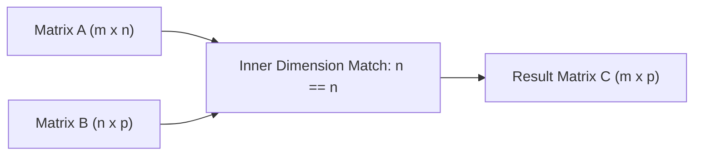

# Vectors Matrices And Vector Spaces

> **Course**: Git Version Control | **Module**: Introduction | **Difficulty**: beginner

---

- **Estimated Time**: 55 Minutes (20m Reading | 25m Practice | 10m Quiz)
- **Difficulty Level**: ⭐⭐ Intermediate
- **Prerequisites**: Reused Python Core (`Python.Lists`, `Python.Functions`)
- **XP Reward**: +60 XP

### Learning Objectives
By the end of this lesson, you will be able to:
1. Perform vector operations (addition, scalar multiplication, dot product, cross product) in $\mathbb{R}^n$.
2. Compute matrix multiplication geometry and transposition rules ($A^T$).
3. Evaluate vector spaces, subspaces, and basis coordinates.
4. Determine linear independence and calculate the span of a set of vectors.

---

---

Open VS Code and install NumPy for vector computations:
- Run `pip install numpy`.

---

---

### 3.1 Vectors & The Dot Product
A vector $\mathbf{v} \in \mathbb{R}^n$ represents a magnitude and direction in $n$-dimensional feature space:

$$\mathbf{u} \cdot \mathbf{v} = \sum_{i=1}^{n} u_i v_i = \|\mathbf{u}\| \|\mathbf{v}\| \cos(\theta)$$

The **Dot Product** measures geometric similarity (cosine similarity) between two feature vectors in ML embeddings.

### 3.2 Matrix Multiplication Geometry
For matrices $A \in \mathbb{R}^{m \times n}$ and $B \in \mathbb{R}^{n \times p}$, the product $C = AB \in \mathbb{R}^{m \times p}$ computes linear transformations sequentially:

$$C_{i,j} = \sum_{k=1}^{n} A_{i,k} B_{k,j}$$

### 3.3 Linear Independence & Span
- **Span**: The set of all possible linear combinations $c_1 \mathbf{v}_1 + c_2 \mathbf{v}_2 + \dots + c_k \mathbf{v}_k$.
- **Linear Independence**: Vectors $\mathbf{v}_1, \dots, \mathbf{v}_k$ are linearly independent if $c_1 \mathbf{v}_1 + \dots + c_k \mathbf{v}_k = \mathbf{0}$ holds ONLY when $c_1 = c_2 = \dots = c_k = 0$.

---

---

### Matrix Multiplication Inner Dimension Match


---

---

```python
import numpy as np

# 1. Vector Operations
u = np.array([2, 4, -1])
v = np.array([1, 0, 3])

dot_product = np.dot(u, v)
cosine_sim = dot_product / (np.linalg.norm(u) * np.linalg.norm(v))

print(f"Dot Product: {dot_product}")
print(f"Cosine Similarity: {cosine_sim:.4f}")

# 2. Matrix Multiplication
A = np.array([[1, 2], [3, 4]])
B = np.array([[5, 6], [7, 8]])

C = A @ B  # Matrix Multiplication operator
print("Matrix Product AB:\n", C)
```

---

---

- **Neural Network Weights**: Weight matrices $W \in \mathbb{R}^{out \times in}$ multiply input vectors $\mathbf{x}$ to transform high-dimensional embeddings in Deep Learning layers.

---

---

1. Save code as `vector_math.py`.
2. Run `python vector_math.py` $\to$ Verify dot product and matrix multiplication outputs!

---

---

| Bug / Error | Root Cause | Engineering Solution |
| :--- | :--- | :--- |
| **`ValueError: shapes not aligned`** | Matrix inner dimensions do not match ($A_{m \times n} \times B_{k \times p}$ where $n \neq k$). | Transpose matrix $B$ using `B.T` so inner dimensions match. |

---

---

- **Use `@` Operator for Matrix Multiplication**: Use `A @ B` instead of `np.dot()` for clear matrix math notation.

---

---

### Q1: What is the geometric interpretation of the dot product between two normalized vectors?
**Answer**: The dot product of two normalized unit vectors equals the cosine of the angle between them ($\cos\theta$), representing Cosine Similarity ranging from $-1$ (opposite) to $+1$ (identical direction).

---

---

```json
{
  "quiz_title": "Lesson 1.1.1 Vectors Assessment",
  "questions": [
    {
      "question_id": "Q1",
      "type": "multiple_choice",
      "question_text": "If two non-zero vectors have a dot product equal to 0, what is their geometric relationship?",
      "options": ["Parallel", "Orthogonal (Perpendicular)", "Identical", "Opposite"],
      "correct_answer_index": 1,
      "explanation": "A dot product of 0 means the angle is 90 degrees (cos 90 = 0), indicating orthogonal vectors."
    }
  ]
}
```

---

---

Write a vector span validator to check if a matrix of column vectors has full rank.

---

---

**Front**: What condition must matrix dimensions satisfy for multiplication $A \times B$?
**Back**: The number of columns in $A$ must equal the number of rows in $B$ ($A_{m \times n} \times B_{n \times p}$).
<!-- flashcard:end -->

---

---

```python
import numpy as np
C = A @ B  # Matrix Product
sim = np.dot(u, v) / (np.linalg.norm(u) * np.linalg.norm(v))
```

---
