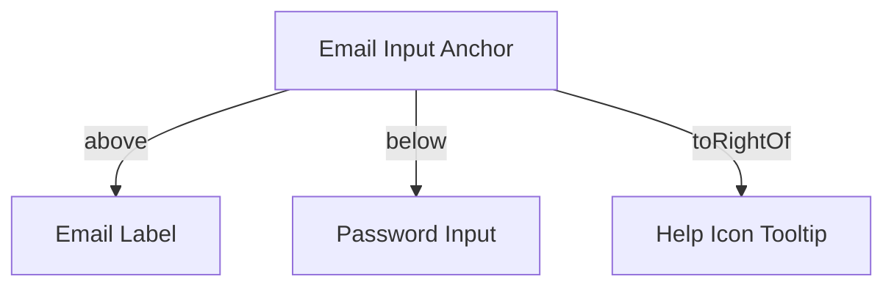

# Selenium4 Relative Locators

> **Course**: Git Version Control | **Module**: Introduction | **Difficulty**: beginner

---

- **Estimated Time**: 45 Minutes (15m Reading | 20m Practice | 10m Quiz)
- **Difficulty Level**: ⭐⭐ Intermediate
- **Prerequisites**: Basic Selenium Locators
- **XP Reward**: +50 XP

### Learning Objectives
By the end of this lesson, you will be able to:
1. Understand the spatial element location paradigm introduced in **Selenium 4**.
2. Locate DOM elements using relative spatial methods: `above()`, `below()`, `toLeftOf()`, `toRightOf()`, and `near()`.
3. Eliminate brittle, hardcoded deep XPaths by locating target elements relative to stable anchor elements.

---

---

Ensure Selenium 4.18+ dependency is present in `pom.xml` / `build.gradle`.

---

---

### 3.1 Spatial Locating in Selenium 4
Traditional Selenium locators rely on strict DOM tree structures. If a developer wraps an input inside a new `<div>`, brittle XPaths break instantly.

**Selenium 4 Relative Locators** (formerly called *Friendly Locators*) find elements based on visual pixel layout proximity on the rendered web page:

```java
// Locate password field directly below the username input anchor!
WebElement passwordInput = driver.findElement(
    RelativeBy.with(By.tagName("input")).below(usernameInput)
);
```

```
┌─────────────────────────────────────────────────────────────────────────────┐
│                      SELENIUM 4 RELATIVE LOCATOR API                        │
├─────────────────┬───────────────────────────────────────────────────────────┤
│ Relative Method │ Spatial Relationship Description                          │
├─────────────────┼───────────────────────────────────────────────────────────┤
│ `above(anchor)` │ Finds target element visually located ABOVE the anchor    │
│ `below(anchor)` │ Finds target element visually located BELOW the anchor    │
│ `toLeftOf(...)` │ Finds target element visually located to the LEFT of anchor│
│ `toRightOf(..)` │ Finds target element visually located to the RIGHT of anchor│
│ `near(anchor)`  │ Finds target element within ~50 pixels distance of anchor │
└─────────────────┴───────────────────────────────────────────────────────────┘
```

---

---



---

---

```java
import org.openqa.selenium.By;
import org.openqa.selenium.WebDriver;
import org.openqa.selenium.WebElement;
import org.openqa.selenium.chrome.ChromeDriver;
import static org.openqa.selenium.support.locators.RelativeBy.with;

public class RelativeLocatorsDemo {
    public static void main(String[] args) {
        WebDriver driver = new ChromeDriver();
        try {
            driver.get("https://example.com/login");

            // 1. Stable Anchor Element
            WebElement emailInput = driver.findElement(By.id("email"));

            // 2. Relative Locator: Find password field BELOW email input
            WebElement passwordInput = driver.findElement(with(By.tagName("input")).below(emailInput));

            // 3. Relative Locator: Find Submit Button to the RIGHT of Cancel Button
            WebElement cancelButton = driver.findElement(By.id("btn-cancel"));
            WebElement submitButton = driver.findElement(with(By.tagName("button")).toRightOf(cancelButton));

            passwordInput.sendKeys("Secret123!");
            submitButton.click();

        } finally {
            driver.quit();
        }
    }
}
```

---

---

- **Complex Dynamic Form Automation**: Automating data tables and responsive forms where CSS class names are dynamically obfuscated (e.g. React/Tailwind hashed classes `class="sc-1a2b3c"`).

---

---

1. Save code as `RelativeLocatorsDemo.java`.
2. Compile and run against a login form $\to$ Observe robust spatial element location!

---

---

| Bug / Error | Root Cause | Engineering Solution |
| :--- | :--- | :--- |
| **`NoSuchElementException`** | Element is hidden or off-screen, breaking visual spatial calculations. | Ensure browser window is maximized (`driver.manage().window().maximize()`). |

---

---

- **Maximize Window**: Always maximize the browser viewport so spatial pixel calculations remain deterministic.

---

---

### Q1: How do Relative Locators in Selenium 4 calculate element positions?
**Answer**: Selenium 4 uses the JavaScript `getBoundingClientRect()` API to retrieve the exact bounding box coordinates (top, left, width, height) of elements on the rendered DOM, finding elements based on spatial proximity rather than HTML DOM tree depth.

---

---

```json
{
  "quiz_title": "Lesson 1.2 Relative Locators Assessment",
  "questions": [
    {
      "question_id": "Q1",
      "type": "multiple_choice",
      "question_text": "Which static import enables relative locator syntax `with(By.tagName(...))` in Selenium 4?",
      "options": ["import static org.openqa.selenium.By.*", "import static org.openqa.selenium.support.locators.RelativeBy.with", "import static org.openqa.selenium.WebDriver.*", "import static org.openqa.selenium.WebElement.*"],
      "correct_answer_index": 1,
      "explanation": "import static org.openqa.selenium.support.locators.RelativeBy.with enables friendly locator syntax."
    }
  ]
}
```

---

---

Automate a dynamic 10-column data grid using Relative Locators without hardcoded row indexes.

---

---

**Front**: What default pixel distance does `near()` search for in Selenium 4?
**Back**: Within approximately 50 pixels of the anchor element.
<!-- flashcard:end -->

---

---

```java
driver.findElement(with(By.tagName("button")).toRightOf(anchor));
```

---
