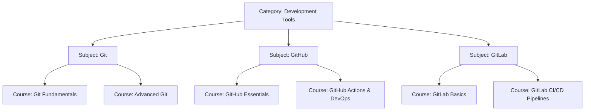

# Master Curriculum: Git, GitHub, & GitLab Learning Path

This document outlines the scalable structure for Git, GitHub, and GitLab within the Learning OS. Following the architectural recommendation, the tools are separated into their own distinct subjects under the **Development Tools** category to allow modular student progression.

---

## 1. CMS Hierarchy Definition

### Category: Development Tools
* **Slug**: `development-tools`
* **Type**: `technical`
* **Icon**: `fas fa-tools`
* **Color**: `#4f46e5` (Indigo)

---

## 2. Subjects, Courses, & Modules Taxonomy

### Subject A: Git
* **Slug**: `git`
* **Icon**: `fab fa-git-alt`
* **Difficulty Level**: `beginner`
* **Description**: Version control fundamentals, internal mechanics, branching, merging, and local workspace management.

#### Course 1: Git Fundamentals (Beginner)
* **Slug**: `git-fundamentals`
* **Estimated Hours**: 15 hours
* **Modules**:
  1. **Introduction to Version Control**: Why VCS exists, Git vs SVN/CVCS, Git History.
  2. **The Git Architecture**: Internals, Objects (Blobs, Commits, Trees), The Three States (Working Directory, Staging Area, Local Repository), HEAD pointer.
  3. **Basic Workflows & Commands**: Init, clone, add, commit, status, log, diff, checkout, restore, switch.
  4. **Branching & Merging Basics**: Branch creation, fast-forward merges, three-way merges, resolving merge conflicts.

#### Course 2: Advanced Git (Advanced)
* **Slug**: `advanced-git`
* **Estimated Hours**: 20 hours
* **Modules**:
  1. **Rewriting History**: Interactive Rebase, amend, squash, cherry-pick, reflog, reset vs revert vs restore.
  2. **Collaboration & Remote Tracking**: Fetch, pull, push, remote branch tracking, conflict resolution strategies.
  3. **Advanced Mechanics & Utilities**: Git Stash, Bisect (debugging), Blame, Git Worktree, Git LFS (Large File Storage).
  4. **Git Customization & Automation**: Git Config, Aliases, Git Hooks (pre-commit, post-merge), Submodules.

---

### Subject B: GitHub
* **Slug**: `github`
* **Icon**: `fab fa-github`
* **Difficulty Level**: `intermediate`
* **Description**: Remote host collaboration, pull requests, repository management, security, and developer automation.

#### Course 1: GitHub Essentials (Intermediate)
* **Slug**: `github-essentials`
* **Estimated Hours**: 10 hours
* **Modules**:
  1. **Remote Repository Basics**: Remotes, fork, pull requests, syncing forks.
  2. **Collaboration Tools**: Issues, Projects (Kanban boards), Wiki, Discussions, Milestones, Labels.
  3. **Access Control & Organization**: Teams, Org permissions, Code Owners, Branch Protection Rules.

#### Course 2: GitHub Actions & DevOps (Advanced)
* **Slug**: `github-actions-devops`
* **Estimated Hours**: 15 hours
* **Modules**:
  1. **Workflow Automations**: GitHub Actions syntax, runners, triggers, environment variables.
  2. **CI/CD Integration**: Building, testing, linting, packaging, and deploying code.
  3. **Security & Packages**: Dependabot alerts, Secret management, GitHub Packages registry.

---

### Subject C: GitLab
* **Slug**: `gitlab`
* **Icon**: `fab fa-gitlab`
* **Difficulty Level**: `intermediate`
* **Description**: Single application DevOps lifecycle, GitLab CI/CD, project planning, and container management.

#### Course 1: GitLab Basics (Intermediate)
* **Slug**: `gitlab-basics`
* **Estimated Hours**: 10 hours
* **Modules**:
  1. **GitLab Environment**: Projects, Groups, Subgroups, Epics, Milestones, Issue Boards.
  2. **Collaboration**: Merge Requests (MRs), Code Review tools, GitLab Pages.

#### Course 2: GitLab CI/CD Pipelines (Advanced)
* **Slug**: `gitlab-cicd-pipelines`
* **Estimated Hours**: 18 hours
* **Modules**:
  1. **Pipelines Syntax**: `.gitlab-ci.yml` architecture, stages, jobs, scripts, runners (shared vs self-hosted).
  2. **Advanced CI/CD features**: Variables, Artifacts, Cache, Container Registry, Environments, Deployments.

---

## 3. Database Seed Insert Schemas

To populate these structured subjects and courses in the database, execute the SQL statements in `seeding_metadata.sql` or use Python migration routines.
