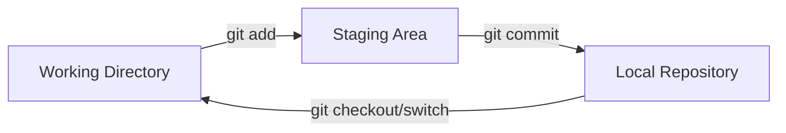

# Lesson 1: Git Architecture and the Three States

---

## 1. Overview
This lesson introduces the core mechanical model of Git. Rather than just memorizing commands, we explore how Git manages files across three distinct environments: the Working Directory, the Staging Area, and the Local Repository.

## 2. Learning Objectives
By the end of this lesson, you will be able to:
- Explain the visual and structural difference between the three states of Git.
- Trace a file's state from untracked to staged to committed.
- Map the internal tracking mechanisms of Git objects.

## 3. Prerequisites
- Basic command-line navigation (changing directories, creating files).
- Text editor installed (VS Code, Notepad++, or Vim).

## 4. Real World Usage
In daily professional development, you edit several files simultaneously. For instance, you might be fixing a styling bug in CSS while adding a new feature in JS. The three states allow you to selectively commit only the JS changes first, leaving the unfinished styling changes unstaged for later, ensuring clean and semantic commits.

## 5. Concept Explanation
Imagine Git as a shipping warehouse:
1. **Working Directory (Your Desk)**: This is where you write code, delete lines, and create files. Like your desk, it is messy, and items here are subject to change. Git does not snapshot changes here automatically.
2. **Staging Area (The Loading Dock)**: Before shipping, you pack specific items into a shipping box and place them on the loading dock. In Git, the staging area (index) is where you select which specific changes are ready to be snapshotted.
3. **Local Repository (The Shipping Container)**: Once the shipping box is complete, you seal it and load it onto the container. In Git, a commit is a permanent snapshot sealed into the history of the local repository (inside the `.git` folder).

## 6. Terminology
- **Untracked**: Files in your Working Directory that Git does not know about yet.
- **Tracked**: Files that Git is monitoring.
- **Staging Area (Index)**: A binary cache file that lists all files slated for the next commit.
- **Commit**: A snapshot of the staging area at a specific point in time.
- **HEAD**: A reference pointer pointing to the current active branch/commit.

## 7. Visual Workflow


## 8. Installation
Download Git for your operating system from the official website [git-scm.com](https://git-scm.com/downloads).
- **Windows**: Run the executable installer, selecting Git Bash.
- **macOS**: Install via Homebrew: `brew install git`.
- **Linux**: Install via apt: `sudo apt-get install git`.

## 9. Configuration
Before making any snapshot commits, you must identify yourself:
```bash
git config --global user.name "Your Name"
git config --global user.email "your.email@example.com"
```

## 10. Commands
- `git init`: Create an empty Git repository.
- `git status`: Show working tree status.
- `git add <file>`: Stage changes for commit.
- `git commit -m "<msg>"`: Record staging area snapshots.

## 11. Command Syntax
```bash
git add [file_pattern]
git commit -m "[commit_message]"
```

## 12. Parameters
- `<file_pattern>`: Specific filename, list of files, or `.` for all files in the current folder.
- `-m`: Specifies the commit message directly inside the command line.

## 13. Examples

### Easy
Initialize a repository and commit a file:
```bash
# 1. Initialize
git init

# 2. Create file
echo "hello world" > readme.txt

# 3. Check status
git status

# 4. Stage
git add readme.txt

# 5. Commit
git commit -m "Initial commit of readme"
```

### Medium
Stage multiple files selectively:
```bash
# Modify two files
echo "print('App')" > app.py
echo "TEMP_LOGS" > debug.log

# We want to stage app.py but ignore debug.log
git add app.py

# Commit the feature
git commit -m "Add core application script"
```

### Advanced
Examine the staging index directly:
```bash
# Look at the list of files in the staging area binary index
git ls-files --stage
```

## 14. Common Mistakes
- **Mistake**: Forgetting to run `git add` before committing.
  - *Fix*: Git only commits what is currently in the Staging Area, not what is on your "desk". Always stage changes first.

## 15. Best Practices
- **Atomic Commits**: Stage and commit changes that solve a single, specific issue or feature. Avoid bundling unrelated code changes in one commit.

## 16. Professional Tips
- Use `git status -s` to get a short, color-coded summary of files across the three states.
  - `M` (Green) = Staged.
  - `M` (Red) = Modified but unstaged.
  - `??` = Untracked.

## 17. Comparison Tables
| State | Tracked? | Location | Writable? | Saved in History? |
|---|---|---|---|---|
| Working Directory | Optionally | Local disk folder | Yes | No |
| Staging Area | Yes | Binary Index cache | Yes | No |
| Local Repository | Yes | `.git` folder | Via Commits | Yes |

## 18. Troubleshooting
- **Symptom**: Committed the wrong files.
- **Solution**: To unstage files before committing, run `git restore --staged <filename>`.

## 19. Interview Questions
1. **Question**: What is the staging area in Git and why is it useful?
   * **Ideal Answer**: The staging area (or index) is a buffer layer between the working directory and the repository database. It lets developers review, organize, and build clean atomic commits of specific changes rather than taking raw snapshots of all modified files.

## 20. Exercises
- [ ] Initialize a repository in a test folder.
- [ ] Create a file, stage it, check its status, and commit it.

## 21. Assignments
Create a repository with 3 text files. Stage and commit them in three separate commits, explaining in the commit messages what each file represents.

## 22. Mini Projects
Create a workflow simulation showing how Git registers modified files by outputting `git status` logs step-by-step.

## 23. Cheat Sheet
- `git init` -> Initialize repo
- `git status` -> View states of files
- `git add .` -> Stage all changes
- `git commit -m "msg"` -> Commit staged changes

## 24. Summary
Git splits our file management into three distinct states: Working Directory (modifying code), Staging Area (preparing files), and Local Repository (persisting snapshots). Understanding this framework is the foundational key to unlocking advanced Git operations.

## 25. References
- [Git Documentation - Three States](https://git-scm.com/book/en/v2/Getting-Started-What-is-Git%3F#_the_three_states)
- [Official Git Book](https://git-scm.com/book/en/v2)
