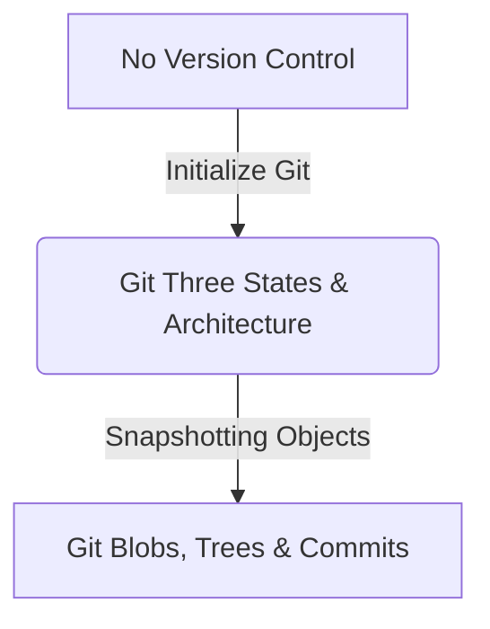
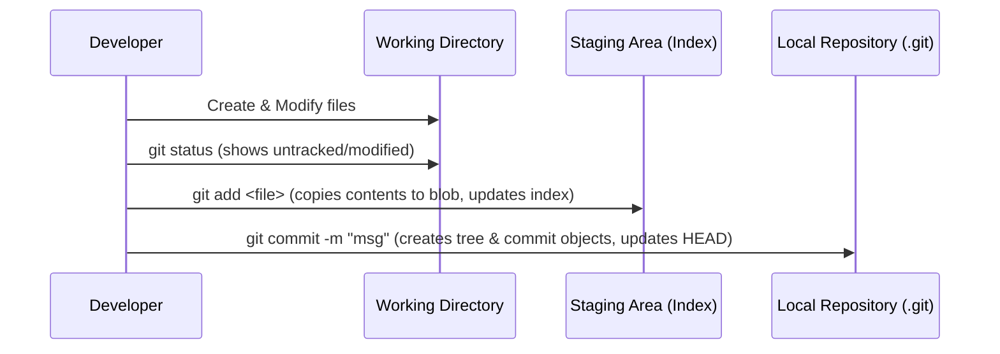

# Upgraded Lesson 1: Git Architecture and the Three States

---

```yaml
lesson_id: "GIT-FND-001"
subject: "Git"
course: "Git Fundamentals"
module: "Git Architecture"
difficulty: "⭐"
time_breakdown:
  reading: "12 min"
  exercise: "15 min"
  quiz: "10 min"
  revision: "5 min"
version: "1.1"
last_updated: "2026-07-16"
status: "Published"
author: "Learning OS Author"
reviewed_by: "Admin"
prerequisites:
  - "Basic CLI navigation"
tags:
  - "Git"
  - "Staging"
  - "Commit"
  - "HEAD"
```

---

## 1. Overview [id: overview]
This lesson introduces the core version control model of Git. Rather than just memorizing commands, we explore how Git manages files across three distinct environments: the Working Directory, the Staging Area, and the Local Repository.

## 2. Knowledge Connections [id: connections]


## 3. Learning Outcomes [id: outcomes]
- **Knowledge (What you will understand)**:
  - The mechanical boundaries of the Working Directory, Staging Area, and Local Repository.
  - How Git handles internal indexing via checksum hash trees.
- **Skills (What you can do)**:
  - Initialize repositories, selectively stage files, and create structured local snapshots.
- **Outcome (Professional application)**:
  - Organize commits atomically to preserve clean project histories on enterprise codebases.

## 4. Concept & Internals Deep-Dive [id: concept]
Imagine Git as a shipping warehouse:
1. **Working Directory (Your Desk)**: This is where you write code, delete lines, and create files. Like your desk, it is messy, and items here are subject to change. Git does not track changes here automatically.
2. **Staging Area (The Loading Dock)**: Before shipping, you pack specific items into a shipping box and place them on the loading dock. In Git, the staging area (index) is a binary cached file that registers exactly what changes are slated for the next commit.
3. **Local Repository (The Shipping Container)**: Once the shipping box is complete, you seal it and load it onto the container. In Git, a commit is a permanent snapshot sealed into the history of the local repository (inside the `.git/objects` directory).

### Internal Architecture
Unlike other VCS (like SVN) that track changes as delta lists, Git tracks changes as **snapshots of the directory structure**.
Every file you add to Git is compressed and stored as a **Blob** (Binary Large Object) containing the file contents, indexed by a unique SHA-1 hash.
The **Index** is a binary file stored at `.git/index` that maps file paths to their corresponding SHA-1 blob hashes. When you commit, Git writes a **Tree** object that acts as a directory listing, mapping file names to blobs, and points the **Commit** object to this tree, along with metadata (author, message, parent commit).

## 5. Professional Box: Industry Usage [id: industry_usage]
> [!NOTE]
> **How Microsoft Uses Git at Scale**:
> Microsoft developed the VFS for Git (Virtual File System) to support the Windows repository—one of the largest Git repositories in the world, containing over 3.5 million files. Under the hood, Git's staging area index is optimized to run selectively, allowing developers to query and track changes across massive workspaces without loading the entire project history into local memory.

## 6. Visual Learning & Architecture [id: visuals]


## 7. Terminology [id: terminology]
- **Blob**: Git's internal format representing a file's contents, stripped of metadata.
- **Tree**: Git's internal folder representation, linking filenames to their respective blobs.
- **HEAD**: A reference pointer pointing to the current active branch or commit.
- **Staging Index**: The binary file `.git/index` tracking the snapshot state of files.

## 8. Installation & Configuration [id: setup]
Install Git via:
- **Windows**: [git-scm.com](https://git-scm.com/downloads) installer.
- **macOS**: `brew install git`
- **Linux**: `sudo apt-get install git`

Configure global identity:
```bash
git config --global user.name "John Doe"
git config --global user.email "johndoe@example.com"
```

## 9. Commands & Command Syntax [id: commands]
```bash
git init
git add <file_pattern>
git commit -m "<message>"
git status
```
- `file_pattern`: Specific file name, wildcard (`*.py`), or `.` to stage everything.

## 10. Practical Code Examples [id: examples]

### Easy
Initialize a local repository and commit a file:
```bash
# Initialize repo
git init

# Write file
echo "initial code" > app.py

# Stage and Commit
git add app.py
git commit -m "Initialize app.py with core script"
```

### Medium
Selective staging of files:
```bash
# Modify app.py and add temp log file
echo "print('Hello')" >> app.py
echo "TEMP" > build.log

# Check modified files
git status

# Stage only app.py
git add app.py

# Commit only app.py (build.log remains unstaged)
git commit -m "Add print execution to app.py"
```

### Advanced
Verify Git index database structure:
```bash
# Inspect the raw staging area index entries
git ls-files --stage
```

## 11. Common Errors & Troubleshooting [id: errors]

### Beginner Errors
- **Error**: `fatal: not a git repository (or any of the parent directories)`
  - *Fix*: You forgot to initialize Git. Run `git init` in the root folder.

### Intermediate Errors
- **Error**: Committed a password or build file by mistake.
  - *Fix*: Unstage the file before committing by running `git restore --staged <file_name>`.

### Professional Errors
- **Error**: Staging files changes CRLF line ending properties unexpectedly.
  - *Fix*: Turn on autocrlf settings: `git config --global core.autocrlf true` (Windows) or `input` (macOS/Linux).

## 12. Comparison Tables [id: comparisons]
| Metric | Working Directory | Staging Area | Local Repository |
|---|---|---|---|
| Command | Edit / Create | `git add` | `git commit` |
| Internal representation | Raw files on disk | Binary Index file (`.git/index`) | Compressed object directory |
| Recovery capability | Not recoverable if deleted | Partially recoverable | Fully recoverable |

## 13. Best Practices & Professional Tips [id: best_practices]
- **Atomic Commits**: Stage and commit changes that address only one task or issue.
- **Pro Tip**: Use `git status -s` for a compact file state report.

## 14. Interview Preparation [id: interview]

### Fresher Questions
1. **Question**: What is the staging area in Git?
   * **Ideal Answer**: The staging area is a middle-tier cache (`.git/index`) that lets developers selectively bundle specific file modifications before committing them as a single snapshot.

### 2 Years Experience Questions
2. **Question**: Explain how Git tracks changes differently compared to SVN.
   * **Ideal Answer**: SVN stores modifications as a set of file deltas over time. Git stores changes as lightweight commits pointing to complete directory snapshot Trees.

### 5 Years Experience Questions
3. **Question**: What happens internally when you run `git add`?
   * **Ideal Answer**: Git reads the file, creates a SHA-1 checksum hash, compresses the file data into a Blob object stored under `.git/objects`, and updates the `.git/index` file mapping the path to the new blob hash.

### Architect Level Questions
4. **Question**: How does Git guarantee content integrity in high-scale projects?
   * **Ideal Answer**: Git uses secure SHA-1 content-addressable hashing. The hash of a commit is generated from its trees, parent hashes, author metadata, and messages. Any alteration in code or history changes the hashes recursively, instantly exposing corruption.

## 15. Ingestion Exercises [id: exercises]

### MCQ
- Which file holds Git's binary staging area index?
  - A) `.git/config`
  - B) `.git/index` (Correct)
  - C) `.git/HEAD`

### Coding Challenge
- Initialize a git repository and commit `script.py` with the message "Init".

### Predict the Output
- If `status.py` is untracked, what does `git status -s` print next to its name?
  - Output: `?? status.py`

### Debugging Task
- Run `git commit -m "add config"` on a fresh directory. Fix the resulting `nothing to commit` error.

### Scenario Question
- A developer modified `auth.py` and `test.log`. They only want `auth.py` in the commit. What commands should they run?
  - Answer: `git add auth.py` then `git commit -m "update authentication"`.

### Hands-on Lab
- Open terminal, create a directory, run `git init`, write `data.json`, and run `git add data.json`.

## 16. Graded Assignments [id: assignments]
Build a local project workspace containing three files. Implement three separate, logically distinct commits. Submit the output of your `git log` history showing all 3 commit metadata checksums.

## 17. Mini Projects [id: projects]
- **Mini Scale**: Write a shell script to automate initialization, addition, and commit processes.
- **Small Scale**: Configure a repository with `.gitignore` parameters to exclude logs.
- **Medium Scale**: Design a script verifying code compilation status before allowing commits.
- **Industry Scale**: Set up pre-commit client hooks blocking commits if a secret key/API key is present in source files.

## 18. Topic Cheat Sheet [id: cheatsheet]
- **Standard Syntax**: `git add <file>`
- **Aliases**: `git config --global alias.co checkout`
- **Shortcut**: Use `Ctrl+Shift+G` in VS Code to open the source control stage interface.
- **Warning**: Never run `git reset --hard` unless you are sure you want to discard all working directory modifications.

## 19. AI Generated Content [id: ai_notes]
- **AI Summary**: Understanding the three states (Working Directory, Staging, Local Repo) is the primary concept behind version control.
- **AI Flashcards**:
  - Q: Where does Git store commit objects?
  - A: `.git/objects/` directory.

## 20. References [id: references]
- [Git Documentation - Three States](https://git-scm.com/book/en/v2/Getting-Started-What-is-Git%3F#_the_three_states)
- [Official Pro Git Book](https://git-scm.com/book/en/v2)
