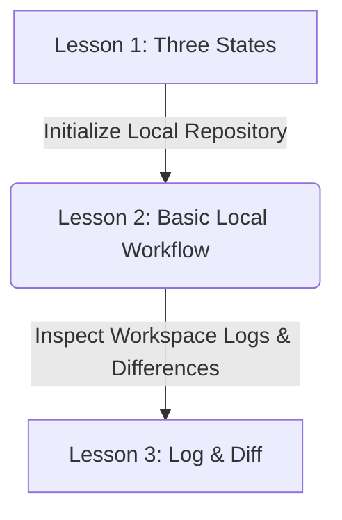
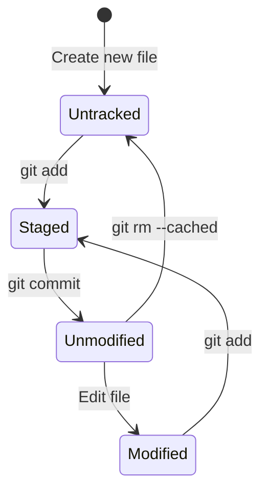

# Lesson 2: Basic Local Workflow — Tracking and Recording Changes

---

```yaml
lesson_id: "GIT-FND-002"
subject: "Git"
course: "Git Fundamentals"
module: "Basic Local Workflow"
difficulty: "⭐"
time_breakdown:
  reading: "15 min"
  exercise: "20 min"
  quiz: "10 min"
  revision: "5 min"
version: "1.0"
last_updated: "2026-07-17"
status: "Published"
author: "Rajasekar"
reviewed_by: "Admin"
prerequisites:
  - "GIT-FND-001 (Git Architecture)"
tags:
  - "Git Init"
  - "Git Add"
  - "Git Commit"
  - "Git Status"
```

---

## 1. Overview [id: overview]
This lesson covers the primary local version control workflow. You will learn how to initialize a repository, track files, inspect modification status, and write structured commit records to the database log.

## 2. Knowledge Connections [id: connections]


## 3. Learning Outcomes [id: outcomes]
- **Knowledge (What you will understand)**:
  - The life cycle of a file in a Git-controlled directory (untracked, unmodified, modified, staged).
  - How Git represents directories and content files internally using indices and objects.
- **Skills (What you can do)**:
  - Construct local repositories, selectively track files, and commit changes with high-quality descriptions.
- **Outcome (Professional application)**:
  - Maintain a clean and traceable project history through semantic local staging configurations.

## 4. Concept & Internals Deep-Dive [id: concept]
Inside a directory initialized with Git, files follow a strict lifecycle:
- **Untracked**: The file exists on disk, but Git has no record of it and does not monitor it for changes.
- **Unmodified**: The file is tracked, and its contents match the last committed version.
- **Modified**: A tracked file has been changed in the Working Directory, but these changes are not yet staged.
- **Staged**: The changes in the file are cached in the index file and ready to be committed.

### Internal database mechanics of `git commit`
When you run `git commit`, Git does not save delta differences. Instead:
1. It reads the current binary `.git/index` file to find the SHA-1 hashes of all staged blobs.
2. It constructs a **Tree** object representing the project's root folder directory.
3. It creates a **Commit** object pointing to the root Tree object, identifying the author, committer, timestamp, and the SHA-1 of parent commits.
4. It moves the active branch head pointer (e.g. `refs/heads/main`) to point to this new commit object hash.

## 5. Professional Box: Industry Usage [id: industry_usage]
> [!NOTE]
> **Commit Signing at Google**:
> When Google engineers contribute code to open-source systems, they must sign their commits using GPG keys. This verification cryptographically signs the commit object payload metadata, proving that the commit author is indeed who they claim to be, blocking supply chain code spoofing.

## 6. Visual Learning & Architecture [id: visuals]


## 7. Terminology [id: terminology]
- **Untracked file**: Any file in your working directory that was not in your last snapshot and is not in your staging area.
- **Modified file**: A file that has changed since it was last committed but has not yet been staged.
- **Index**: Git's binary cache tracking the snapshot state of files slated for the next commit.

## 8. Installation & Configuration [id: setup]
To configure commit templates globally:
```bash
git config --global commit.template ~/.gitmessage
```

## 9. Commands & Command Syntax [id: commands]
```bash
git init
git add <file>
git status
git commit -m "<message>"
```

## 10. Practical Code Examples [id: examples]

### Easy
Create a new directory and initialize it as a repository:
```bash
mkdir my-app
cd my-app
git init
```

### Medium
Selective addition of multiple files:
```bash
echo "import os" > main.py
echo "SECRET_KEY=123" > secrets.env

# Add only Python files, ignore secrets
git add *.py
git status
```

### Advanced
Creating a commit message containing metadata using multi-line formats:
```bash
git commit -m "feat(auth): add email login controller" -m "Resolves issue #42. Sets up standard auth session handling."
```

## 11. Common Errors & Troubleshooting [id: errors]

### Beginner Errors
- **Error**: `fatal: pathspec 'app.py' did not match any files`
  - *Fix*: The file name is misspelled, or the file does not exist in the current working directory.

### Intermediate Errors
- **Error**: Accidental commit of a large binary file (e.g. `data.bin`).
  - *Fix*: Unstage the file using `git rm --cached data.bin` and add it to your `.gitignore`.

### Professional Errors
- **Error**: `detaching HEAD` warning during checkouts.
  - *Fix*: You checked out a specific commit hash rather than a branch. Create a new branch pointing to the current commit using `git switch -c <branch_name>`.

## 12. Comparison Tables [id: comparisons]
| File State | Tracked by Git? | Exists in Index? | Modified since last commit? |
|---|---|---|---|
| Untracked | No | No | N/A |
| Unmodified | Yes | Yes | No |
| Modified | Yes | Yes (older version) | Yes |
| Staged | Yes | Yes (new version) | Yes |

## 13. Best Practices & Professional Tips [id: best_practices]
- **Configure `.gitignore` early**: Never track generated logs, binaries, or environmental variables.
- **Imperative Commit Messages**: Write messages in the imperative mood, e.g. "Add email validation logic" instead of "Added email validation logic".

## 14. Interview Preparation [id: interview]

### Fresher Questions
1. **Question**: What is the difference between `git add` and `git commit`?
   * **Ideal Answer**: `git add` copies files from the Working Directory into the Staging Area (index cache). `git commit` takes the staged files and creates a permanent snapshot record in the local repository.

### 2 Years Experience Questions
2. **Question**: If a file is in the `.gitignore`, will Git stop tracking it if it was already committed?
   * **Ideal Answer**: No. Git will continue to track the file. To stop tracking, you must remove it from the index using `git rm --cached <file>`.

### 5 Years Experience Questions
3. **Question**: Explain how the staging index acts as a safety buffer.
   * **Ideal Answer**: It allows developers to craft precise commits. You can work on multiple features, but only stage and commit the lines addressing one specific bug, ensuring atomic commits.

### Architect Level Questions
4. **Question**: Explain how Git stores metadata on authorship vs. committers.
   * **Ideal Answer**: Git distinguishes between the Author (the person who wrote the code changes) and the Committer (the person who applied the commit). In patches or rebases, these hashes and names can diverge, keeping full lineage integrity.

## 15. Ingestion Exercises [id: exercises]

### MCQ
- Which state represents a file that has changes prepared for the next commit?
  - A) Untracked
  - B) Modified
  - C) Staged (Correct)

### Coding Challenge
- Initialize a local git repository, write a file named `hello.py` containing `print('hello')`, stage it, and commit it with message "Add greeting".

### Predict the Output
- If you run `git add file.txt` and then run `git status -s`, what code symbol prints next to the filename?
  - Output: `A  file.txt`

### Debugging Task
- A developer runs `git commit` and it opens Vim. How do they save and exit the editor?
  - Answer: Press `Esc`, type `:wq`, and press `Enter`.

### Scenario Question
- A student wants to ignore all `.log` files in their project. What configuration file must they create and what text should it contain?
  - Answer: Create `.gitignore` containing `*.log`.

### Hands-on Lab
- Run `git init`, create `index.html`, run `git status`, add it, and commit.

## 16. Graded Assignments [id: assignments]
Create a repository containing 3 files. Modify them and show how you stage and commit only two of the files in a single commit, leaving the third modified but unstaged. Export the output of your `git status` command.

## 17. Mini Projects [id: projects]
- **Mini Scale**: Write a script to automate initializing a folder and creating a standard `.gitignore` template.
- **Small Scale**: Create a pre-commit check verifying that no file size exceeds 10MB.
- **Medium Scale**: Design a python hook that lints code before allowing commits to proceed.
- **Industry Scale**: Build a script parsing changed files to auto-assign commit categories (feat, fix, docs) based on diff extensions.

## 18. Topic Cheat Sheet [id: cheatsheet]
- **Standard Syntax**: `git commit -m "<msg>"`
- **Aliases**: `git config --global alias.st status`
- **Shortcut**: Press `Ctrl+Enter` in VS Code source control menu to commit staged changes.
- **Warning**: Do not use `git add .` indiscriminately without review, as you may accidentally stage security keys.

## 19. AI Generated Content [id: ai_notes]
- **AI Summary**: This lesson focuses on the local workflow path (untracked -> modified -> staged -> committed) to manage project file histories.
- **AI Flashcards**:
  - Q: How do you untrack a file but keep it on disk?
  - A: Use `git rm --cached <file>`.

## 20. References [id: references]
- [Git Documentation - Record Changes](https://git-scm.com/book/en/v2/Git-Basics-Recording-Changes-to-the-Repository)
- [Official Pro Git Book](https://git-scm.com/book/en/v2)
