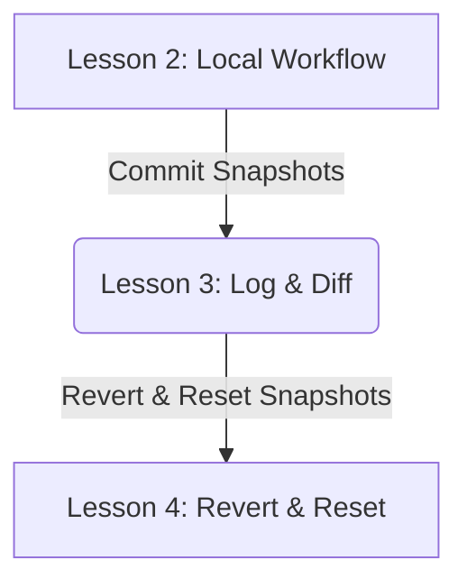
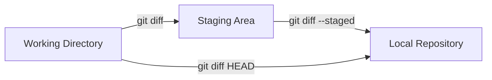

# Lesson 3: Inspecting History and Comparing Changes — Log and Diff

---

```yaml
lesson_id: "GIT-FND-003"
subject: "Git"
course: "Git Fundamentals"
module: "Basic Local Workflow"
difficulty: "⭐"
time_breakdown:
  reading: "12 min"
  exercise: "15 min"
  quiz: "10 min"
  revision: "5 min"
version: "1.0"
last_updated: "2026-07-17"
status: "Published"
author: "Rajasekar"
reviewed_by: "Admin"
prerequisites:
  - "GIT-FND-002 (Basic Local Workflow)"
tags:
  - "Git Log"
  - "Git Diff"
  - "Inspect Changes"
  - "Git Show"
```

---

## 1. Overview [id: overview]
This lesson teaches you how to query and navigate Git repository history records using the log system, and how to perform line-by-line file content comparison using differences rendering analysis.

## 2. Knowledge Connections [id: connections]


## 3. Learning Outcomes [id: outcomes]
- **Knowledge (What you will understand)**:
  - How Git represents changes between commits using raw diff outputs.
  - The difference between working tree diffs, staged diffs, and commit comparisons.
- **Skills (What you can do)**:
  - Format, filter, and restrict git log history views using advanced flags.
  - Review staged and unstaged edits line-by-line using git diff.
- **Outcome (Professional application)**:
  - Debug regressions by tracking changes, authors, and commit branches history logs.

## 4. Concept & Internals Deep-Dive [id: concept]
When you request a list of history, Git does not query a central server. It starts at the commit pointed to by **HEAD**, reads its metadata, and follows parent commit hashes pointers backward in time to reconstruct the line of development.

### How `git diff` works internally
Git compares two snapshot tree states. It uses the **Myers Diff Algorithm** to calculate the minimum edit script (insertions and deletions) required to transform one tree structure or file content into another.
- `git diff` (without flags) compares your Working Directory with the Staging Area.
- `git diff --staged` (or `--cached`) compares the Staging Area with the last commit in the Local Repository.

## 5. Professional Box: Industry Usage [id: industry_usage]
> [!NOTE]
> **Audit Logs at Netflix**:
> Netflix deployment pipelines use git log filters to automatically generate changelogs for production microservices. When a service deploy triggers, an automated script runs `git log <last_tag>..HEAD --oneline` to draft release notes, notify Slack channels, and trace commits back to developers.

## 6. Visual Learning & Architecture [id: visuals]


## 7. Terminology [id: terminology]
- **Commit Hash**: A unique 40-character SHA-1 checksum identifying a specific commit object.
- **Diff marker**: Character flags (`+` for additions, `-` for deletions) showing changes.
- **Oneline Log**: A compacted single-line view formatting commit hashes and messages.

## 8. Installation & Configuration [id: setup]
Configure colored terminal diff outputs:
```bash
git config --global color.ui true
```

## 9. Commands & Command Syntax [id: commands]
```bash
git log
git log --oneline --graph
git diff
git diff --staged
```

## 10. Practical Code Examples [id: examples]

### Easy
View a compacted history graph list:
```bash
git log --oneline --graph --all
```

### Medium
Compare the Working Directory with the last commit:
```bash
# Edit file.txt
echo "new line" >> file.txt

# Run diff comparing working tree directly to HEAD
git diff HEAD
```

### Advanced
Search for commits affecting a specific file containing a specific word (Snoop search):
```bash
git log -S "API_KEY" --oneline
```

## 11. Common Errors & Troubleshooting [id: errors]

### Beginner Errors
- **Error**: `git diff` returns no output even though you edited a file.
  - *Fix*: You staged the file. Run `git diff --staged` to compare changes inside the staging area.

### Intermediate Errors
- **Error**: Log output gets stuck and does not return to the prompt.
  - *Fix*: Press `q` to exit the pager (Git uses `less` to display long history lists).

### Professional Errors
- **Error**: Merge commit logs clutter the clean line story history.
  - *Fix*: Filter them out by querying `git log --no-merges`.

## 12. Comparison Tables [id: comparisons]
| Command | Left Side of Comparison | Right Side of Comparison |
|---|---|---|
| `git diff` | Working Directory | Staging Area |
| `git diff --staged` | Staging Area | HEAD Commit |
| `git diff HEAD` | Working Directory | HEAD Commit |

## 13. Best Practices & Professional Tips [id: best_practices]
- **Limit logs output length**: Use `git log -n 5` to view only the 5 most recent commits.
- **Compare branches**: Run `git diff main..feature-branch` to view all changes in a feature branch.

## 14. Interview Preparation [id: interview]

### Fresher Questions
1. **Question**: How do you view a list of all commit records?
   * **Ideal Answer**: Use `git log`. You can add `--oneline` to compact the list, or `--graph` to visualize branching histories.

### 2 Years Experience Questions
2. **Question**: What is the difference between `git diff` and `git diff --staged`?
   * **Ideal Answer**: `git diff` compares unstaged changes on your disk with the staging area. `git diff --staged` compares staged changes with the last commit.

### 5 Years Experience Questions
3. **Question**: How can you search for which commit deleted a specific line of code?
   * **Ideal Answer**: Use `git log -G <regex>` or `git log -S <string>` to search the history for occurrences where the string was added or removed.

### Architect Level Questions
4. **Question**: How does Git compute tree diffs efficiently for massive folders?
   * **Ideal Answer**: Because Git is a content-addressable storage, each folder is represented by a Tree object containing SHA-1 hashes of its subtrees and files. Git compares hashes of matching trees. If they are equal, it skips scanning that entire directory tree instantly.

## 15. Ingestion Exercises [id: exercises]

### MCQ
- Which command shows commits as a text graph?
  - A) `git log --graph` (Correct)
  - B) `git log --tree`
  - C) `git log --map`

### Coding Challenge
- Generate a commit history log limit of exactly 2 entries in standard formatting.

### Predict the Output
- If you run `git diff` on a file where you only deleted the word "foo", what does the matching line output prefix with?
  - Output: `- foo`

### Debugging Task
- Fix a slow git search query by limiting search parameters to files within the `src/` directory:
  - Answer: `git log -- src/`

### Scenario Question
- A developer wants to see who changed the file `auth.py` and when. What command should they use?
  - Answer: `git log --oneline -- auth.py` or `git blame auth.py`.

### Hands-on Lab
- Make an edit to `app.py`, run `git diff`, stage it, and verify `git diff` output is empty.

## 16. Graded Assignments [id: assignments]
Create a repository, run 3 separate commits. Edit `index.html` twice, staging the first change and leaving the second unstaged. Output both `git diff` and `git diff --staged` and submit the differences reports.

## 17. Mini Projects [id: projects]
- **Mini Scale**: Script a command that lists the commits made by you in the last 24 hours.
- **Small Scale**: Configure a log alias that displays a colorized custom metadata graph.
- **Medium Scale**: Create a script that alerts if a commit message deviates from standard styles.
- **Industry Scale**: Build a pipeline script parsing log lists to construct weekly email summaries of code commits grouped by developer.

## 18. Topic Cheat Sheet [id: cheatsheet]
- **Standard Syntax**: `git diff <commit_a> <commit_b>`
- **Aliases**: `git config --global alias.lg "log --oneline --graph --all"`
- **Shortcut**: Use the `git show <hash>` command to quickly inspect a single commit object data.
- **Warning**: Running `git diff` without parameters may show line endings mismatches if CRLF settings are not aligned.

## 19. AI Generated Content [id: ai_notes]
- **AI Summary**: This lesson explains how to read and search repository commit logs and tree differences.
- **AI Flashcards**:
  - Q: How do you exit from the `git log` view screen?
  - A: Press `q` key.

## 20. References [id: references]
- [Git Documentation - Viewing Commit History](https://git-scm.com/book/en/v2/Git-Basics-Viewing-the-Commit-History)
- [Official Pro Git Book](https://git-scm.com/book/en/v2)
