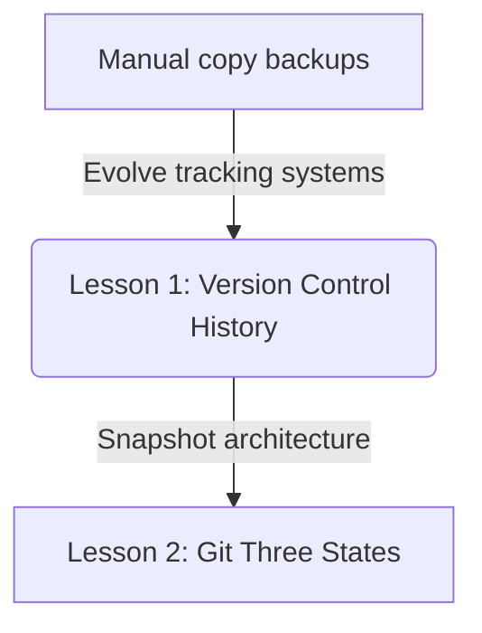
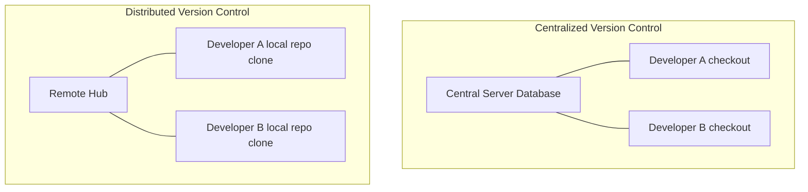

# Lesson 1: Version Control History — Core Concepts and Evolution

---

```yaml
lesson_id: "GIT-FND-001a"
subject: "Git"
course: "Git Fundamentals"
module: "Introduction to VCS"
difficulty: "⭐"
time_breakdown:
  reading: "10 min"
  exercise: "10 min"
  quiz: "5 min"
  revision: "5 min"
version: "1.0"
last_updated: "2026-07-17"
status: "Published"
author: "Rajasekar"
reviewed_by: "Admin"
prerequisites:
  - "Basic command line navigation"
tags:
  - "VCS"
  - "Git Origin"
  - "Distributed"
  - "Centralized"
```

---

## 1. Overview [id: overview]
This lesson explores the history and categories of Version Control Systems (VCS). We analyze why version tracking is necessary and trace the evolution from local files and centralized systems to modern distributed systems like Git.

## 2. Knowledge Connections [id: connections]


## 3. Learning Outcomes [id: outcomes]
- **Knowledge (What you will understand)**:
  - The historical progression of VCS (Local, Centralized, Distributed).
  - The key differences between centralized models (SVN) and distributed models (Git).
- **Skills (What you can do)**:
  - Compare system architectures and explain the origin and performance criteria of Git.
- **Outcome (Professional application)**:
  - Select appropriate collaboration models based on security, speed, and network availability.

## 4. Concept & Internals Deep-Dive [id: concept]
Version control is the practice of tracking and managing changes to software code.
- **Local VCS**: Simple database mapping files to version histories (e.g. RCS). Prone to human errors, like writing to the wrong directory.
- **Centralized VCS (CVCS)**: A single central database server hosting all versioned files. Clients check out files from this central source (e.g. SVN, Perforce). If the server goes down, collaboration halts.
- **Distributed VCS (DVCS)**: Clients fully clone the entire database repository history locally (e.g. Git, Mercurial). Every checkout is a complete backup of the data.

### Internals: Why Git is fast
Because every client has a complete local copy of the repository database, operations like diff, commit, and log run instantly without making network calls.

## 5. Professional Box: Industry Usage [id: industry_usage]
> [!NOTE]
> **Why Linux Switched to Git**:
> In 2005, the Linux kernel developers lost their free license for the proprietary DVCS tool BitKeeper. Linus Torvalds, the creator of Linux, designed Git in just a few weeks to serve as a fast, distributed, and highly secure alternative capable of handling thousands of branch merges per day.

## 6. Visual Learning & Architecture [id: visuals]


## 7. Terminology [id: terminology]
- **VCS**: Version Control System.
- **CVCS**: Centralized Version Control System.
- **DVCS**: Distributed Version Control System.

## 8. Installation & Configuration [id: setup]
Check your installed Git version:
```bash
git --version
```

## 9. Commands & Command Syntax [id: commands]
```bash
git --version
```

## 10. Practical Code Examples [id: examples]

### Easy
Check installed version:
```bash
git --version
```

### Medium
Print help parameters for configuration:
```bash
git help config
```

### Advanced
Retrieve internal system parameters:
```bash
git var -l
```

## 11. Common Errors & Troubleshooting [id: errors]

### Beginner Errors
- **Error**: `git is not recognized as an internal or external command`
  - *Fix*: Git is not installed or not added to your system's PATH variables. Restart your terminal after installing.

### Intermediate Errors
- **Error**: Permission denied (publickey) during remote clones.
  - *Fix*: Your local SSH key is not added to the remote host account settings.

### Professional Errors
- **Error**: Repository history database corruption due to hard-drive failures.
  - *Fix*: Restore the database fully by cloning from any team member's machine.

## 12. Comparison Tables [id: comparisons]
| Metric | Centralized (CVCS) | Distributed (DVCS) |
|---|---|---|
| Server Reliance | Hard reliance for all commits | Only for syncing remotes |
| Offline Work | Impossible | Fully supported |
| Branching Speed | Slow (requires network) | Fast (instant local logs) |

## 13. Best Practices & Professional Tips [id: best_practices]
- Use distributed workflows to commit locally before pushing code blocks.

## 14. Interview Preparation [id: interview]

### Fresher Questions
1. **Question**: What is the main drawback of centralized version control?
   * **Ideal Answer**: A single point of failure. If the central database server goes offline, developers cannot commit changes or review file history.

### 2 Years Experience Questions
2. **Question**: Why does Git perform diffs faster than CVCS?
   * **Ideal Answer**: Git does not need to send queries to a remote server. It reads the local repository database commits directly from your disk.

### 5 Years Experience Questions
3. **Question**: Explain why every DVCS checkout is a complete backup.
   * **Ideal Answer**: A clone in Git copies the entire project history, including all past branches, commit objects, and tag metadata.

### Architect Level Questions
4. **Question**: How did the BitKeeper licensing crisis shape Git's architecture?
   * **Ideal Answer**: It forced Linus Torvalds to design a system with three core design goals: absolute support for distributed workflows, strong safeguards against corruption, and high-performance throughput for thousands of concurrent file revisions.

## 15. Ingestion Exercises [id: exercises]

### MCQ
- Which system type clones the complete repository database to each client?
  - A) Centralized
  - B) Distributed (Correct)
  - C) Local

### Coding Challenge
- Run the command to check the installed version of Git.

### Predict the Output
- What does `git --version` output if Git is installed?
  - Output: `git version 2.x.x`

### Debugging Task
- Resolve the terminal error `git: command not found`.
  - Answer: Install Git via package manager or installer.

### Scenario Question
- A team works in an area with poor internet connectivity. Should they use SVN or Git?
  - Answer: Git, because all commits and history views run offline.

### Hands-on Lab
- Open terminal and check your git configuration credentials list using `git config --list`.

## 16. Graded Assignments [id: assignments]
Write a short report summarizing the differences between CVCS and DVCS. Explain how Git's speed benefits team collaboration.

## 17. Mini Projects [id: projects]
- **Mini Scale**: Verify and log the current local git client version.
- **Small Scale**: Check environmental PATH values for Git binaries.

## 18. Topic Cheat Sheet [id: cheatsheet]
- **Standard Syntax**: `git --version`
- **Aliases**: None.
- **Shortcut**: None.
- **Warning**: Avoid working without VCS in any production repository.

## 19. AI Generated Content [id: ai_notes]
- **AI Summary**: Centralized VCS uses a central database, while Distributed VCS clones the entire history locally.
- **AI Flashcards**:
  - Q: Who created Git?
  - A: Linus Torvalds.

## 20. References [id: references]
- [Git Documentation - About Version Control](https://git-scm.com/book/en/v2/Getting-Started-About-Version-Control)
