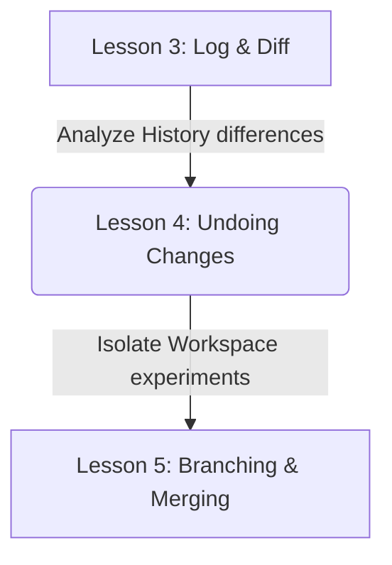
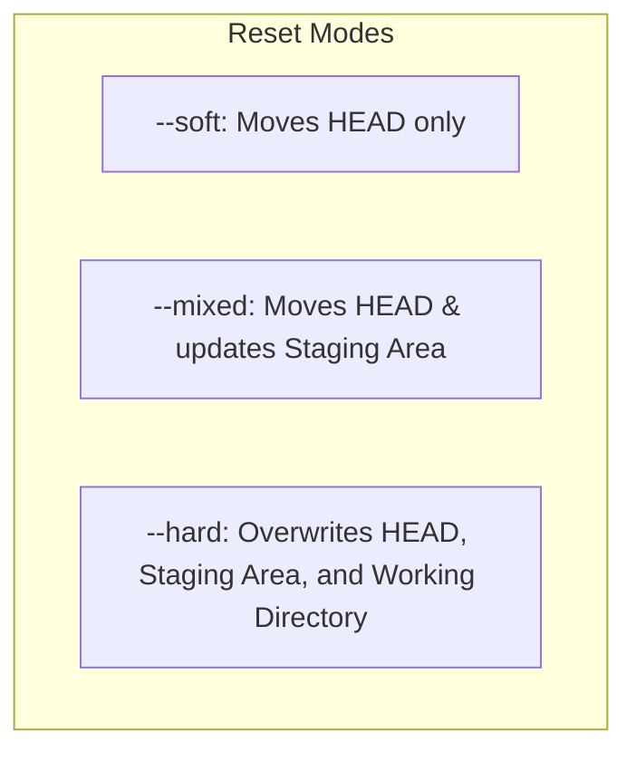

# Lesson 4: Undoing Changes — Reset, Revert, and Restore

---

```yaml
lesson_id: "GIT-FND-004"
subject: "Git"
course: "Git Fundamentals"
module: "Basic Local Workflow"
difficulty: "⭐⭐"
time_breakdown:
  reading: "15 min"
  exercise: "25 min"
  quiz: "10 min"
  revision: "5 min"
version: "1.0"
last_updated: "2026-07-17"
status: "Published"
author: "Rajasekar"
reviewed_by: "Admin"
prerequisites:
  - "GIT-FND-003 (Log and Diff)"
tags:
  - "Git Reset"
  - "Git Revert"
  - "Git Restore"
  - "Undoing Changes"
```

---

## 1. Overview [id: overview]
This lesson covers the primary mechanisms for correcting mistakes and rolling back state changes in Git. We explore the differences between resetting branch histories, reverting committed snapshots, and restoring working copy contents.

## 2. Knowledge Connections [id: connections]


## 3. Learning Outcomes [id: outcomes]
- **Knowledge (What you will understand)**:
  - The behavior of soft, mixed, and hard resets on the three Git states.
  - The architectural difference between modifying history (`reset`) and appending history (`revert`).
- **Skills (What you can do)**:
  - Unstage accidentally added files, discard working tree modifications, and safely revert commits.
- **Outcome (Professional application)**:
  - Perform safe rollback actions on collaborative repositories without destroying project history.

## 4. Concept & Internals Deep-Dive [id: concept]
Correcting errors requires choosing the right tool:
- **`git restore`**: Discards unstaged modifications in your Working Directory or unstages changes from the Staging Area. It operates on *files*, not commits.
- **`git reset`**: Moves the current branch HEAD pointer to a specific commit. It changes *where* the branch points.
  - `--soft`: Moves HEAD. Staging Area and Working Directory remain unchanged.
  - `--mixed` (default): Moves HEAD and updates Staging Area to match. Working Directory remains unchanged.
  - `--hard`: Moves HEAD, updates Staging Area, and overwrites Working Directory. **Destructive operation!**
- **`git revert`**: Appends a *new* commit that applies the exact inverse of the changes from a target commit. It does not rewrite history, making it safe for public repositories.

## 5. Professional Box: Industry Usage [id: industry_usage]
> [!NOTE]
> **Rollbacks at Amazon**:
> When an automated deployment pipeline at Amazon detects errors in a production canary server, it immediately triggers a git revert via API. Because revert appends history rather than rewriting it, the deployment pipeline preserves full audit trails of the failure and recovery commits.

## 6. Visual Learning & Architecture [id: visuals]


## 7. Terminology [id: terminology]
- **Detached HEAD**: A state where HEAD points to a specific commit rather than a branch.
- **Reflog**: A local log tracking every move of the HEAD pointer, allowing recovery of hard-reset commits.

## 8. Installation & Configuration [id: setup]
Configure your editor for commit reverts:
```bash
git config --global core.editor "code --wait"
```

## 9. Commands & Command Syntax [id: commands]
```bash
git restore <file>
git restore --staged <file>
git reset --soft <commit_hash>
git revert <commit_hash>
```

## 10. Practical Code Examples [id: examples]

### Easy
Unstage a file that was accidentally staged:
```bash
git restore --staged app.py
```

### Medium
Discard all local uncommitted edits:
```bash
git restore .
```

### Advanced
Recover from an accidental `git reset --hard HEAD~1` using the reflog database:
```bash
# Locate the lost commit hash in the reflog list
git reflog

# Reset HEAD back to the lost commit
git reset --hard HEAD@{1}
```

## 11. Common Errors & Troubleshooting [id: errors]

### Beginner Errors
- **Error**: `git reset --hard` deleted all uncommitted work.
  - *Fix*: Hard resets are destructive. Uncommitted changes are not saved in Git's object database and cannot be recovered via reflog.

### Intermediate Errors
- **Error**: Reverting a merge commit fails with `error: commit is a merge but no -m option was given`.
  - *Fix*: You must specify the parent side number to revert using `git revert -m 1 <commit_hash>`.

### Professional Errors
- **Error**: Pushing rewritten history after a local reset is rejected.
  - *Fix*: Never force-push (`-f`) modified histories if other team members have pulled those commits. Use `git revert` instead.

## 12. Comparison Tables [id: comparisons]
| Command | Modifies History? | Destructive to Working Directory? | Safe for Shared Remotes? |
|---|---|---|---|
| `git reset --soft` | Yes (local) | No | No |
| `git reset --hard` | Yes (local) | Yes (uncommitted edits lost) | No |
| `git revert` | No (appends) | No | Yes |

## 13. Best Practices & Professional Tips [id: best_practices]
- Use `git revert` for all shared remote branches.
- Use `git restore` to revert file changes instead of the legacy `git checkout <file>` syntax.

## 14. Interview Preparation [id: interview]

### Fresher Questions
1. **Question**: How do you unstage a file?
   * **Ideal Answer**: Use `git restore --staged <file>`. This removes the file modifications from the staging area but preserves the work in the working directory.

### 2 Years Experience Questions
2. **Question**: What is the difference between `git reset` and `git revert`?
   * **Ideal Answer**: `git reset` rewrites history by moving the branch pointer backward. `git revert` preserves history by creating a new commit with the opposite changes.

### 5 Years Experience Questions
3. **Question**: What happens to your working directory changes during a `git reset --soft HEAD~1`?
   * **Ideal Answer**: They remain completely intact. The commit is undone, and the changes are placed back in the Staging Area.

### Architect Level Questions
4. **Question**: If a developer runs `git reset --hard` and loses a committed branch, how does the reflog retrieve it?
   * **Ideal Answer**: The reflog stores a chronological record of where HEAD has pointed. Even if a commit is unreferenced by any branch, it remains in Git's object database until garbage collection. Finding the hash in `git reflog` and running `git reset --hard <hash>` restores the state.

## 15. Ingestion Exercises [id: exercises]

### MCQ
- Which reset mode modifies HEAD and Staging Area but leaves the Working Directory untouched?
  - A) `--soft`
  - B) `--mixed` (Correct)
  - C) `--hard`

### Coding Challenge
- Unstage a file named `config.json`.

### Predict the Output
- If you run `git revert HEAD` on a clean directory, what type of commit is created?
  - Output: A new commit with message "Revert '...'".

### Debugging Task
- Recover a lost commit from `git reflog` by returning HEAD to `HEAD@{3}`.
  - Answer: `git reset --hard HEAD@{3}`.

### Scenario Question
- A developer pushed a broken commit to the remote production branch. What command should they use to fix this?
  - Answer: `git revert <commit_hash>` and push.

### Hands-on Lab
- Make changes to `test.py`, run `git restore --staged test.py` (if staged), then `git restore test.py` to discard.

## 16. Graded Assignments [id: assignments]
Create a repository, run two commits. Run a hard reset to the first commit. Use `git reflog` to recover and return back to the second commit. Submit your reflog history output.

## 17. Mini Projects [id: projects]
- **Mini Scale**: Write a script to quickly restore all uncommitted files.
- **Small Scale**: Create an alias helper for soft resets.
- **Medium Scale**: Design a tool checking commit dates to restrict resets.
- **Industry Scale**: Build an automation script scanning git reflog logs to find dangling commit objects and auto-generate recovery branches.

## 18. Topic Cheat Sheet [id: cheatsheet]
- **Standard Syntax**: `git reset --hard <hash>`
- **Aliases**: `git config --global alias.unstage "restore --staged"`
- **Shortcut**: Use `git checkout .` as legacy shortcut for `git restore .`.
- **Warning**: Never run `git reset --hard` on public shared branches.

## 19. AI Generated Content [id: ai_notes]
- **AI Summary**: Learn to undo changes: `restore` for files, `reset` for local branches, and `revert` for public commits.
- **AI Flashcards**:
  - Q: Which command deletes uncommitted edits permanently?
  - A: `git reset --hard`.

## 20. References [id: references]
- [Git Documentation - Undoing Things](https://git-scm.com/book/en/v2/Git-Basics-Undoing-Things)
