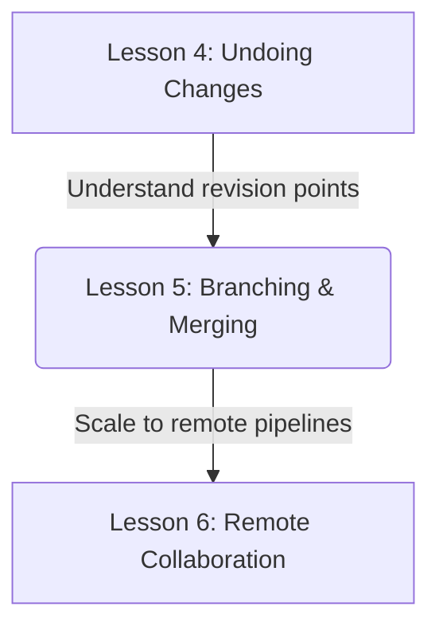
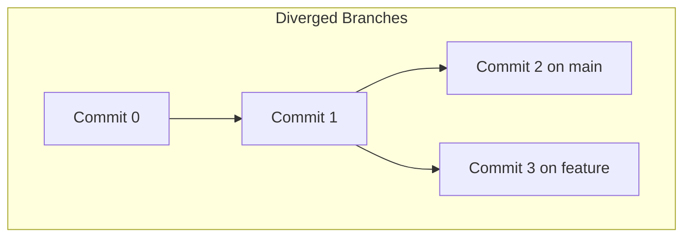

# Lesson 5: Branching and Merging Basics — Creating, Switching, and Merging

---

```yaml
lesson_id: "GIT-FND-005"
subject: "Git"
course: "Git Fundamentals"
module: "Branching & Merging Basics"
difficulty: "⭐⭐"
time_breakdown:
  reading: "15 min"
  exercise: "25 min"
  quiz: "10 min"
  revision: "5 min"
version: "1.0"
last_updated: "2026-07-17"
status: "Published"
author: "Rajasekar"
reviewed_by: "Admin"
prerequisites:
  - "GIT-FND-004 (Undoing Changes)"
tags:
  - "Git Branch"
  - "Git Merge"
  - "Switch Branch"
  - "Fast-Forward"
```

---

## 1. Overview [id: overview]
This lesson covers Git's core branching model. You will learn how to create independent development lines, switch between them, merge code using fast-forward and three-way strategies, and resolve basic merge conflicts.

## 2. Knowledge Connections [id: connections]


## 3. Learning Outcomes [id: outcomes]
- **Knowledge (What you will understand)**:
  - How branches are implemented as lightweight references pointing to commit hashes.
  - The difference between Fast-Forward merges and Three-Way (Recursive) merges.
- **Skills (What you can do)**:
  - Create and switch branches, merge codebases, identify conflict zones, and resolve merge conflicts.
- **Outcome (Professional application)**:
  - Isolate feature development using branches to keep production code clean and stable.

## 4. Concept & Internals Deep-Dive [id: concept]
In Git, a branch is simply a lightweight, mutable pointer to a commit hash. When you commit, the branch pointer automatically moves forward to point to the new commit.
The **HEAD** pointer is a reference that points to the current active branch pointer (or to a specific commit if detached).

### Merging Strategies
- **Fast-Forward Merge**: Occurs when the target branch has not diverged from the source branch. Git simply moves the branch pointer forward. No new merge commit is created.
- **Three-Way Merge (Recursive)**: Occurs when the branches have diverged. Git finds the common ancestor commit, compares both branches' latest snapshots, merges the changes, and automatically creates a new **Merge Commit** pointing to both parent commits.

## 5. Professional Box: Industry Usage [id: industry_usage]
> [!NOTE]
> **Branching Workflows at GitHub**:
> GitHub uses the "GitHub Flow" model. Every new feature, bug fix, or documentation change is developed in a dedicated feature branch. Once complete, a Pull Request is opened, code review is completed, tests are verified, and the branch is merged into the main branch.

## 6. Visual Learning & Architecture [id: visuals]


## 7. Terminology [id: terminology]
- **Fast-Forward**: A merge where the branch pointer is simply moved forward.
- **Merge Commit**: A commit with two or more parent commits, representing a combined state.
- **Merge Conflict**: A state where Git cannot automatically merge changes because line edits overlap.

## 8. Installation & Configuration [id: setup]
Configure default branch name for new repositories:
```bash
git config --global init.defaultBranch main
```

## 9. Commands & Command Syntax [id: commands]
```bash
git branch <branch_name>
git switch <branch_name>
git merge <branch_name>
```

## 10. Practical Code Examples [id: examples]

### Easy
Create a new feature branch and switch to it:
```bash
git switch -c feature-login
```

### Medium
Merge a feature branch back into main:
```bash
git switch main
git merge feature-login
```

### Advanced
Resolving a merge conflict:
```bash
# Git merge outputs: "Automatic merge failed; fix conflicts..."
# Open conflict file to locate markers:
# <<<<<<< HEAD
# print("Version A")
# =======
# print("Version B")
# >>>>>>> feature-branch

# Edit file to resolve conflict, then stage and commit:
git add conflict_file.py
git commit -m "Merge branch feature-branch and resolve conflicts"
```

## 11. Common Errors & Troubleshooting [id: errors]

### Beginner Errors
- **Error**: `fatal: A branch named 'feature-auth' already exists.`
  - *Fix*: You tried to create an existing branch. Switch to it using `git switch feature-auth`.

### Intermediate Errors
- **Error**: Accidental merge of a wrong branch.
  - *Fix*: Abort the merge using `git merge --abort`.

### Professional Errors
- **Error**: Merge conflict in binary files (e.g. image files).
  - *Fix*: Select one version explicitly using `git checkout --ours image.png` or `git checkout --theirs image.png`.

## 12. Comparison Tables [id: comparisons]
| Merge Type | Requires Divergent Commits? | Creates Merge Commit? | Pointer Moved? |
|---|---|---|---|
| Fast-Forward | No | No | Yes |
| Three-Way (Recursive) | Yes | Yes | Yes |

## 13. Best Practices & Professional Tips [id: best_practices]
- **Keep branches short-lived**: Merge feature branches back into main as soon as they are tested.
- **Delete merged branches**: Clean up local branches using `git branch -d <branch_name>`.

## 14. Interview Preparation [id: interview]

### Fresher Questions
1. **Question**: What is a branch in Git?
   * **Ideal Answer**: A branch is a lightweight pointer to a commit hash. Git uses branches to isolate code changes.

### 2 Years Experience Questions
2. **Question**: What is the difference between a fast-forward merge and a three-way merge?
   * **Ideal Answer**: A fast-forward merge simply moves the branch pointer forward when there is no divergence. A three-way merge creates a new merge commit because both branches have changed independently.

### 5 Years Experience Questions
3. **Question**: How do you resolve a merge conflict?
   * **Ideal Answer**: Open the conflicted files, analyze the conflict markers (`<<<<<<<`, `=======`, `>>>>>>>`), choose the correct code version, remove the markers, stage the resolved files with `git add`, and run `git commit` to complete the merge.

### Architect Level Questions
4. **Question**: Explain how the HEAD pointer tracks active branches internally.
   * **Ideal Answer**: HEAD is a reference file located at `.git/HEAD`. It contains a path reference to a branch ref file, e.g., `ref: refs/heads/main`. The branch ref file contains the 40-character SHA-1 commit hash. When you commit, Git updates the commit hash in the branch ref file, and HEAD follows it.

## 15. Ingestion Exercises [id: exercises]

### MCQ
- Which command switches to a branch and creates it if it does not exist?
  - A) `git branch -c`
  - B) `git switch -c` (Correct)
  - C) `git checkout -b` (Correct - legacy)

### Coding Challenge
- Create and switch to a branch named `fix-bug`.

### Predict the Output
- If you run `git merge --abort` during a conflict, what state does the repository return to?
  - Output: The state before the merge attempt started.

### Debugging Task
- Resolve a conflict where HEAD has `val = 1` and branch has `val = 2` by selecting `val = 2`.
  - Answer: Replace conflict block with `val = 2`, stage, and commit.

### Scenario Question
- A developer wants to see all local branches. What command should they use?
  - Answer: `git branch` or `git branch -a`.

### Hands-on Lab
- Initialize repo, add file on main, create feature branch, edit file on feature, switch to main, merge.

## 16. Graded Assignments [id: assignments]
Create a repository with a file. Branch off, make different changes to the same line in both branches, merge them to trigger a conflict, resolve the conflict, and export the merge commit details.

## 17. Mini Projects [id: projects]
- **Mini Scale**: Script to list all merged branches.
- **Small Scale**: Create a shortcut alias for branch cleanups.
- **Medium Scale**: Design a workflow script enforcing branch naming conventions (e.g. `feat/*`).
- **Industry Scale**: Build an automation script alerting developers if a feature branch is divergent by more than 20 commits from main.

## 18. Topic Cheat Sheet [id: cheatsheet]
- **Standard Syntax**: `git branch -d <branch_name>`
- **Aliases**: `git config --global alias.sw switch`
- **Shortcut**: `git merge --abort` resets merge state.
- **Warning**: Do not merge untested feature branches into main.

## 19. AI Generated Content [id: ai_notes]
- **AI Summary**: Learn to create branches for code isolation and merge them using FF or 3-way strategies.
- **AI Flashcards**:
  - Q: What file tracks the current branch?
  - A: `.git/HEAD`.

## 20. References [id: references]
- [Git Documentation - Branching Basic Merging](https://git-scm.com/book/en/v2/Git-Branching-Basic-Branching-and-Merging)
