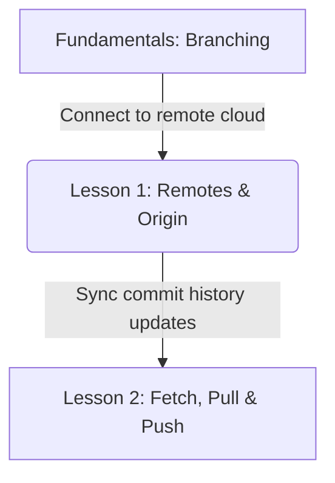
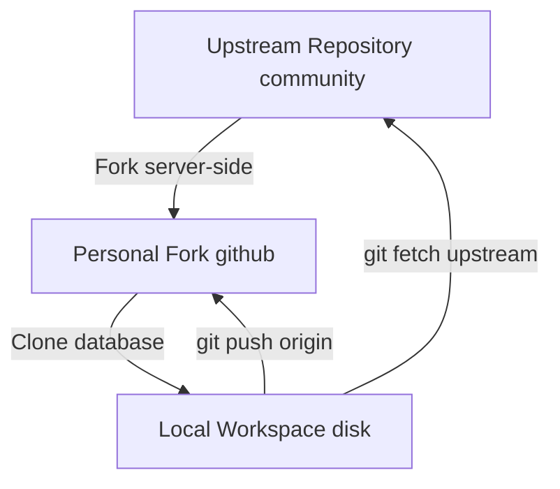

# Lesson 1: Remote Repositories and Origin Configuration — Establishing remotes and naming conventions

---

```yaml
lesson_id: "GIT-COL-001"
subject: "Git"
course: "Git Collaboration"
module: "Remotes & Origin"
difficulty: "⭐⭐"
time_breakdown:
  reading: "12 min"
  exercise: "15 min"
  quiz: "10 min"
  revision: "5 min"
version: "1.0"
last_updated: "2026-07-17"
status: "Published"
author: "Rajasekar"
reviewed_by: "Admin"
prerequisites:
  - "GIT-FND-005 (Branching Basics)"
tags:
  - "Git Remote"
  - "Origin"
  - "Clone"
  - "Fork"
```

---

## 1. Overview [id: overview]
This lesson teaches how to link your local Git workspace to external cloud repositories. You will learn the mechanics of Git remotes, cloning databases, configure origin aliases, and the structural differences between clones and forks.

## 2. Knowledge Connections [id: connections]


## 3. Learning Outcomes [id: outcomes]
- **Knowledge (What you will understand)**:
  - How Git tracks remote references mapping local namespaces.
  - The architectural difference between cloning a repository and creating a server-side fork.
- **Skills (What you can do)**:
  - Add, rename, query, and remove remotes. Clone remote repositories using HTTP and SSH keys.
- **Outcome (Professional application)**:
  - Configure multi-remote workspaces to manage open-source contributions and team deployment streams.

## 4. Concept & Internals Deep-Dive [id: concept]
A **remote repository** is a version of your project that is hosted on the internet or network.
- **`origin`**: When you clone a repository, Git automatically creates a remote connection alias named `origin` pointing back to the cloned URL.
- **Clone vs. Fork**:
  - **Clone**: Copies the remote repository database to your local machine. You now have full commit rights locally, but can only push to remote if authorized.
  - **Fork**: A server-side copy of a repository (e.g. on GitHub). It is completely independent of the original. You clone your fork locally, make modifications, and submit a Pull Request to merge changes back to the original source.

### Internals: Remote-Tracking Branches
Git stores remote branch pointers under `.git/refs/remotes/origin/`. You cannot move these pointers locally. They only update when you perform data syncing operations (`fetch` or `pull`).

## 5. Professional Box: Industry Usage [id: industry_usage]
> [!NOTE]
> **Open Source Workflows at Red Hat**:
> Engineers contributing to projects like Kubernetes or Linux kernel fork the upstream codebase, add a remote alias named `upstream` pointing to the main project, and another named `origin` pointing to their personal fork. This allows them to stay in sync with community releases while pushing feature code blocks.

## 6. Visual Learning & Architecture [id: visuals]


## 7. Terminology [id: terminology]
- **Remote**: An alias pointer mapping a URL hosting your code history.
- **Origin**: The default name Git gives to the remote repository you cloned from.
- **Upstream**: A term refering to the main original repository from which a project was forked.

## 8. Installation & Configuration [id: setup]
To add a remote tracking connection using SSH:
```bash
git remote add origin git@github.com:username/project.git
```

## 9. Commands & Command Syntax [id: commands]
```bash
git remote -v
git remote add <name> <url>
git clone <url>
```

## 10. Practical Code Examples [id: examples]

### Easy
List all configured remote servers connections:
```bash
git remote -v
```

### Medium
Linking a local repository to GitHub:
```bash
# Initialize local
git init

# Link to remote
git remote add origin https://github.com/rajasekarrk96/app.git

# Verify link
git remote -v
```

### Advanced
Configuring push URL separate from fetch URL for secure audits:
```bash
git remote set-url --push origin https://secure-gate.company.com/repo.git
```

## 11. Common Errors & Troubleshooting [id: errors]

### Beginner Errors
- **Error**: `fatal: remote origin already exists.`
  - *Fix*: The remote name `origin` is already in use. Rename it using `git remote rename origin old-origin` or modify it using `git remote set-url origin <new_url>`.

### Intermediate Errors
- **Error**: `fatal: 'origin' does not appear to be a git repository`
  - *Fix*: You forgot to define the remote URL, or misspelled the name. Run `git remote -v` to check configured URLs.

### Professional Errors
- **Error**: Authentication failures when pushing via HTTPS after credentials modifications.
  - *Fix*: Clear cached credentials helper: `git credential-manager clear` or use SSH keys mappings.

## 12. Comparison Tables [id: comparisons]
| Metric | Git Clone | Git Fork |
|---|---|---|
| Target Location | Local computer disk | Hosting Server (e.g. GitHub) |
| Core Operation | Copy database history | Duplicate project repository |
| Relationship | Linked to source via `origin` | Isolated, submits PRs to original |

## 13. Best Practices & Professional Tips [id: best_practices]
- **Verify remotes before pushing**: Run `git remote -v` to ensure you are pushing to the correct server.
- Use SSH keys instead of password-based HTTPS clones for secure automation.

## 14. Interview Preparation [id: interview]

### Fresher Questions
1. **Question**: What is 'origin' in Git?
   * **Ideal Answer**: 'origin' is a default alias pointer name Git creates when you clone a repository, mapping back to the remote server URL.

### 2 Years Experience Questions
2. **Question**: What is the difference between cloning and forking?
   * **Ideal Answer**: Forking duplicates the repository on the server-side, giving you a personal copy. Cloning downloads a copy of the repository to your local machine.

### 5 Years Experience Questions
3. **Question**: How do you sync changes from an upstream repository to a forked local repository?
   * **Ideal Answer**: Add a remote for the parent repository: `git remote add upstream <url>`. Fetch the upstream branches: `git fetch upstream`. Merge the changes: `git merge upstream/main`.

### Architect Level Questions
4. **Question**: Explain how Git structures remote-tracking references under the hood.
   * **Ideal Answer**: Remote branches are stored as files in `.git/refs/remotes/<remote_name>/`. They record the state of remote branches at the time of your last fetch. Git prevents you from checking them out directly or modifying them. You must create a local branch that tracks them instead.

## 15. Ingestion Exercises [id: exercises]

### MCQ
- Which command prints the URLs of configured remotes?
  - A) `git remote`
  - B) `git remote -v` (Correct)
  - C) `git remote -l`

### Coding Challenge
- Add a remote named `backup` pointing to `https://backup.git`.

### Predict the Output
- What does `git remote` output on a fresh clone?
  - Output: `origin`

### Debugging Task
- Rename remote `origin` to `source`.
  - Answer: `git remote rename origin source`.

### Scenario Question
- A developer wants to clone a repository into a specific directory named `my-code`. What command should they use?
  - Answer: `git clone <url> my-code`.

### Hands-on Lab
- Check your local repository remote URLs using `git remote -v`.

## 16. Graded Assignments [id: assignments]
Fork a public template repository. Clone it to your local machine, inspect the remote URLs, and submit the terminal logs.

## 17. Mini Projects [id: projects]
- **Mini Scale**: Script to print all remote names.
- **Small Scale**: Automated script checking if Git remote connection is reachable.

## 18. Topic Cheat Sheet [id: cheatsheet]
- **Standard Syntax**: `git remote add <name> <url>`
- **Aliases**: None.
- **Shortcut**: None.
- **Warning**: Do not push code containing API keys to public remotes.

## 19. AI Generated Content [id: ai_notes]
- **AI Summary**: Learn to connect local workspaces to remote servers, query remotes, and use forks.
- **AI Flashcards**:
  - Q: How do you remove a remote named `backup`?
  - A: `git remote remove backup`.

## 20. References [id: references]
- [Git Documentation - Working with Remotes](https://git-scm.com/book/en/v2/Git-Basics-Working-with-Remotes)
