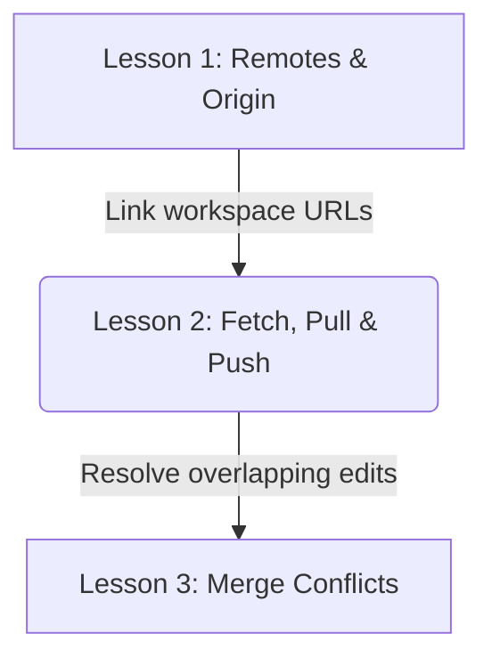
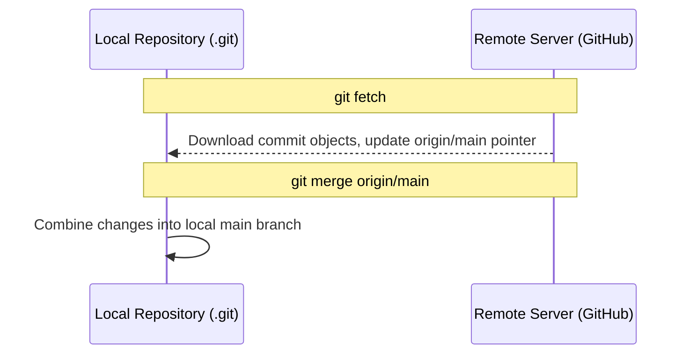

# Lesson 2: Syncing Data — Fetch, Pull, and Push

---

```yaml
lesson_id: "GIT-COL-002"
subject: "Git"
course: "Git Collaboration"
module: "Data Syncing"
difficulty: "⭐⭐"
time_breakdown:
  reading: "15 min"
  exercise: "20 min"
  quiz: "10 min"
  revision: "5 min"
version: "1.0"
last_updated: "2026-07-17"
status: "Published"
author: "Rajasekar"
reviewed_by: "Admin"
prerequisites:
  - "GIT-COL-001 (Remotes & Origin)"
tags:
  - "Git Fetch"
  - "Git Pull"
  - "Git Push"
  - "Syncing"
```

---

## 1. Overview [id: overview]
This lesson covers Git's core network synchronization workflows. We analyze how data flows between local repositories and remotes, comparing the mechanics of fetch, pull (fetch + merge), and push.

## 2. Knowledge Connections [id: connections]


## 3. Learning Outcomes [id: outcomes]
- **Knowledge (What you will understand)**:
  - The difference between `git fetch` (inspect metadata) and `git pull` (fetch + merge).
  - How tracking branches establish local/remote mapping links.
- **Skills (What you can do)**:
  - Download remote commits, update branch HEAD positions, publish code, and configure pull rebase workflows.
- **Outcome (Professional application)**:
  - Maintain clean linear histories in team branches by executing safe retrieval integration protocols.

## 4. Concept & Internals Deep-Dive [id: concept]
Data flow syncing uses three main operations:
- **`git fetch`**: Downloads all objects and refs from the remote repository that are not in your local workspace. It updates remote-tracking pointers under `refs/remotes/origin/` but does not touch your Working Directory or active branches. It is 100% safe.
- **`git pull`**: Performs a `fetch` and immediately merges the retrieved changes into your active local branch. It modifies your Working Directory.
  - Formula: `git pull` = `git fetch` + `git merge`.
- **`git push`**: Uploads your local commit objects and branch pointers to the remote repository.

### Internals: Upstream Tracking Relationships
A local branch can track a remote branch. When you run `git status`, Git compares your branch commit pointer with the remote tracking pointer (e.g. `origin/main`) and reports if you are "ahead" or "behind" commits.

## 5. Professional Box: Industry Usage [id: industry_usage]
> [!NOTE]
> **Rebase Pulls at Uber**:
> Large engineering teams at Uber avoid merge commits by configuring pull to run rebase by default: `git config --global pull.rebase true`. When engineers run `git pull`, Git fetches updates and replays their local unpushed commits on top of the remote changes, maintaining a clean, linear project history log.

## 6. Visual Learning & Architecture [id: visuals]


## 7. Terminology [id: terminology]
- **Fast-Forward Pull**: A pull operation that simply moves the local branch pointer forward because no local commits diverged.
- **Tracking Branch**: A local branch linked directly to a remote branch, enabling simplified syncing.

## 8. Installation & Configuration [id: setup]
Configure pull to run rebase by default:
```bash
git config --global pull.rebase true
```

## 9. Commands & Command Syntax [id: commands]
```bash
git fetch <remote>
git pull <remote> <branch>
git push <remote> <branch>
```

## 10. Practical Code Examples [id: examples]

### Easy
Download remote updates without modifying working copy files:
```bash
git fetch origin
```

### Medium
Publishing a new local feature branch to GitHub:
```bash
# Create feature branch
git switch -c feature-ui

# Commit changes, then push and set tracking upstream link
git push -u origin feature-ui
```

### Advanced
Force-pushing changes after rewriting history (using force-with-lease for safety):
```bash
git push --force-with-lease origin main
```

## 11. Common Errors & Troubleshooting [id: errors]

### Beginner Errors
- **Error**: `fatal: The current branch has no upstream branch.`
  - *Fix*: You created a branch locally but did not link it on the server. Run `git push -u origin <branch_name>` to publish and establish link tracking.

### Intermediate Errors
- **Error**: `Updates were rejected because the remote contains work that you do not have locally.`
  - *Fix*: Your branch is behind. Run `git pull` or `git fetch` followed by `git merge origin/<branch>` before attempting to push again.

### Professional Errors
- **Error**: Accidental force push overrides co-workers' remote commits.
  - *Fix*: Use `git push --force-with-lease` which aborts the push if the remote branch has new commits added by others since your last fetch.

## 12. Comparison Tables [id: comparisons]
| Command | Downloads Objects? | Modifies Working Directory? | Overwrites Remote History? |
|---|---|---|---|
| `git fetch` | Yes | No | No |
| `git pull` | Yes | Yes | No |
| `git push` | No (Uploads) | No | No (unless forced) |

## 13. Best Practices & Professional Tips [id: best_practices]
- **Fetch before you merge**: Inspect the remote status using `git fetch` and `git status` before merging or pulling changes blindly.
- Use `git push -u` on your first push to simplify future commands to `git push` and `git pull`.

## 14. Interview Preparation [id: interview]

### Fresher Questions
1. **Question**: What does the `-u` flag do in `git push -u`?
   * **Ideal Answer**: The `-u` (or `--set-upstream`) flag links the local branch to the remote branch, allowing you to use `git push` and `git pull` without specifying remote and branch names in the future.

### 2 Years Experience Questions
2. **Question**: What is the difference between `git fetch` and `git pull`?
   * **Ideal Answer**: `git fetch` downloads remote objects and updates pointers but does not modify your local work. `git pull` downloads the changes and automatically merges them into your active branch.

### 5 Years Experience Questions
3. **Question**: Why is `git push --force-with-lease` preferred over `git push -f`?
   * **Ideal Answer**: `--force-with-lease` is a safety mechanism. It refuses to force-push if another developer has pushed new commits to the remote branch since you last fetched, preventing you from accidentally overwriting their work.

### Architect Level Questions
4. **Question**: Under what circumstances does `git pull` generate a merge commit, and how can this be architecturally avoided?
   * **Ideal Answer**: `git pull` generates a merge commit when your local branch and the remote tracking branch have diverged (both have new, unique commits). It can be avoided by configuring `git pull --rebase`, which reapplies your local commits on top of the fetched remote commit history, keeping history linear.

## 15. Ingestion Exercises [id: exercises]

### MCQ
- Which command downloads remote changes but does not alter your working tree?
  - A) `git pull`
  - B) `git fetch` (Correct)
  - C) `git push`

### Coding Challenge
- Push a branch named `main` and set its upstream tracking branch.

### Predict the Output
- If you run `git status` after a fetch and you are 2 commits ahead of remote, what does it output?
  - Output: `Your branch is ahead of 'origin/main' by 2 commits.`

### Debugging Task
- Resolve a rejected push error due to remote changes.
  - Answer: Run `git pull` to fetch and merge, resolve conflicts if any, then run `git push`.

### Scenario Question
- A developer wants to see what changes others pushed before merging them. What commands should they run?
  - Answer: `git fetch` followed by `git diff HEAD..origin/main`.

### Hands-on Lab
- Run `git fetch`, then run `git status` to verify if your branch matches remote.

## 16. Graded Assignments [id: assignments]
Clone a shared team repository. Make a local commit, fetch remote updates, inspect local differences using `git log HEAD..origin/main`, merge, and push your changes. Export the execution logs.

## 17. Mini Projects [id: projects]
- **Mini Scale**: Script verifying if local is ahead or behind origin branch.
- **Small Scale**: Autorefresh script fetching origin updates every hour.

## 18. Topic Cheat Sheet [id: cheatsheet]
- **Standard Syntax**: `git push <remote> <branch>`
- **Aliases**: None.
- **Shortcut**: None.
- **Warning**: Never force push to shared default integration branches.

## 19. AI Generated Content [id: ai_notes]
- **AI Summary**: Learn to upload and download code updates safely using fetch, pull, and push.
- **AI Flashcards**:
  - Q: What does `git pull` do under the hood?
  - A: `git fetch` followed by `git merge`.

## 20. References [id: references]
- [Git Documentation - Fetching and Pushing](https://git-scm.com/book/en/v2/Git-Basics-Working-with-Remotes#_fetching_and_pushing_your_remotes)
