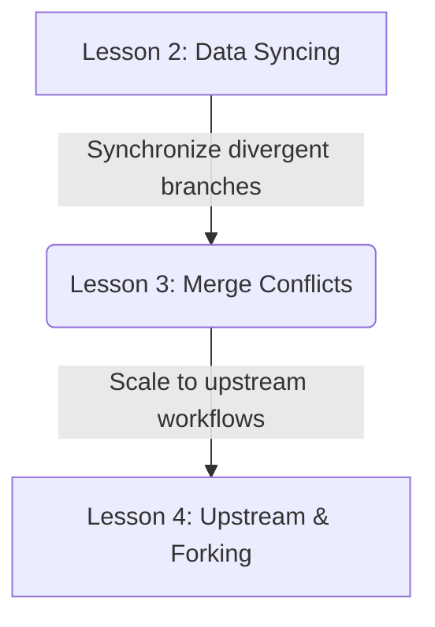
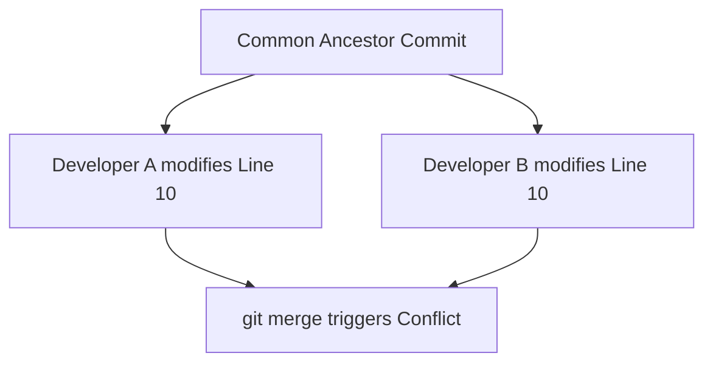

# Lesson 3: Handling Merge Conflicts in Teams — Visual markers and resolution strategies

---

```yaml
lesson_id: "GIT-COL-003"
subject: "Git"
course: "Git Collaboration"
module: "Merge Conflicts"
difficulty: "⭐⭐⭐"
time_breakdown:
  reading: "15 min"
  exercise: "25 min"
  quiz: "10 min"
  revision: "5 min"
version: "1.0"
last_updated: "2026-07-17"
status: "Published"
author: "Rajasekar"
reviewed_by: "Admin"
prerequisites:
  - "GIT-COL-002 (Data Syncing)"
tags:
  - "Merge Conflicts"
  - "Conflict Resolution"
  - "Git Merge"
  - "Syncing"
```

---

## 1. Overview [id: overview]
This lesson covers conflict management in collaborative developer environments. You will learn why merge conflicts occur, how to interpret conflict markers, and strategies for resolving overlaps during merges or rebases.

## 2. Knowledge Connections [id: connections]


## 3. Learning Outcomes [id: outcomes]
- **Knowledge (What you will understand)**:
  - Why Git enters conflict states (overlapping line modifications vs file deletion mismatches).
  - The meaning of `HEAD` (ours) and branch (theirs) references during merge conflicts.
- **Skills (What you can do)**:
  - Read conflict blocks, resolve file conflicts, use git merge tools, and safely abort failed merges.
- **Outcome (Professional application)**:
  - Coordinate code integrations with teammates by resolving conflicts without losing active logic.

## 4. Concept & Internals Deep-Dive [id: concept]
A **merge conflict** occurs when Git attempts to merge two branches that have divergent edits on the exact same line of a file, or if one developer deletes a file that another developer modified.
When this happens:
1. Git halts the merge process and does not create a merge commit.
2. It marks the conflicted file as "unmerged" in the Staging Area index.
3. It inserts **conflict markers** directly into the conflicted file to show the differences.

### Understanding Conflict Markers
```text
<<<<<<< HEAD
code changes on your active local branch
=======
code changes on the incoming merged branch
>>>>>>> feature-branch
```
- `<<<<<<< HEAD`: Starts the section containing edits from your active branch.
- `=======`: Divides the two conflicted versions.
- `>>>>>>> feature-branch`: Closes the section containing edits from the incoming branch.

## 5. Professional Box: Industry Usage [id: industry_usage]
> [!NOTE]
> **Conflict Resolution at GitLab**:
> Product teams at GitLab use Web IDE conflict resolution interfaces. When a merge request has conflicts, developers can click "Resolve conflicts" to view the code blocks side-by-side in their browser, toggle between ours/theirs versions, edit lines, and commit resolutions directly without using local CLI tools.

## 6. Visual Learning & Architecture [id: visuals]


## 7. Terminology [id: terminology]
- **Three-Way Merge Ancestor**: The last shared commit parent of two divergent branches.
- **Ours**: The active branch state you are currently checked out on (represented by HEAD).
- **Theirs**: The incoming branch state you are merging into your active branch.

## 8. Installation & Configuration [id: setup]
Configure Visual Studio Code as your default merge tool helper:
```bash
git config --global merge.tool code
git config --global mergetool.code.cmd "code --wait --merge \$LOCAL \$REMOTE \$BASE \$MERGED"
```

## 9. Commands & Command Syntax [id: commands]
```bash
git merge <branch>
git status
git merge --abort
```

## 10. Practical Code Examples [id: examples]

### Easy
Abort a conflicted merge to restore previous state:
```bash
git merge --abort
```

### Medium
Checking which files are in conflict:
```bash
# Run status to see unmerged files lists
git status
# Conflicted files are labeled under "Unmerged paths"
```

### Advanced
Using diff3 format to display the common ancestor state in conflict markers:
```bash
# Configure diff3 layout
git config --global merge.conflictstyle diff3

# Conflict markers will now include the shared ancestor baseline:
# <<<<<<< HEAD
# local version
# ||||||| parent of...
# original common ancestor version
# =======
# incoming version
# >>>>>>> feature-branch
```

## 11. Common Errors & Troubleshooting [id: errors]

### Beginner Errors
- **Error**: Accidental commit of files containing conflict markers.
  - *Fix*: You forgot to delete the marker lines. Open the file, search for `<<<<<<<`, delete all marker lines, stage the file with `git add`, and re-commit.

### Intermediate Errors
- **Error**: Getting stuck in a loop resolving the same conflicts during a rebase.
  - *Fix*: A rebase applies commits one-by-one. You must resolve conflicts for *each* commit. If it gets too complex, run `git rebase --abort`.

### Professional Errors
- **Error**: Accidental override of critical code by choosing "ours" or "theirs" blindly.
  - *Fix*: Always coordinate with the author of the conflicting commit before finalizing resolutions.

## 12. Comparison Tables [id: comparisons]
| Parameter | Ours (HEAD) | Theirs (Incoming) |
|---|---|---|
| Role during `git merge` | Active branch you are on | Branch you are pulling in |
| Role during `git rebase` | Upstream branch you rebase onto | Your commits being replayed |

## 13. Best Practices & Professional Tips [id: best_practices]
- **Pull frequently**: Regularly merge or rebase the remote main branch into your feature branch to address conflicts early.
- **Run tests before committing resolution**: Never finalize a conflict merge without compiling and testing the resolved code first.

## 14. Interview Preparation [id: interview]

### Fresher Questions
1. **Question**: When does a merge conflict occur in Git?
   * **Ideal Answer**: A merge conflict occurs when Git tries to combine commits from two branches that have different modifications on the exact same line of a file, preventing automatic resolution.

### 2 Years Experience Questions
2. **Question**: What is the difference between Ours and Theirs during a merge?
   * **Ideal Answer**: 'Ours' refers to the active branch you are currently on. 'Theirs' refers to the incoming branch you are merging into your active branch.

### 5 Years Experience Questions
3. **Question**: How does setting `merge.conflictstyle` to `diff3` assist in debugging conflicts?
   * **Ideal Answer**: Standard conflicts only show Ours and Theirs. `diff3` inserts a third section showing the text as it was in the common ancestor commit. This reveals what *both* developers changed, making it much easier to determine the correct merge resolution.

### Architect Level Questions
4. **Question**: Explain how Git represents unmerged conflicted files inside the index database structure.
   * **Ideal Answer**: Git uses index slots 1, 2, and 3 inside `.git/index` for conflicted files. Slot 1 stores the common ancestor blob hash, Slot 2 stores the local active branch (Ours) version, and Slot 3 stores the incoming branch (Theirs) version. When you stage a resolved file with `git add`, Git evicts slots 1, 2, and 3, replacing them with a single entry in Slot 0, indicating the conflict is resolved.

## 15. Ingestion Exercises [id: exercises]

### MCQ
- What symbol marks the start of your local changes in a conflict block?
  - A) `<<<<<<< HEAD` (Correct)
  - B) `=======`
  - C) `>>>>>>>`

### Coding Challenge
- Abort a merge conflict state.

### Predict the Output
- If you run `git status` during a merge conflict, what header label identifies the conflicted files?
  - Output: `Unmerged paths:`

### Debugging Task
- Clean up a file containing standard conflict markers by keeping only the incoming branch line `active = true`.
  - Answer: Delete markers and local lines, keeping only `active = true`, then run `git add`.

### Scenario Question
- A developer is resolving conflicts. They run `git add resolved.py`. What is the next command to complete the merge?
  - Answer: `git commit` or `git merge --continue`.

### Hands-on Lab
- Edit a file on main, switch to branch, edit same line, merge main to trigger conflict, resolve.

## 16. Graded Assignments [id: assignments]
Create a merge conflict in a text file. Export the file with conflict markers visible, document your resolution plan, resolve, and submit the final merge commit object hash.

## 17. Mini Projects [id: projects]
- **Mini Scale**: Script showing all unmerged paths.
- **Small Scale**: Alias setting to abort merges instantly.

## 18. Topic Cheat Sheet [id: cheatsheet]
- **Standard Syntax**: `git merge --abort`
- **Aliases**: None.
- **Shortcut**: None.
- **Warning**: Do not delete conflict markers without reviewing the code.

## 19. AI Generated Content [id: ai_notes]
- **AI Summary**: Learn to identify, analyze, and resolve line-by-line merge conflicts in teams.
- **AI Flashcards**:
  - Q: How do you abort a merge conflict?
  - A: `git merge --abort`.

## 20. References [id: references]
- [Git Documentation - Basic Merge Conflicts](https://git-scm.com/book/en/v2/Git-Branching-Basic-Branching-and-Merging#_basic_merge_conflicts)
