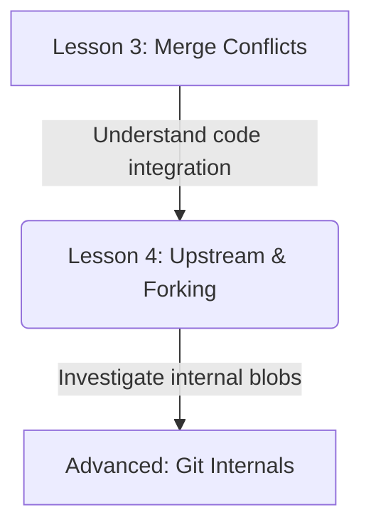
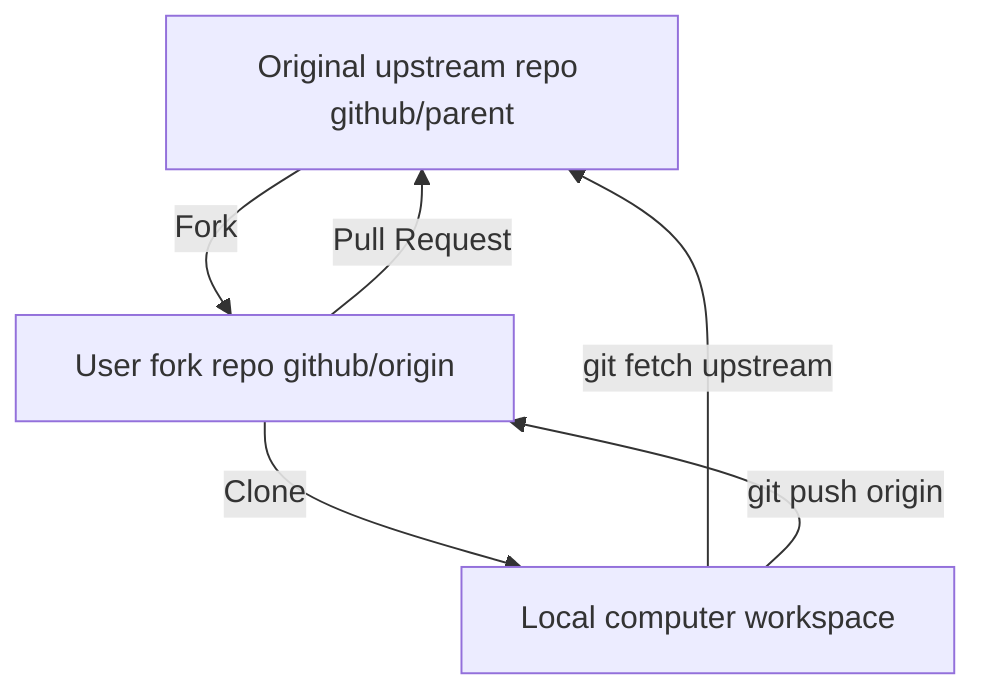

# Lesson 4: Upstream and Forking Workflows — Managing community contributions

---

```yaml
lesson_id: "GIT-COL-004"
subject: "Git"
course: "Git Collaboration"
module: "Upstream & Forking Workflows"
difficulty: "⭐⭐⭐"
time_breakdown:
  reading: "12 min"
  exercise: "15 min"
  quiz: "10 min"
  revision: "5 min"
version: "1.0"
last_updated: "2026-07-17"
status: "Published"
author: "Rajasekar"
reviewed_by: "Admin"
prerequisites:
  - "GIT-COL-003 (Merge Conflicts)"
tags:
  - "Upstream"
  - "Forking"
  - "Sync Fork"
  - "Pull Request"
```

---

## 1. Overview [id: overview]
This lesson covers Git's open-source and enterprise scaling workflows. You will learn how to sync your personal forks with upstream repositories, open pull requests, and organize branch collaborations without write access.

## 2. Knowledge Connections [id: connections]


## 3. Learning Outcomes [id: outcomes]
- **Knowledge (What you will understand)**:
  - The purpose of the `upstream` remote alias in open-source fork structures.
  - How Pull Requests (PRs) handle remote branch evaluations.
- **Skills (What you can do)**:
  - Add upstream tracking remotes, pull updates from parent codebases, sync forks, and submit pull requests.
- **Outcome (Professional application)**:
  - Contribute to major open-source repositories and maintain clean local development forks.

## 4. Concept & Internals Deep-Dive [id: concept]
In a **forking workflow**, you do not push directly to the official codebase. Instead:
1. You fork the target repository on GitHub/GitLab, creating a server-side clone under your account.
2. You clone this fork to your local machine (configured automatically as the `origin` remote).
3. You add the original repository URL as another remote alias named **`upstream`**.
4. You create feature branches locally, pull updates from `upstream` regularly to stay in sync, and push modifications to your `origin` fork.
5. You open a **Pull Request (PR)** or **Merge Request (MR)** requesting the upstream maintainers pull changes from your fork.

## 5. Professional Box: Industry Usage [id: industry_usage]
> [!NOTE]
> **Open Source at Microsoft**:
> Microsoft's VS Code is developed as open-source on GitHub. Thousands of external developers submit contributions weekly. They fork `microsoft/vscode`, clone it, add Microsoft's repository as `upstream`, build feature branches, and submit Pull Requests. Automated pipelines run tests before maintainers approve the merge.

## 6. Visual Learning & Architecture [id: visuals]


## 7. Terminology [id: terminology]
- **Forking**: Server-side cloning of a repository to your own account namespace.
- **Upstream**: The original official repository from which your fork was derived.
- **Pull Request**: A request to merge your branch changes into the parent codebase.

## 8. Installation & Configuration [id: setup]
Configure your upstream remote URL tracking:
```bash
git remote add upstream https://github.com/original-owner/repo.git
```

## 9. Commands & Command Syntax [id: commands]
```bash
git remote add upstream <url>
git fetch upstream
git merge upstream/main
```

## 10. Practical Code Examples [id: examples]

### Easy
Add the upstream repository connection:
```bash
git remote add upstream https://github.com/community/app.git
```

### Medium
Syncing your local fork with upstream main:
```bash
# Fetch latest commits from upstream
git fetch upstream

# Switch to local main and merge upstream
git switch main
git merge upstream/main

# Push clean updates to your personal origin fork
git push origin main
```

### Advanced
Rebasing a feature branch on top of upstream changes to avoid merge commits:
```bash
git fetch upstream
git switch feature-ui
git rebase upstream/main
```

## 11. Common Errors & Troubleshooting [id: errors]

### Beginner Errors
- **Error**: Trying to push to the `upstream` remote.
  - *Fix*: You do not have write access to the upstream repository. You must push to your `origin` fork and open a Pull Request.

### Intermediate Errors
- **Error**: Your fork main branch diverges from upstream.
  - *Fix*: Avoid making commits directly on your `main` branch. Only write code on feature branches, keeping `main` as a clean mirror of `upstream/main`.

### Professional Errors
- **Error**: Pull Request has conflicts that prevent merging.
  - *Fix*: Fetch upstream: `git fetch upstream`. Switch to your feature branch: `git switch feature-branch`. Rebase or merge: `git merge upstream/main`. Resolve conflicts locally, push to your fork, and the PR will update automatically.

## 12. Comparison Tables [id: comparisons]
| Remote Alias | Represents | Permissions | Purpose |
|---|---|---|---|
| `origin` | Your personal fork | Read & Write | Where you push feature branches |
| `upstream` | The main repository | Read Only (usually) | Where you fetch parent updates |

## 13. Best Practices & Professional Tips [id: best_practices]
- **Never develop on main**: Keep your local `main` branch clean and synchronized with `upstream/main`. Develop every change on a separate feature branch.
- **Sync before submitting PRs**: Pull the latest upstream changes and resolve any conflicts locally before opening a pull request.

## 14. Interview Preparation [id: interview]

### Fresher Questions
1. **Question**: What is the purpose of the 'upstream' remote in a forking workflow?
   * **Ideal Answer**: The 'upstream' remote points to the original repository. It is used to fetch the latest updates from the main project to keep your personal fork in sync.

### 2 Years Experience Questions
2. **Question**: How do you contribute changes back to the original repository after forking it?
   * **Ideal Answer**: Push your changes to a branch on your personal fork (`origin`), then open a Pull Request (PR) on GitHub/GitLab requesting to merge your fork's branch into the upstream repository.

### 5 Years Experience Questions
3. **Question**: Explain why it is best practice to keep your fork's main branch clean of direct commits.
   * **Ideal Answer**: If you commit directly to `main`, your fork's `main` diverges from the official `upstream/main`. This makes syncing difficult and leads to unnecessary merge conflicts. Keeping `main` clean allows fast-forward merges from upstream.

### Architect Level Questions
4. **Question**: In large scale corporate repositories, when should you choose a Forking Workflow over a Shared Repository Workflow?
   * **Ideal Answer**: Use the Shared Repository Workflow (all developers push feature branches directly to one repository) for close-knit internal teams with branch protection rules. Use the Forking Workflow for large open-source projects or enterprise monorepos with hundreds of developers to prevent branch name pollution and maintain strict security isolation.

## 15. Ingestion Exercises [id: exercises]

### MCQ
- Which remote alias typically points to the original parent repository?
  - A) `origin`
  - B) `upstream` (Correct)
  - C) `source`

### Coding Challenge
- Fetch all remote branches from `upstream`.

### Predict the Output
- What prints if you run `git remote` after setting up origin and upstream?
  - Output:
    ```text
    origin
    upstream
    ```

### Debugging Task
- Resolve a merge conflict in your PR by pulling the latest upstream commits.
  - Answer: `git fetch upstream`, `git merge upstream/main` inside feature branch, resolve conflicts, and run `git push origin feature-branch`.

### Scenario Question
- A developer wants to sync their fork. They fetch upstream. What is the next step?
  - Answer: Switch to local main and merge `upstream/main`.

### Hands-on Lab
- Add a remote named `upstream`, fetch upstream updates, and check tracking status.

## 16. Graded Assignments [id: assignments]
Add an upstream remote to your local repository. Fetch updates, rebase your feature branch on top of upstream changes, and submit the final repository network graph log.

## 17. Mini Projects [id: projects]
- **Mini Scale**: Script to add upstream and sync main.
- **Small Scale**: Automation script syncing multiple forks.

## 18. Topic Cheat Sheet [id: cheatsheet]
- **Standard Syntax**: `git remote add upstream <url>`
- **Aliases**: None.
- **Shortcut**: None.
- **Warning**: Do not force push to public upstream repositories.

## 19. AI Generated Content [id: ai_notes]
- **AI Summary**: Learn to use forking workflows, link upstream remotes, and sync project forks.
- **AI Flashcards**:
  - Q: What does PR stand for?
  - A: Pull Request.

## 20. References [id: references]
- [Git Documentation - Contributing to a Project](https://git-scm.com/book/en/v2/GitHub-Contributing-to-a-Project)
