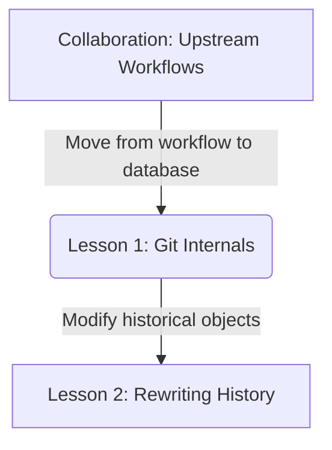
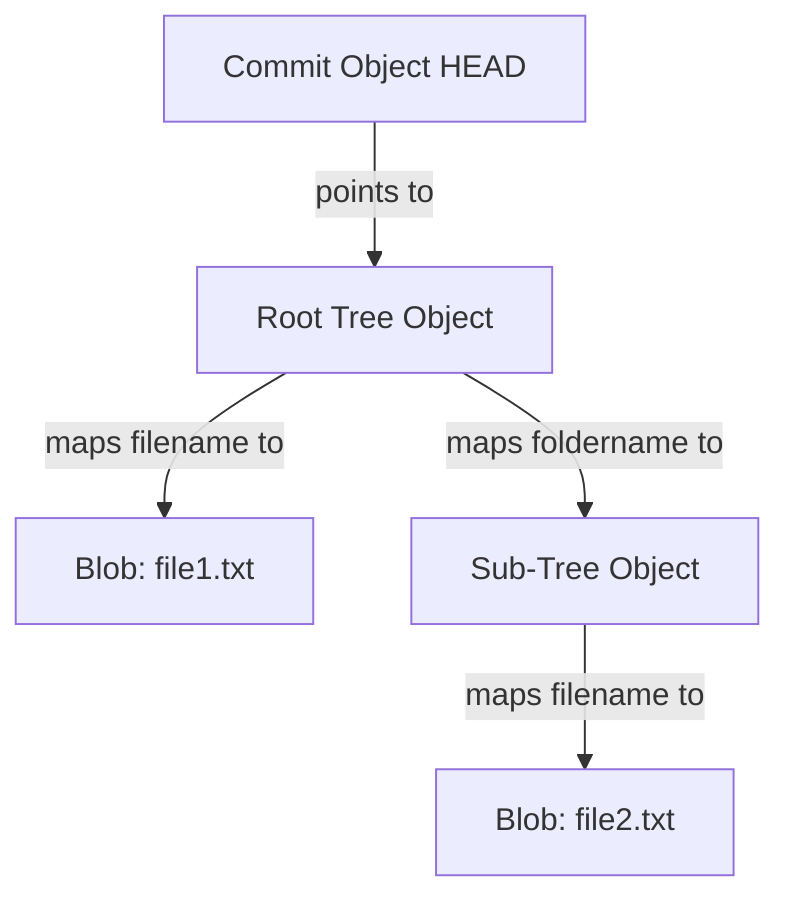

# Lesson 1: Git Internals — Blobs, Trees, Commits, and Refs

---

```yaml
lesson_id: "GIT-ADV-001"
subject: "Git"
course: "Advanced Git"
module: "Git Internals Deep-Dive"
difficulty: "⭐⭐⭐⭐"
time_breakdown:
  reading: "20 min"
  exercise: "25 min"
  quiz: "15 min"
  revision: "5 min"
version: "1.0"
last_updated: "2026-07-17"
status: "Published"
author: "Rajasekar"
reviewed_by: "Admin"
prerequisites:
  - "GIT-COL-004 (Upstream Workflows)"
tags:
  - "Git Internals"
  - "Objects"
  - "SHA-1"
  - "Refs"
```

---

## 1. Overview [id: overview]
This lesson explores Git's internal storage mechanisms. We inspect the contents of the `.git` directory, analyze Git's content-addressable storage model, and dissect the byte structures of Blobs, Trees, Commits, and References.

## 2. Knowledge Connections [id: connections]


## 3. Learning Outcomes [id: outcomes]
- **Knowledge (What you will understand)**:
  - How Git represents code history in a content-addressable object database.
  - The byte-level structure and relationships between Blobs, Trees, Commits, and Tags.
- **Skills (What you can do)**:
  - Inspect, write, and dissect raw Git objects using low-level plumbing commands.
- **Outcome (Professional application)**:
  - Debug repository corruption errors and analyze Git metadata anomalies directly inside `.git`.

## 4. Concept & Internals Deep-Dive [id: concept]
At its core, Git is a **content-addressable filesystem** built on a simple key-value store. You insert a piece of content, and Git returns a 40-character SHA-1 checksum key that points to it.

### The Four Object Types
Every object in `.git/objects/` is compressed with zlib and begins with a header defining its type and byte size, followed by a null byte `\0` and the content.
1. **Blob**: Stores raw file content bytes. It does not store filenames, directory paths, or permission metadata.
2. **Tree**: Represents directory structure. It acts as a directory index mapping filenames to blob hashes (files) or other tree hashes (subdirectories), along with file execution modes.
3. **Commit**: Contains metadata pointing to a root Tree hash, list of parent commit hashes, timestamps, author details, and the commit description message.
4. **Tag**: A permanent commit reference pointing to a specific target commit hash, accompanied by a tagger name and signature.

## 5. Professional Box: Industry Usage [id: industry_usage]
> [!NOTE]
> **Monorepos at Google**:
> Google's massive codebase contains billions of lines of code. Large-scale repository tooling tracks objects mapping and caches trees on virtual file systems. Because tree references are unique content-addressable hashes, Google's tools compare root trees instantly to identify which code sections changed without crawling directories.

## 6. Visual Learning & Architecture [id: visuals]


## 7. Terminology [id: terminology]
- **Plumbing Commands**: Low-level Git utility commands that manipulate internal structures directly (e.g. `hash-object`, `cat-file`).
- **Porcelain Commands**: High-level user-friendly Git commands (e.g. `add`, `commit`, `status`).
- **Content-Addressable**: Hashing content to determine its address/location in database.

## 8. Installation & Configuration [id: setup]
Inspect the internal `.git/` folder architecture:
```bash
ls -la .git
```

## 9. Commands & Command Syntax [id: commands]
```bash
git hash-object -w <file>
git cat-file -p <hash>
git cat-file -t <hash>
```

## 10. Practical Code Examples [id: examples]

### Easy
Generate the SHA-1 hash key of a string without writing it to database:
```bash
echo "hello world" | git hash-object --stdin
# Output: 3b18e512dba79e4c8300dd08aeb37f8e728b8dad
```

### Medium
Dissect the type and content of a Git object by hash:
```bash
# Get type (returns blob, tree, or commit)
git cat-file -t 3b18e512

# View pretty-printed contents
git cat-file -p 3b18e512
```

### Advanced
Manually write a blob and tree to the Git database using plumbing:
```bash
# Write blob, retrieve hash
BLOB_HASH=$(echo "print('API Code')" | git hash-object -w --stdin)

# Write to staging index directly
git update-index --add --cacheinfo 100644 $BLOB_HASH app.py

# Write index tree snapshot to database, returns tree hash
git write-tree
```

## 11. Common Errors & Troubleshooting [id: errors]

### Beginner Errors
- **Error**: `fatal: Not a valid object name`
  - *Fix*: You passed an incorrect, truncated, or nonexistent SHA-1 hash to a cat-file command.

### Intermediate Errors
- **Error**: `.git/index.lock` prevents git additions.
  - *Fix*: Another Git process crashed while writing index. Delete the lock file: `rm .git/index.lock` manually.

### Professional Errors
- **Error**: Repository corruption reported: `error: object file ... is empty`.
  - *Fix*: A hardware failure or crash wrote empty file bytes. Locate the corrupt object hash, find it in your reflog, checkout the file, and rebuild it using plumbing.

## 12. Comparison Tables [id: comparisons]
| Object Type | Stores Filenames? | Stores File Permissions? | Stores Parent Hashes? |
|---|---|---|---|
| Blob | No | No | No |
| Tree | Yes | Yes | No |
| Commit | No | No | Yes |

## 13. Best Practices & Professional Tips [id: best_practices]
- **Understand garbage collection**: Git runs `git gc` to compress loose objects into packfiles periodically to optimize disk space.
- Do not modify files in `.git/objects/` manually to prevent corrupting database tables tracking.

## 14. Interview Preparation [id: interview]

### Fresher Questions
1. **Question**: Where does Git store all project objects and history logs?
   * **Ideal Answer**: Git stores all data in the hidden `.git/` directory at the root of the project. Commit objects, trees, and blobs are saved under `.git/objects/`.

### 2 Years Experience Questions
2. **Question**: What is the difference between a Blob and a Tree in Git's internals?
   * **Ideal Answer**: A Blob stores only raw file contents. A Tree represents a directory, mapping filenames and file modes (permissions) to their corresponding Blob or Sub-Tree hashes.

### 5 Years Experience Questions
3. **Question**: What happens at the byte-level when Git creates a commit object?
   * **Ideal Answer**: Git packages metadata—such as the root tree hash, author name, committer name, timestamp, and message—along with parent hashes into a text block, appends a header defining type and size, hashes it to create the commit's 40-character SHA-1, compresses it with zlib, and writes it to `.git/objects/`.

### Architect Level Questions
4. **Question**: Explain how Git utilizes packfiles and idx index references to maintain high performance in massive repositories.
   * **Ideal Answer**: Storing each file version as a separate file ("loose object") becomes inefficient on disk. Git packs multiple loose objects into a single compressed binary **packfile** (`.pack`), using delta compression (storing one file version as a base and others as differences). An accompanying index file (`.idx`) maps object hashes to byte offsets inside the packfile for fast random-access lookups.

## 15. Ingestion Exercises [id: exercises]

### MCQ
- Which plumbing command prints the contents of a Git object?
  - A) `git show-object`
  - B) `git cat-file` (Correct)
  - C) `git inspect-file`

### Coding Challenge
- Write the string "test content" to Git's object database as a blob and print its SHA-1 hash.

### Predict the Output
- If you run `git cat-file -t` on a commit object hash, what does it output?
  - Output: `commit`

### Debugging Task
- Fix a corrupt reference error by inspecting the HEAD file contents.
  - Answer: View `.git/HEAD` and verify it contains a valid reference path like `ref: refs/heads/main`.

### Scenario Question
- A developer modified a file name but did not change the file content. How many new Blobs are written during addition?
  - Answer: Zero, because content hashing ensures identical files map to the same Blob hash. Only a new Tree object is written.

### Hands-on Lab
- Navigate to `.git/objects/`, locate a subdirectory, and pretty-print an object using `git cat-file -p`.

## 16. Graded Assignments [id: assignments]
Create a file, write content. Find its SHA-1 hash using `git hash-object`. Inspect the directory path `.git/objects/` to verify where Git stored the zlib compressed representation. Write down the path.

## 17. Mini Projects [id: projects]
- **Mini Scale**: Script parsing `.git/HEAD` to print current active ref.
- **Small Scale**: Python script compressing and decompressing loose Git objects using zlib.

## 18. Topic Cheat Sheet [id: cheatsheet]
- **Standard Syntax**: `git cat-file -p <hash>`
- **Aliases**: None.
- **Shortcut**: None.
- **Warning**: Modifying files inside `.git/refs/` manually is highly discouraged.

## 19. AI Generated Content [id: ai_notes]
- **AI Summary**: Dissect the core Git key-value database mapping blobs, trees, commits, and refs.
- **AI Flashcards**:
  - Q: What hashing algorithm does standard Git use?
  - A: SHA-1 (160-bit hash).

## 20. References [id: references]
- [Git Documentation - Git Objects](https://git-scm.com/book/en/v2/Git-Internals-Git-Objects)
