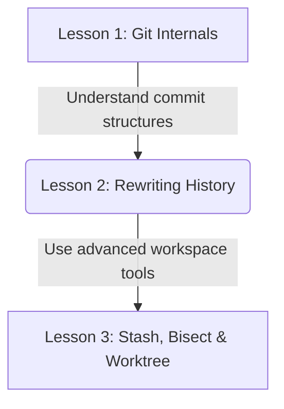
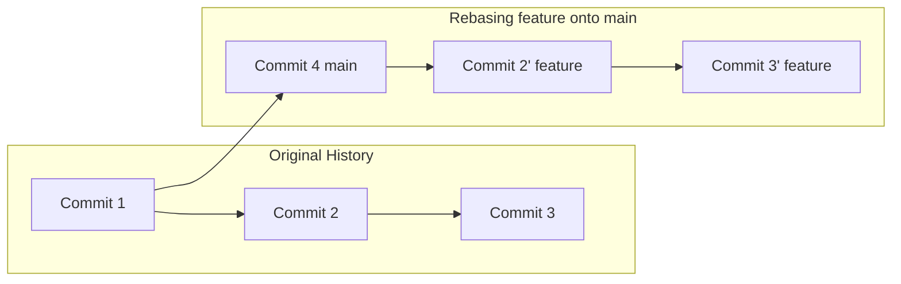

# Lesson 2: Rewriting History — Amend, Rebase, and Squash

---

```yaml
lesson_id: "GIT-ADV-002"
subject: "Git"
course: "Advanced Git"
module: "Rewriting History"
difficulty: "⭐⭐⭐⭐"
time_breakdown:
  reading: "18 min"
  exercise: "25 min"
  quiz: "15 min"
  revision: "5 min"
version: "1.0"
last_updated: "2026-07-17"
status: "Published"
author: "Rajasekar"
reviewed_by: "Admin"
prerequisites:
  - "GIT-ADV-001 (Git Internals)"
tags:
  - "Rebase"
  - "Amend"
  - "Squash"
  - "Reflog"
```

---

## 1. Overview [id: overview]
This lesson covers Git history modification workflows. You will learn how to modify the last commit using amend, reorder/edit historical commits using interactive rebase, combine multiple commits using squash, and recover lost commits using the reflog.

## 2. Knowledge Connections [id: connections]


## 3. Learning Outcomes [id: outcomes]
- **Knowledge (What you will understand)**:
  - Why rewriting history creates new commit hashes while leaving old commits orphaned.
  - The Golden Rule of Rebasing: Never rewrite history on public, shared branches.
- **Skills (What you can do)**:
  - Edit commit messages, squash local commits, perform interactive rebases, and recover deleted commits.
- **Outcome (Professional application)**:
  - Clean up development branches before merging into main, keeping project histories readable and linear.

## 4. Concept & Internals Deep-Dive [id: concept]
Commits in Git are immutable. When you "rewrite" history, you do not modify existing commit objects. Instead, Git creates **new commit objects** with new SHA-1 hashes and moves the branch HEAD pointer to them. The old commits remain in the database as "orphaned" objects until garbage collection removes them.

### Rewriting Tools
- **`git commit --amend`**: Replaces the last commit of the current branch with a new commit containing staged updates and/or an edited commit message.
- **`git rebase -i`**: Interactive rebase opens an edit checklist list allowing you to:
  - `pick`: Keep the commit.
  - `reword`: Keep the commit but edit the message.
  - `edit`: Halt rebase to edit files.
  - `squash`: Combine the commit with the previous one.
  - `drop`: Remove the commit entirely.

## 5. Professional Box: Industry Usage [id: industry_usage]
> [!NOTE]
> **Linear History at Airbnb**:
> Airbnb's engineering workflow forbids merge commits on main. Developers must rebase their feature branches on top of `origin/main` and squash their commits into a single cohesive commit before merging: `git rebase -i HEAD~N` followed by squash. This guarantees a clean, linear git history log that is easy to search.

## 6. Visual Learning & Architecture [id: visuals]


## 7. Terminology [id: terminology]
- **Rebasing**: Replaying a series of commits on top of a new base commit.
- **Squashing**: Combining two or more consecutive commits into a single commit.
- **Orphaned Commit**: A commit that is no longer reachable by any branch pointer or tag reference.

## 8. Installation & Configuration [id: setup]
Configure VS Code as default editor for interactive rebase menus:
```bash
git config --global core.editor "code --wait"
```

## 9. Commands & Command Syntax [id: commands]
```bash
git commit --amend -m "<new_msg>"
git rebase -i HEAD~<N>
git reflog
```

## 10. Practical Code Examples [id: examples]

### Easy
Correct the message of the last commit:
```bash
git commit --amend -m "fix(auth): correct password hash checking algorithm"
```

### Medium
Squash the last 3 commits into a single commit:
```bash
# Open interactive editor menu for last 3 commits
git rebase -i HEAD~3
# Change 'pick' to 'squash' (or 's') for the 2nd and 3rd commits, save and exit.
```

### Advanced
Recovering a commit lost during an interactive rebase:
```bash
# View reflog to locate the commit hash before rebase started
git reflog
# Output shows: HEAD@{4}: rebase -i (start): checkout HEAD~3

# Reset the branch pointer to the state before rebase
git reset --hard HEAD@{5}
```

## 11. Common Errors & Troubleshooting [id: errors]

### Beginner Errors
- **Error**: Rebase fails with conflict list during step execution.
  - *Fix*: Git halts rebase. Open conflicted files, resolve conflicts, stage them using `git add`, and run `git rebase --continue`. Avoid running `git commit`.

### Intermediate Errors
- **Error**: Force pushing rewrote co-workers commits on a shared branch.
  - *Fix*: You violated the Golden Rule of Rebasing. Recover the original state by locating the pre-push commit hash in `git reflog` and reset the remote branch.

### Professional Errors
- **Error**: Rebasing commits that have already been pushed results in duplicate commits.
  - *Fix*: When pulling rebased branches, configure `git pull --rebase` to avoid merge conflict loops.

## 12. Comparison Tables [id: comparisons]
| Metric | Git Merge | Git Rebase |
|---|---|---|
| History Structure | Preserves actual timeline graph | Creates clean linear story |
| Commit Creation | Adds a new Merge Commit | Replays commits (creates new hashes) |
| Conflicts | Resolved once at merge | Resolved per replayed commit |

## 13. Best Practices & Professional Tips [id: best_practices]
- **The Golden Rule**: Never rebase/rewrite history of commits that exist on remote shared branches (e.g. `main` or `staging`).
- Squash commits before merging to combine WIP commits like "typo fix" or "temp save".

## 14. Interview Preparation [id: interview]

### Fresher Questions
1. **Question**: How do you modify the message of the most recent commit?
   * **Ideal Answer**: Use `git commit --amend -m "new message"`. This replaces the last commit with a new commit containing the corrected message.

### 2 Years Experience Questions
2. **Question**: What is the Golden Rule of Rebasing?
   * **Ideal Answer**: Never rebase or rewrite history on commits that have been pushed to a public or shared remote repository. It creates duplicate commits and disrupts other team members' history tracks.

### 5 Years Experience Questions
3. **Question**: What is the difference between `git rebase` and `git merge`?
   * **Ideal Answer**: `git merge` combines two branches by creating a new merge commit, preserving historical chronology. `git rebase` moves the base of the current branch to a target branch, rewriting history to create a clean, linear commit path.

### Architect Level Questions
4. **Question**: If you run `git rebase -i` and squash 5 commits, what happens to the intermediate commit objects in Git's databases?
   * **Ideal Answer**: The 5 original commits are dereferenced. Git constructs a single new commit object pointing to the combined tree. The original 5 commit objects remain inside `.git/objects` as loose objects. They can be found using `git reflog` or `git fsck`. If they remain unreferenced for 30 days, Git's garbage collection (`git gc`) deletes them.

## 15. Ingestion Exercises [id: exercises]

### MCQ
- Which interactive rebase command combines a commit with the previous one?
  - A) `reword`
  - B) `squash` (Correct)
  - C) `edit`

### Coding Challenge
- Start an interactive rebase for the last 4 commits.

### Predict the Output
- What does `git log` show after a successful rebase squashes 3 commits into 1?
  - Output: A single commit replacing the 3 old commits.

### Debugging Task
- Resolve a conflict during a rebase, then continue.
  - Answer: `git add <file>` followed by `git rebase --continue`.

### Scenario Question
- A developer accidentally ran `git commit --amend` with wrong files. How do they undo this amend?
  - Answer: Inspect `git reflog` and run `git reset --soft HEAD@{1}` to restore files to staging.

### Hands-on Lab
- Make a commit, run `git commit --amend` to change its message, and verify the hash changes.

## 16. Graded Assignments [id: assignments]
Create 3 commits. Run `git rebase -i` to reword the second commit and squash the third commit. Export the final log history showing the updated commit hashes.

## 17. Mini Projects [id: projects]
- **Mini Scale**: Script to print reflog logs of HEAD pointer changes.
- **Small Scale**: Git alias shortcut command starting interactive rebase.

## 18. Topic Cheat Sheet [id: cheatsheet]
- **Standard Syntax**: `git rebase -i HEAD~<N>`
- **Aliases**: None.
- **Shortcut**: None.
- **Warning**: Do not rewrite history on main production branches.

## 19. AI Generated Content [id: ai_notes]
- **AI Summary**: Learn to clean branch histories using amend, interactive rebase, and commit squashing.
- **AI Flashcards**:
  - Q: How do you abort an active rebase?
  - A: `git rebase --abort`.

## 20. References [id: references]
- [Git Documentation - Rewriting History](https://git-scm.com/book/en/v2/Git-Tools-Rewriting-History)
