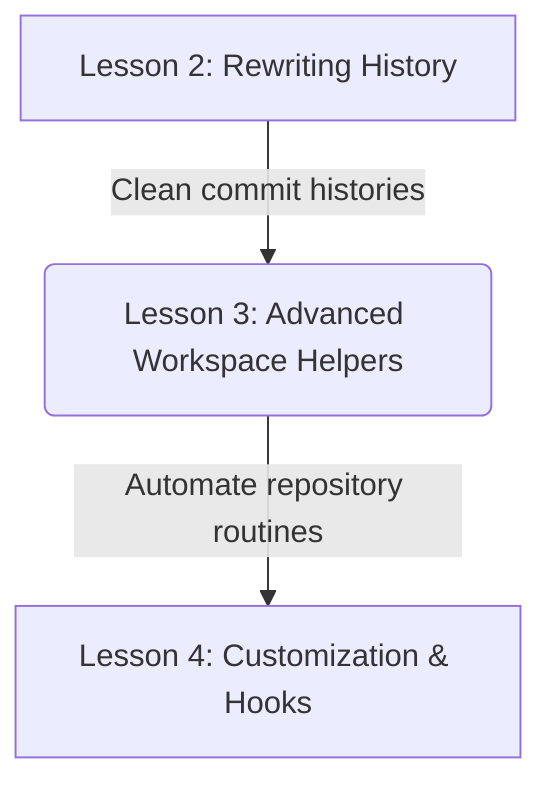
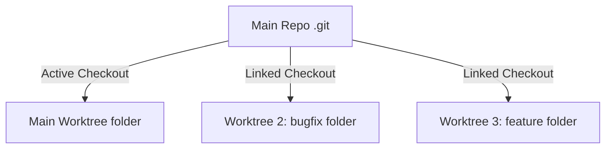

# Lesson 3: Advanced Workspace Helpers — Stash, Bisect, and Worktree

---

```yaml
lesson_id: "GIT-ADV-003"
subject: "Git"
course: "Advanced Git"
module: "Advanced Workflows"
difficulty: "⭐⭐⭐⭐"
time_breakdown:
  reading: "15 min"
  exercise: "20 min"
  quiz: "10 min"
  revision: "5 min"
version: "1.0"
last_updated: "2026-07-17"
status: "Published"
author: "Rajasekar"
reviewed_by: "Admin"
prerequisites:
  - "GIT-ADV-002 (Rewriting History)"
tags:
  - "Git Stash"
  - "Git Bisect"
  - "Git Worktree"
  - "Advanced Workflows"
```

---

## 1. Overview [id: overview]
This lesson covers advanced Git productivity workflows. We analyze how to temporarily cache uncommitted changes using stash, locate code regressions using binary search debugging (bisect), and run multiple branch workspaces concurrently using worktrees.

## 2. Knowledge Connections [id: connections]


## 3. Learning Outcomes [id: outcomes]
- **Knowledge (What you will understand)**:
  - How Git represents stash stacks internally using commit objects.
  - The binary search mechanics of git bisect.
  - The directory mapping differences of git worktree.
- **Skills (What you can do)**:
  - Stash and retrieve changes, debug bugs using bisect automation, and configure concurrent worktrees.
- **Outcome (Professional application)**:
  - Accelerate feature context switching and debugging cycles on enterprise codebases.

## 4. Concept & Internals Deep-Dive [id: concept]
These advanced utilities solve specific development constraints:
- **`git stash`**: Temporarily saves your uncommitted modifications (working directory + staged changes) to a local stack, returning your branch to a clean HEAD state. Internally, a stash entry is actually stored as a **special commit object** pointing to two parent commits (one for the staging index state and one for the working directory state).
- **`git bisect`**: Uses binary search to find the commit that introduced a bug. You identify a "bad" commit where the bug exists and a "good" commit before the bug was introduced. Git checks out the middle commit, you test it, mark it good or bad, and Git repeats the process until the culprit commit is isolated.
- **`git worktree`**: Allows you to have multiple checked-out branches of the same repository in separate local directory folders concurrently, avoiding branch checkout context switches.

## 5. Professional Box: Industry Usage [id: industry_usage]
> [!NOTE]
> **Bug-Hunting at Meta**:
> Meta's large web applications have thousands of daily commits. When a regression bug escapes to staging, release engineers run automated scripts using `git bisect run <test_script.sh>`. Git automatically checks out commits, runs the test script, checks exit codes, and isolates the bug commit in seconds without human manual checks.

## 6. Visual Learning & Architecture [id: visuals]


## 7. Terminology [id: terminology]
- **Stash Stack**: A local stack list storing stashed workspace modifications.
- **Binary Search**: Search algorithm dividing search areas in half recursively.
- **Worktree**: Linked directory containing a checkout of a specific branch.

## 8. Installation & Configuration [id: setup]
Configure stash to automatically track untracked files by default:
```bash
git config --global alias.stash-all "stash -u"
```

## 9. Commands & Command Syntax [id: commands]
```bash
git stash push -m "<label>"
git stash pop
git bisect start
git worktree add <path> <branch>
```

## 10. Practical Code Examples [id: examples]

### Easy
Stash your uncommitted work and pop it back later:
```bash
# Save changes
git stash

# Work on urgent hotfix...

# Apply changes back
git stash pop
```

### Medium
Running a concurrent branch hotfix using a worktree:
```bash
# Add a new directory checked out to branch hotfix-branch
git worktree add ../hotfix-folder hotfix-branch

# Open hotfix-folder, edit, commit, and push.
# Your main repository directory remains on your active feature branch!
```

### Advanced
Debugging using manual git bisect:
```bash
# Start bisect session
git bisect start

# Mark current state as bad
git bisect bad

# Mark a known working commit hash as good
git bisect good c9f5865a

# Git checks out middle commit. Run test, then label:
git bisect good  # or git bisect bad

# Git isolates the bad commit hash. Reset bisect session:
git bisect reset
```

## 11. Common Errors & Troubleshooting [id: errors]

### Beginner Errors
- **Error**: `git worktree add` fails because path is inside main repository.
  - *Fix*: Worktree folders must be created outside the main repository directory (e.g. `../folder-name`).

### Intermediate Errors
- **Error**: Stash pop fails due to merge conflict.
  - *Fix*: Git leaves the stash entry in the stack. Open conflicted files, resolve conflicts, stage, and run `git stash drop` manually.

### Professional Errors
- **Error**: Git bisect session gets stuck due to a broken intermediate build commit.
  - *Fix*: Skip testing that specific broken commit by running `git bisect skip`.

## 12. Comparison Tables [id: comparisons]
| Tool | Modifies HEAD? | Modifies Disk Paths? | Stores State in Stack? |
|---|---|---|---|
| `git stash` | Yes (resets to clean) | Yes (cleans files) | Yes |
| `git bisect` | Yes (checks out commits) | Yes (switches files) | No |
| `git worktree` | No | Yes (creates folder) | No |

## 13. Best Practices & Professional Tips [id: best_practices]
- **Label your stashes**: Use `git stash push -m "description"` so you know what is in each stash entry.
- Clean up old worktrees using `git worktree prune` to clear dangling metadata references.

## 14. Interview Preparation [id: interview]

### Fresher Questions
1. **Question**: What is `git stash` used for?
   * **Ideal Answer**: It temporarily saves your uncommitted changes (working directory modifications and staged files) to a local stack, giving you a clean working directory so you can switch branches quickly.

### 2 Years Experience Questions
2. **Question**: What is the difference between `git stash pop` and `git stash apply`?
   * **Ideal Answer**: Both commands apply the changes from the stash stack. However, `pop` deletes the stash entry from the stack after applying it, while `apply` keeps the entry in the stack for reuse.

### 5 Years Experience Questions
3. **Question**: How does `git worktree` improve on checking out branches recursively?
   * **Ideal Answer**: Checking out branches swaps files in your main directory. If you are running long builds or server runs, changing branches halts them. `git worktree` creates a separate physical folder for another branch, allowing you to run builds or edit code on multiple branches concurrently.

### Architect Level Questions
4. **Question**: Explain how `git bisect run` automates debugging using script exit codes.
   * **Ideal Answer**: `git bisect run <script>` automatically executes the binary search loop. Git checks out a commit, runs the script, reads the exit code (exit code 0 = good, exit codes 1-127 = bad, exit code 125 = skip), checks out the next commit, and repeats until the regression commit is found.

## 15. Ingestion Exercises [id: exercises]

### MCQ
- Which command lists linked worktree folders?
  - A) `git worktree list` (Correct)
  - B) `git worktree show`
  - C) `git worktree status`

### Coding Challenge
- Stash your changes with label "wip UI".

### Predict the Output
- What does `git stash list` output if there are no stashes?
  - Output: Empty response (no text).

### Debugging Task
- Clean up a stale worktree folder metadata.
  - Answer: `git worktree prune`.

### Scenario Question
- A developer needs to fix a bug in `main` but has unstaged work in `feature`. They want to save the work without committing. What should they run?
  - Answer: `git stash`.

### Hands-on Lab
- Edit a file, run `git stash`, inspect `git status` (clean), then run `git stash pop` to restore.

## 16. Graded Assignments [id: assignments]
Create a change, stash it. Create a new branch using a worktree in a sibling folder. Merge the hotfix, come back to main, delete the worktree, and pop your stash. Export the terminal logs.

## 17. Mini Projects [id: projects]
- **Mini Scale**: Script displaying the number of active stashes.
- **Small Scale**: Auto-pruning helper script clearing old worktrees.

## 18. Topic Cheat Sheet [id: cheatsheet]
- **Standard Syntax**: `git stash pop`
- **Aliases**: None.
- **Shortcut**: None.
- **Warning**: Do not run `git stash clear` unless you want to delete all stashes permanently.

## 19. AI Generated Content [id: ai_notes]
- **AI Summary**: Learn to stash uncommitted modifications, search bugs using bisect, and add multiple worktree environments.
- **AI Flashcards**:
  - Q: How do you list all stashes?
  - A: `git stash list`.

## 20. References [id: references]
- [Git Documentation - Stashing and Cleaning](https://git-scm.com/book/en/v2/Git-Tools-Stashing-and-Cleaning)
