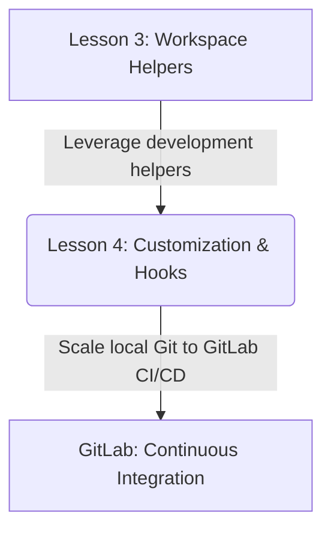
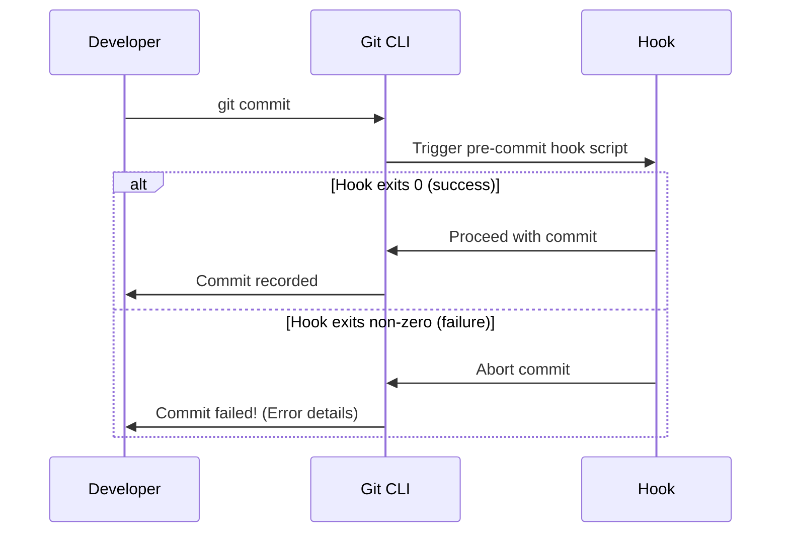

# Lesson 4: Customization and Automation — Git Hooks and Aliases

---

```yaml
lesson_id: "GIT-ADV-004"
subject: "Git"
course: "Advanced Git"
module: "Customization & Hooks"
difficulty: "⭐⭐⭐⭐"
time_breakdown:
  reading: "15 min"
  exercise: "20 min"
  quiz: "10 min"
  revision: "5 min"
version: "1.0"
last_updated: "2026-07-17"
status: "Published"
author: "Rajasekar"
reviewed_by: "Admin"
prerequisites:
  - "GIT-ADV-003 (Workspace Helpers)"
tags:
  - "Git Hooks"
  - "Aliases"
  - "Automation"
  - "Config"
```

---

## 1. Overview [id: overview]
This lesson covers Git automation and customization. We inspect how to trigger local check hooks (pre-commit, commit-msg, post-merge) to automate code linting, enforce commit format metrics, and configure global alias shortcuts.

## 2. Knowledge Connections [id: connections]


## 3. Learning Outcomes [id: outcomes]
- **Knowledge (What you will understand)**:
  - How Git hooks run as shell scripts in response to version control events.
  - The difference between client-side hooks and server-side hooks.
- **Skills (What you can do)**:
  - Write executable shell script hooks, block invalid commits, and create custom alias shortcuts.
- **Outcome (Professional application)**:
  - Build automated pre-commit linting and commit-message validation pipelines for your team.

## 4. Concept & Internals Deep-Dive [id: concept]
**Git Hooks** are scripts that run automatically before or after Git executes major actions (like commit, push, merge).
Hooks are stored in `.git/hooks/`. By default, Git populates this directory with sample shell scripts (e.g. `pre-commit.sample`). To activate a hook:
1. Rename the file to remove the `.sample` extension (e.g. `pre-commit`).
2. Make the file executable: `chmod +x .git/hooks/pre-commit`.

### Client-side vs. Server-side Hooks
- **Client-side Hooks**: Run locally on the developer's machine.
  - `pre-commit`: Runs before writing the commit. Used to check code style/linters.
  - `commit-msg`: Runs to validate the commit message format.
  - `pre-push`: Runs before pushing code to remote.
- **Server-side Hooks**: Run on the hosting server (e.g. GitHub/GitLab).
  - `pre-receive`: Runs when push starts; can reject the entire push (e.g. if files contain passwords).
  - `post-receive`: Runs after push is completed; used to notify slack bots or trigger CI pipelines.

## 5. Professional Box: Industry Usage [id: industry_usage]
> [!NOTE]
> **Husky Hooks at Spotify**:
> Spotify developers use tools like Husky to manage pre-commit hooks. When developers commit, a pre-commit hook automatically triggers, formatting files using Prettier, checking code using ESLint, and running unit tests. If any step fails, the commit is aborted.

## 6. Visual Learning & Architecture [id: visuals]


## 7. Terminology [id: terminology]
- **Hook**: An executable script triggered automatically by a Git lifecycle event.
- **Exit Code**: Integer code returned by scripts (0 indicates success; any non-zero value indicates failure).
- **Git Alias**: Custom shortcut mappings for long Git commands.

## 8. Installation & Configuration [id: setup]
Navigate to the hooks configuration directory:
```bash
cd .git/hooks
ls -la
```

## 9. Commands & Command Syntax [id: commands]
```bash
git config --global alias.<shortcut> "<command>"
```

## 10. Practical Code Examples [id: examples]

### Easy
Create a global alias to format logs in a compact graph tree:
```bash
git config --global alias.l "log --oneline --graph --all"
# Now running 'git l' outputs the full graph tree!
```

### Medium
Creating a simple `pre-commit` hook to block commits containing debugging markers:
```bash
# Create file .git/hooks/pre-commit with contents:
#!/bin/sh
if git diff --cached | grep -q "TODO: debug"; then
    echo "Error: Unfinished debugging todo found!"
    exit 1
fi
exit 0
```
Make the script executable:
```bash
chmod +x .git/hooks/pre-commit
```

### Advanced
Creating a `commit-msg` hook enforcing Conventional Commits formatting:
```bash
# Create file .git/hooks/commit-msg with contents:
#!/bin/bash
MSG_FILE=$1
COMMIT_MSG=$(cat $MSG_FILE)
REGEX="^(feat|fix|docs|style|refactor|test|chore)(\(.+\))?: .+"

if [[ ! $COMMIT_MSG =~ $REGEX ]]; then
    echo "Error: Commit message does not follow Conventional Commits format!"
    echo "Format: feat(auth): add email login"
    exit 1
fi
exit 0
```

## 11. Common Errors & Troubleshooting [id: errors]

### Beginner Errors
- **Error**: The hook script exists in `.git/hooks/` but Git is ignoring it.
  - *Fix*: Ensure the `.sample` extension is removed, and check permissions. You must run `chmod +x .git/hooks/pre-commit` on Unix-based shells.

### Intermediate Errors
- **Error**: Python or node script interpreter path in hook's hashbang (`#!`) is incorrect.
  - *Fix*: Check the path. For python, use `#!/usr/bin/env python` for portability.

### Professional Errors
- **Error**: Hooks are not committed to Git repositories since `.git/` is ignored, making sharing difficult.
  - *Fix*: Configure a custom hooks directory inside your repo: `git config core.hooksPath .githooks` and commit the `.githooks` folder.

## 12. Comparison Tables [id: comparisons]
| Hook Name | Client or Server? | Trigger Phase | Common Use Case |
|---|---|---|---|
| `pre-commit` | Client | Before write | Linters, checkers |
| `commit-msg` | Client | Before message save | Semantic syntax audits |
| `pre-receive` | Server | Before remote accept | Block secret keys |

## 13. Best Practices & Professional Tips [id: best_practices]
- **Skip hooks when needed**: If you need to bypass a client-side hook for an emergency, run `git commit --no-verify` (or `-n`).
- **Use core.hooksPath**: Commit team hooks to a project directory and bind them globally for all workspace developers.

## 14. Interview Preparation [id: interview]

### Fresher Questions
1. **Question**: Where does Git store local hook scripts?
   * **Ideal Answer**: Local hook scripts are stored under the hidden directory `.git/hooks/` inside the repository.

### 2 Years Experience Questions
2. **Question**: How do you bypass a pre-commit hook that is failing?
   * **Ideal Answer**: You can bypass the hooks execution by running your commit with the `--no-verify` (or `-n`) flag, e.g., `git commit -m "temp commit" --no-verify`.

### 5 Years Experience Questions
3. **Question**: What is the difference between client-side hooks and server-side hooks?
   * **Ideal Answer**: Client-side hooks run locally on the developer's computer (e.g., `pre-commit` check). Server-side hooks run on the remote Git server (e.g., `pre-receive` check) and can enforce constraints repository-wide.

### Architect Level Questions
4. **Question**: How would you design a hooks system that forces all developers to run tests before pushing, since the `.git/` folder cannot be committed?
   * **Ideal Answer**: Create a directory named `.githooks/` inside the repository and commit the scripts. In the project's onboarding scripts or package file (e.g., `package.json` scripts), configure `git config core.hooksPath .githooks`. This shifts Git's hooks search target to the committed folder, ensuring hooks are active for everyone automatically.

## 15. Ingestion Exercises [id: exercises]

### MCQ
- Which flag bypasses commit hook verification checks?
  - A) `--skip-hooks`
  - B) `--no-verify` (Correct)
  - C) `--force`

### Coding Challenge
- Map a global Git alias named `co` to the `checkout` command.

### Predict the Output
- What does `git co main` execute if `alias.co` is mapped to `checkout`?
  - Output: `git checkout main`

### Debugging Task
- Make a pre-commit script executable on a Linux machine.
  - Answer: `chmod +x .git/hooks/pre-commit`.

### Scenario Question
- A developer wants to reject commits if they don't contain a JIRA issue key like `[JIRA-1234]`. What type of hook should they write?
  - Answer: A `commit-msg` hook.

### Hands-on Lab
- Add a global alias `st` for `status`, and test it by running `git st`.

## 16. Graded Assignments [id: assignments]
Create a custom Git alias. Write a local `pre-commit` hook that blocks commits containing the word "console.log" in staged files. Verify it works and submit the script code.

## 17. Mini Projects [id: projects]
- **Mini Scale**: Script listing active hook names.
- **Small Scale**: Global config setting to bind hooksPath to `.githooks`.

## 18. Topic Cheat Sheet [id: cheatsheet]
- **Standard Syntax**: `git config --global alias.<name> "<command>"`
- **Aliases**: `git config --global alias.c "commit -m"`
- **Shortcut**: `--no-verify` skips hooks.
- **Warning**: Do not rely on client-side hooks for security constraints, as developers can bypass them using `--no-verify`. Use server-side hooks instead.

## 19. AI Generated Content [id: ai_notes]
- **AI Summary**: Learn to automate repository tasks using local client/server hooks and map aliases.
- **AI Flashcards**:
  - Q: What hook runs before a push is accepted by a remote?
  - A: `pre-receive` hook.

## 20. References [id: references]
- [Git Documentation - Customizing Git Hooks](https://git-scm.com/book/en/v2/Customizing-Git-Git-Hooks)
