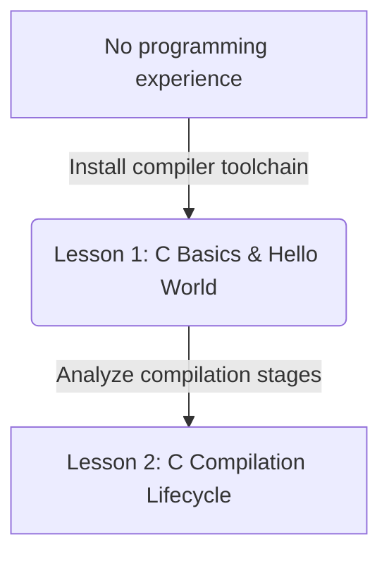

# Lesson 1: Introduction to C — History, Setup, and Hello World

---

```yaml
lesson_id: "C-FND-001"
subject: "C"
course: "C Programming Fundamentals"
module: "Introduction & Basics"
difficulty: "⭐"
time_breakdown:
  reading: "10 min"
  exercise: "15 min"
  quiz: "5 min"
  revision: "5 min"
version: "1.0"
last_updated: "2026-07-17"
status: "Published"
author: "Rajasekar"
reviewed_by: "Admin"
prerequisites:
  - "None"
tags:
  - "C Basics"
  - "Hello World"
  - "Console Output"
  - "GCC"
```

---

## 1. Overview [id: overview]
This lesson introduces the C programming language. We trace its origins, set up the compiler toolchains, write your first "Hello World" program, and dissect its line-by-line components.

## 2. Knowledge Connections [id: connections]


## 3. Learning Outcomes [id: outcomes]
- **Knowledge (What you will understand)**:
  - Why C is a compiled, statically-typed, and procedural system language.
  - The purpose of standard libraries (stdio.h) and entrypoints (main).
- **Skills (What you can do)**:
  - Write standard C syntax, invoke the GCC compiler, and run executable binaries.
- **Outcome (Professional application)**:
  - Configure native local development sandboxes for systems programming.

## 4. Concept & Internals Deep-Dive [id: concept]
C was created in 1972 by Dennis Ritchie at Bell Labs to write the UNIX operating system. It provides low-level memory access while maintaining procedural structure, making it the bedrock language for OS kernels, embedded systems, and databases (including MySQL/TiDB!).

### Dissecting "Hello World" in C
```c
#include <stdio.h> // Preprocessor directive to load standard input-output functions

int main() {       // The entrypoint function where execution begins
    printf("Hello, World!\n"); // Call library function to print string to console buffer
    return 0;      // Return status code 0 to operating system, indicating success
}
```

## 5. Professional Box: Industry Usage [id: industry_usage]
> [!NOTE]
> **Bedrock of UNIX Kernels**:
> The UNIX kernel was originally written in assembly language. Dennis Ritchie created C so the kernel could be rewritten in a high-level language. Today, the Linux kernel, Windows kernel, and macOS kernel are all written primarily in C and C++, showing its unmatched execution performance.

## 6. Visual Learning & Architecture [id: visuals]
Here is the console command sequence to compile and run your first program:

```text
┌────────────────────────────────────────────────────────┐
│                        CONSOLE                         │
├────────────────────────────────────────────────────────┤
│ $ gcc hello.c -o hello                                 │
│ $ ./hello                                              │
│ Hello, World!                                          │
│                                                        │
│ Process exited with status code 0                      │
└────────────────────────────────────────────────────────┘
```

## 7. Terminology [id: terminology]
- **Compiler**: A tool that translates source code text files into binary machine code instructions.
- **Header File**: A file (`.h`) containing function declarations to be shared across source code files.
- **Preprocessor**: The first stage of compilation that handles directives starting with `#`.

## 8. Installation & Configuration [id: setup]
On Debian/Ubuntu Linux, install compiler utilities:
```bash
sudo apt update
sudo apt install build-essential
```

## 9. Commands & Command Syntax [id: commands]
```bash
gcc <source_file.c> -o <output_executable_name>
```

## 10. Practical Code Examples [id: examples]

### Easy
Basic print syntax:
```c
#include <stdio.h>
int main() {
    printf("C is fast!\n");
    return 0;
}
```

### Medium
Printing multiple lines and escape characters:
```c
#include <stdio.h>
int main() {
    printf("Line 1\n\tLine 2 indented\nLine 3\n");
    return 0;
}
```

### Advanced
Reading exit status code using terminal scripts:
```c
#include <stdio.h>
int main() {
    printf("Checking system codes...\n");
    return 1; // Return error code 1 instead of 0
}
```
Console checking:
```text
┌────────────────────────────────────────────────────────┐
│                        CONSOLE                         │
├────────────────────────────────────────────────────────┤
│ $ gcc exit_test.c -o exit_test                         │
│ $ ./exit_test                                          │
│ Checking system codes...                               │
│ $ echo $?                                              │
│ 1                                                      │
└────────────────────────────────────────────────────────┘
```

## 11. Common Errors & Troubleshooting [id: errors]

### Beginner Errors
- **Error**: `hello.c:4:5: error: expected ';' before 'return'`
  - *Fix*: C statements must end with a semicolon `;`. Add `;` to the end of the previous line.

### Intermediate Errors
- **Error**: `fatal error: stdio: No such file or directory`
  - *Fix*: You forgot `.h` in header declaration, e.g., `#include <stdio>`. Change to `#include <stdio.h>`.

### Professional Errors
- **Error**: `undefined reference to 'main'` Linker error.
  - *Fix*: Your file does not contain the `main` entrypoint function, or the compiler did not compile the main file.

## 12. Comparison Tables [id: comparisons]
| Parameter | C Language | Python / Interpreted |
|---|---|---|
| Typing | Static (declared at compile time) | Dynamic (checked at runtime) |
| Compilation | Compiled directly to machine code | Interpreted via bytecode virtual machine |
| Speed | Extremely high (native) | Moderate |

## 13. Best Practices & Professional Tips [id: best_practices]
- **Always declare `int main()`**: Avoid using the legacy `void main()` syntax. Returning an integer status code to the OS is the ANSI C standard.
- Match brackets and brace groupings early to keep syntax readable.

## 14. Interview Preparation [id: interview]

### Fresher Questions
1. **Question**: What is the purpose of `#include <stdio.h>`?
   * **Ideal Answer**: It is a preprocessor directive that includes the Standard Input-Output header file in your program, allowing you to use input/output library functions like `printf()` and `scanf()`.

### 2 Years Experience Questions
2. **Question**: Why does C return an integer code from `main`?
   * **Ideal Answer**: The exit code indicates execution status to the calling parent shell or system. A status of `0` denotes clean success, whereas any non-zero value indicates error codes.

### 5 Years Experience Questions
3. **Question**: What is the structural difference between `printf` and `puts`?
   * **Ideal Answer**: `printf()` parses format specifiers and outputs formatted text streams, whereas `puts()` only prints raw strings and automatically appends a newline `\n` character.

### Architect Level Questions
4. **Question**: Describe how the entrypoint `main(int argc, char *argv[])` loads command-line arguments.
   * **Ideal Answer**: The operating system allocates argument vectors. `argc` contains the number of arguments (including program name path), and `argv` is an array of character pointers pointing to the string representations of the parameters in memory, loaded onto the program stack before launch.

## 15. Ingestion Exercises [id: exercises]

### MCQ
- Which function is the mandatory entrypoint of a C program?
  - A) `start()`
  - B) `main()` (Correct)
  - C) `run()`

### Coding Challenge
- Write a C program printing "BB Solutions".

### Predict the Output
- What is the output of `printf("Hello\tWorld");`?
  - Output: `Hello   World` (with tab spacing).

### Debugging Task
- Fix the syntax:
  ```c
  #include <stdio.h>
  void main {
      print("hi")
  }
  ```
  - Answer:
    ```c
    #include <stdio.h>
    int main() {
        printf("hi");
        return 0;
    }
    ```

### Scenario Question
- A developer runs a script checking if a compiled C program succeeded. How does the program signal success to the script?
  - Answer: By executing `return 0;` at the end of `main()`.

### Hands-on Lab
- Write, compile, and run a C program showing your name.

## 16. Graded Assignments [id: assignments]
Create a C file `info.c` printing your name, email, and target workspace path. Compile it and copy the command line console inputs and outputs.

## 17. Mini Projects [id: projects]
- **Mini Scale**: Code verifying your system's GCC compiler package configurations.
- **Small Scale**: Compile script automatically building files on save.

## 18. Topic Cheat Sheet [id: cheatsheet]
- **Standard Syntax**: `gcc <file>.c -o <binary>`
- **Aliases**: None.
- **Shortcut**: Use `Ctrl+F5` in VS Code with C extensions to compile and launch.
- **Warning**: Always terminate statements with `;` to avoid compiler failures.

## 19. AI Generated Content [id: ai_notes]
- **AI Summary**: Learn the history of C, configure GCC tools, and write your first Hello World executable program.
- **AI Flashcards**:
  - Q: What does GCC stand for?
  - A: GNU Compiler Collection.

## 20. References [id: references]
- [C Programming Reference - Ritchie Book](https://en.wikipedia.org/wiki/The_C_Programming_Language)
