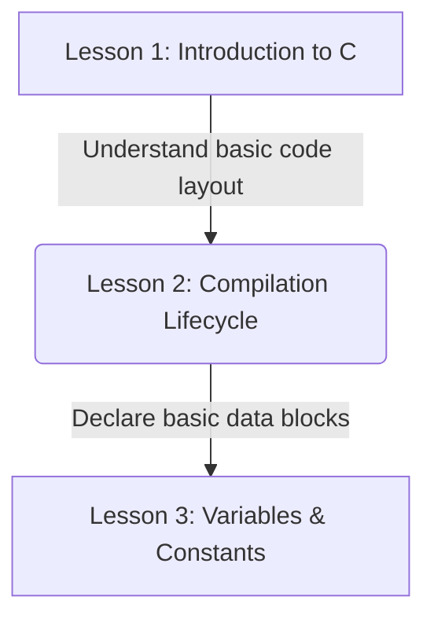

# Lesson 2: C Compilation Lifecycle — Preprocessing, Compiling, Assembling, and Linking

---

```yaml
lesson_id: "C-FND-002"
subject: "C"
course: "C Programming Fundamentals"
module: "Introduction & Basics"
difficulty: "⭐⭐"
time_breakdown:
  reading: "15 min"
  exercise: "20 min"
  quiz: "10 min"
  revision: "5 min"
version: "1.0"
last_updated: "2026-07-17"
status: "Published"
author: "Rajasekar"
reviewed_by: "Admin"
prerequisites:
  - "C-FND-001 (Introduction to C)"
tags:
  - "Compilation"
  - "GCC"
  - "Preprocessor"
  - "Linker"
```

---

## 1. Overview [id: overview]
This lesson breaks down the C compilation process. You will learn the exact pipeline that translates plain text C source code into runnable binary machine executables: Preprocessing, Compiling, Assembling, and Linking.

## 2. Knowledge Connections [id: connections]


## 3. Learning Outcomes [id: outcomes]
- **Knowledge (What you will understand)**:
  - The distinct role and output file extension of each compilation phase.
  - The structural difference between compiler errors and linker errors.
- **Skills (What you can do)**:
  - Halt compiler execution at intermediate stages to inspect output preprocessed source files (`.i`) and assembly files (`.s`).
- **Outcome (Professional application)**:
  - Troubleshoot header file overlaps and diagnose unresolved external reference failures.

## 4. Concept & Internals Deep-Dive [id: concept]
The journey from `.c` source code file to a runnable executable is a four-stage translation process managed by the **GNU Compiler Collection (GCC)** pipeline.


### 1. Preprocessing (`cpp`)
The preprocessor handles directives that begin with `#`. It:
- Replaces `#include` statements with the actual contents of the referenced header file.
- Substitutes `#define` macro identifiers with their literal values.
- Evaluates conditional compilation directives (e.g. `#ifdef`, `#ifndef`).
- **Output**: Preprocessed source file (`.i`).

### 2. Compilation (`cc1`)
The compiler translates preprocessed C code into **Assembly Language** specific to the target CPU architecture (e.g. x86_64 or ARM).
- **Output**: Assembly source code file (`.s`).

### 3. Assembly (`as`)
The assembler translates assembly instructions into raw **Machine Code** (binary).
- **Output**: Relocatable machine object code file (`.o` or `.obj`).

### 4. Linking (`ld`)
The linker combines multiple relocatable object files and pre-compiled library binaries (e.g. `libc`) into a single **Executable Binary**. It resolves function calls and maps global variables to their respective addresses.
- **Output**: Final executable file (e.g., `a.out` or `app.exe`).

## 5. Professional Box: Industry Usage [id: industry_usage]
> [!NOTE]
> **Debugging Preprocessor Collisions at Apple**:
> Apple's iOS Core Foundation libraries define thousands of macros. When developers run into naming collisions (where code compiles but behaves unexpectedly), they run `gcc -E main.c` to expand macros and verify that the preprocessor substituted identifiers correctly.

## 6. Visual Learning & Architecture [id: visuals]
Here is a command lifecycle log showing the commands used to extract intermediate file outputs:

```text
┌────────────────────────────────────────────────────────┐
│                        CONSOLE                         │
├────────────────────────────────────────────────────────┤
│ # 1. Extract Preprocessed file (.i)                    │
│ $ gcc -E main.c -o main.i                              │
│                                                        │
│ # 2. Extract Assembly file (.s)                        │
│ $ gcc -S main.i -o main.s                              │
│                                                        │
│ # 3. Extract Binary Object file (.o)                   │
│ $ gcc -c main.s -o main.o                              │
│                                                        │
│ # 4. Link into final executable binary                 │
│ $ gcc main.o -o my_app                                 │
└────────────────────────────────────────────────────────┘
```

## 7. Terminology [id: terminology]
- **Object File**: A machine-readable file containing compiled binary instructions but without resolved external memory addresses.
- **Linker**: A build-stage program that connects function calls to their physical addresses in memory.
- **Macro**: A code segment replaced by the preprocessor during the build process.

## 8. Installation & Configuration [id: setup]
Ensure the complete GCC utilities toolchain is installed:
```bash
gcc -v
```

## 9. Commands & Command Syntax [id: commands]
```bash
gcc -E <file.c> # Preprocess only
gcc -S <file.c> # Preprocess + Compile to Assembly
gcc -c <file.c> # Preprocess + Compile + Assemble to Object
```

## 10. Practical Code Examples [id: examples]

### Easy
Inspecting the output of a macro replacement:
```c
// macro.c
#define PI 3.14159
int main() {
    double radius = 5.0;
    double area = PI * radius * radius;
    return 0;
}
```
Command:
```text
┌────────────────────────────────────────────────────────┐
│                        CONSOLE                         │
├────────────────────────────────────────────────────────┤
│ $ gcc -E macro.c | tail -n 5                           │
│ int main() {                                           │
│     double radius = 5.0;                               │
│     double area = 3.14159 * radius * radius;           │
│     return 0;                                          │
│ }                                                      │
└────────────────────────────────────────────────────────┘
```

### Medium
Compiling multiple files:
```bash
# Compile individual object files
gcc -c file1.c -o file1.o
gcc -c file2.c -o file2.o

# Link object files together
gcc file1.o file2.o -o final_program
```

### Advanced
Debugging undefined reference errors (Linker vs Compiler):
```c
// unresolved.c
void external_function(); // Declaration only

int main() {
    external_function(); // Call undefined function
    return 0;
}
```
Compilation output showing compiler success but linking failure:
```text
┌────────────────────────────────────────────────────────┐
│                        CONSOLE                         │
├────────────────────────────────────────────────────────┤
│ # Compiling object succeeds (Declaration is enough)     │
│ $ gcc -c unresolved.c -o unresolved.o                  │
│                                                        │
│ # Linking fails because implementation is missing      │
│ $ gcc unresolved.o -o program                          │
│ unresolved.o: In function `main':                      │
│ unresolved.c: undefined reference to `external_func'  │
│ collect2: error: ld returned 1 exit status             │
└────────────────────────────────────────────────────────┘
```

## 11. Common Errors & Troubleshooting [id: errors]

### Beginner Errors
- **Error**: `fatal error: header.h: No such file or directory`
  - *Fix*: The preprocessor cannot find the requested header file. Add the search path using the `-I` flag: `gcc -I/path/to/headers main.c -o main`.

### Intermediate Errors
- **Error**: `undefined reference to 'symbol_name'`
  - *Fix*: This is a **Linker error**. You declared a function but forgot to link the object file that implements it. Add the file to your compilation command: `gcc main.o library.o -o app`.

### Professional Errors
- **Error**: Multiple definitions of a variable during linking.
  - *Fix*: You defined a global variable inside a header file without using the `extern` keyword, leading to duplicate definitions when included in multiple `.c` files. Declare as `extern` in the header, and define it in a single `.c` source file.

## 12. Comparison Tables [id: comparisons]
| Stage | Output File | Input Format | Primary Tool | Primary Error Type |
|---|---|---|---|---|
| Preprocess | `.i` | C Code + Directives | `cpp` | Directive missing |
| Compile | `.s` | Preprocessed Code | `cc1` | Syntax Errors |
| Assemble | `.o` / `.obj` | Assembly Text | `as` | Architecture mismatch |
| Link | Executable | Object Files | `ld` | Undefined References |

## 13. Best Practices & Professional Tips [id: best_practices]
- Use headers (`.h`) only for declarations (prototypes, structs, macros), never for code implementations.
- Always compile with warnings enabled: `gcc -Wall -Wextra main.c -o main` to identify logic errors early.

## 14. Interview Preparation [id: interview]

### Fresher Questions
1. **Question**: Name the four stages of C compilation.
   * **Ideal Answer**: Preprocessing, Compilation, Assembly, and Linking.

### 2 Years Experience Questions
2. **Question**: What is the difference between compiler errors and linker errors?
   * **Ideal Answer**: Compiler errors occur during translation of code to assembly due to syntax or semantic violations. Linker errors occur when combining object files because a declared function or variable implementation cannot be resolved.

### 5 Years Experience Questions
3. **Question**: How do header guards (`#ifndef`, `#define`, `#endif`) prevent preprocessor errors?
   * **Ideal Answer**: If a header file is included multiple times within the same compile unit, it can cause duplicate declaration errors. Header guards check if a unique macro identifier has been defined; if not, it defines the macro and includes the header contents. If already defined, the preprocessor skips the file contents.

### Architect Level Questions
4. **Question**: Describe the internal structure of a relocatable object file (`.o`), and what the linker does with it.
   * **Ideal Answer**: Relocatable object files (typically in ELF format on Linux) are split into segments: `.text` (binary instructions), `.data` (initialized globals), `.bss` (uninitialized variables), and a Symbol Table mapping names to offsets. The linker parses these symbol tables, merges corresponding segments from all input object files into single segments, adjusts memory references, and writes the final executable binary.

## 15. Ingestion Exercises [id: exercises]

### MCQ
- Which flag stops GCC execution after the assembly stage?
  - A) `-E`
  - B) `-S`
  - C) `-c` (Correct)

### Coding Challenge
- Write a header guard block for header file `config.h`.

### Predict the Output
- What does `gcc -S main.c` output?
  - Output: An assembly code file named `main.s`.

### Debugging Task
- Resolve: `main.o: undefined reference to 'sum'`.
  - Answer: Link the object file containing `sum` implementation, e.g., `gcc main.o math_utils.o -o program`.

### Scenario Question
- A developer wants to see the source code after all `#define` macros have been replaced. What command should they use?
  - Answer: `gcc -E main.c`.

### Hands-on Lab
- Compile `hello.c` into object file `hello.o` using `gcc -c`.

## 16. Graded Assignments [id: assignments]
Create a project containing two source files (`app.c`, `calc.c`) and a header file (`calc.h`). Compile them into object files, link them manually, and export the terminal logs.

## 17. Mini Projects [id: projects]
- **Mini Scale**: Script to display code line counts pre and post preprocessing.
- **Small Scale**: Automated build script tracking file dependencies.

## 18. Topic Cheat Sheet [id: cheatsheet]
- **Standard Syntax**: `gcc main.c -o app`
- **Aliases**: None.
- **Shortcut**: None.
- **Warning**: Do not include `.c` source files directly in other files using `#include`.

## 19. AI Generated Content [id: ai_notes]
- **AI Summary**: Learn the compilation pipeline stages, intermediate formats, and build configurations.
- **AI Flashcards**:
  - Q: What tool combines object files into binaries?
  - A: The Linker (`ld`).

## 20. References [id: references]
- [GCC Command Options Reference](https://gcc.gnu.org/onlinedocs/gcc/Overall-Options.html)
