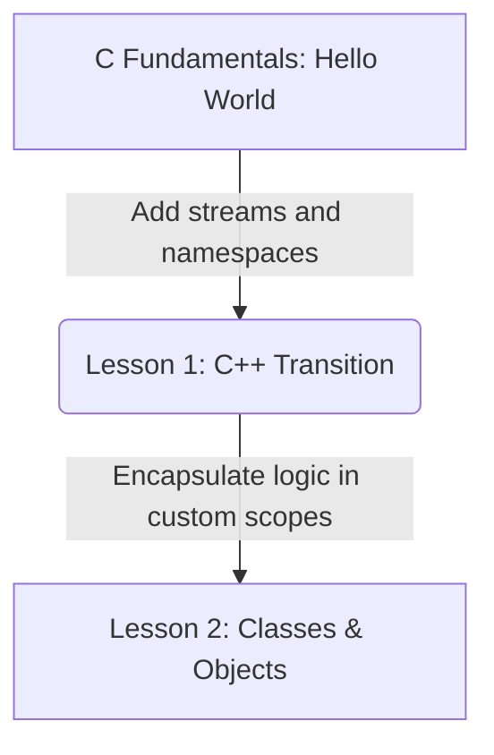

# Lesson 1: Transitioning to C++ — Namespaces and I/O Stream Buffers

---

```yaml
lesson_id: "CPP-OOP-001"
subject: "C++"
course: "C++ Object-Oriented Programming"
module: "Transitioning from C"
difficulty: "⭐⭐"
time_breakdown:
  reading: "12 min"
  exercise: "15 min"
  quiz: "5 min"
  revision: "5 min"
version: "1.0"
last_updated: "2026-07-17"
status: "Published"
author: "Rajasekar"
reviewed_by: "Admin"
prerequisites:
  - "C-FND-001 (Introduction to C)"
tags:
  - "C++ Basics"
  - "Namespaces"
  - "Streams"
  - "OOP Intro"
```

---

## 1. Overview [id: overview]
This lesson bridges C and C++. We introduce namespaces for scope isolation, explore C++ input/output streams (`cin`, `cout`), and analyze buffer behaviors.

## 2. Knowledge Connections [id: connections]


## 3. Learning Outcomes [id: outcomes]
- **Knowledge (What you will understand)**:
  - How C++ namespaces prevent name collisions in enterprise apps.
  - The stream-based I/O model vs. C's functional `printf`/`scanf` approach.
- **Skills (What you can do)**:
  - Declare scopes, use standard stream extractors/inserters, and manipulate buffers.
- **Outcome (Professional application)**:
  - Build clean, safe C++ codebases using modern structured console wrappers.

## 4. Concept & Internals Deep-Dive [id: concept]
Unlike C's procedural focus, C++ introduces powerful object-oriented abstractions. Let's analyze the core differences in scope control and stream-based console interactions.

### Namespaces: Preventing Scope Pollution
In large systems, two library providers might declare functions with the same name. C++ solves this using **namespaces**:
```cpp
namespace Audio {
    void init() { /* initialize sound cards */ }
}
namespace Video {
    void init() { /* initialize display frames */ }
}
```

### I/O Streams: Cin and Cout
C uses functional arguments (`printf`, `scanf`). C++ uses **streams** representing continuous sequences of characters:
- **`std::cout`**: Standard output stream (connected to console buffer).
- **`std::cin`**: Standard input stream.
- **`<<`**: Stream insertion operator (sends data to output).
- **`>>`**: Stream extraction operator (retrieves data from input).

```cpp
#include <iostream> // Load stream library

int main() {
    int age;
    std::cout << "Enter your age: "; // Send prompt to stdout buffer
    std::cin >> age;                 // Extract input from stdin buffer
    std::cout << "You are " << age << " years old." << std::endl;
    return 0;
}
```

## 5. Professional Box: Industry Usage [id: industry_usage]
> [!NOTE]
> **Stream Speeds in High-Frequency Trading (HFT)**:
> In latency-sensitive C++ applications, default streams are synchronized with C's standard buffers (`stdio`), slowing execution. Engineers speed up operations by executing: `std::ios_base::sync_with_stdio(false); std::cin.tie(NULL);` at startup to disconnect buffers and achieve raw file-writing speeds.

## 6. Visual Learning & Architecture [id: visuals]
Here is the console simulation running a streams program:

```text
┌────────────────────────────────────────────────────────┐
│                        CONSOLE                         │
├────────────────────────────────────────────────────────┤
│ $ g++ streams.cpp -o streams                           │
│ $ ./streams                                            │
│ Enter your age: 29                                     │
│ You are 29 years old.                                  │
│                                                        │
│ Process exited with status code 0                      │
└────────────────────────────────────────────────────────┘
```

## 7. Terminology [id: terminology]
- **Stream Inserter (`<<`)**: Operator directing data variables to stream buffer.
- **Namespace**: Scope block containing variables and functions under a unique name.
- **std**: Standard C++ library namespace where core functions (cout, cin, vector) reside.

## 8. Installation & Configuration [id: setup]
To compile C++ files locally, install the GCC C++ compiler tool (`g++`):
```bash
g++ --version
```

## 9. Commands & Command Syntax [id: commands]
```bash
g++ <source.cpp> -o <binary_name>
```

## 10. Practical Code Examples [id: examples]

### Easy
Hello World C++ stream:
```cpp
#include <iostream>
int main() {
    std::cout << "Welcome to C++!" << std::endl;
    return 0;
}
```

### Medium
Using the `using namespace std;` shorthand helper:
```cpp
#include <iostream>
using namespace std; // Avoid typing std:: before every stream call

int main() {
    cout << "This uses standard namespace shortcuts." << endl;
    return 0;
}
```

### Advanced
Creating and using custom nested namespaces:
```cpp
#include <iostream>

namespace Company {
    namespace Software {
        void printDetails() {
            std::cout << "BB Solutions Core System Engine v1.0" << std::endl;
        }
    }
}

int main() {
    Company::Software::printDetails(); // Access nested scopes
    return 0;
}
```

## 11. Common Errors & Troubleshooting [id: errors]

### Beginner Errors
- **Error**: `'cout' was not declared in this scope`
  - *Fix*: You forgot standard scope prefix `std::` or forgot to declare `using namespace std;` at the top of the file.

### Intermediate Errors
- **Error**: Stream extraction `cin >> variable` fails or hangs.
  - *Fix*: The user typed letters into an integer variable, corrupting stream state flags. Clear flags: `std::cin.clear(); std::cin.ignore(1000, '\n');`.

### Professional Errors
- **Error**: Slow performance when compiling with high-throughput streams.
  - *Fix*: Stop using `std::endl` which forces buffer flushes, and use `'\n'` character instead.

## 12. Comparison Tables [id: comparisons]
| Parameter | C (`printf`/`scanf`) | C++ (`cout`/`cin`) |
|---|---|---|
| Type Safety | No (relies on correct format specifiers) | Yes (variables detected automatically) |
| Speed | Fast by default | Fast (if standard buffer sync is disabled) |
| Syntax Style | Functional args | Operators stream chaining |

## 13. Best Practices & Professional Tips [id: best_practices]
- **Avoid global `using namespace std;` in header files**: Declaring standard namespaces in shared header files leads to naming conflicts across large codebases. Specify names explicitly: `std::string` inside headers.
- Prefer `'\n'` over `std::endl` for high-performance output printing.

## 14. Interview Preparation [id: interview]

### Fresher Questions
1. **Question**: What is a namespace in C++?
   * **Ideal Answer**: A namespace is a declarative region that provides a scope to the identifiers (names of types, functions, variables, etc.) inside it, preventing name conflicts in large projects.

### 2 Years Experience Questions
2. **Question**: Why does C++ use `std::` before `cout`?
   * **Ideal Answer**: `cout` is defined inside the standard library namespace. Prefixing it with `std::` specifies that we are using the `cout` instance located within that namespace.

### 5 Years Experience Questions
3. **Question**: How does `std::endl` differ from the newline character `'\n'`?
   * **Ideal Answer**: `'\n'` simply writes a newline character to the output stream. `std::endl` writes the newline character *and* forces the output buffer to flush immediately to the physical terminal, which is resource-heavy.

### Architect Level Questions
4. **Question**: Explain why disconnecting C++ stream sync with `std::ios_base::sync_with_stdio(false)` increases I/O throughput.
   * **Ideal Answer**: By default, C++ standard streams sync their buffers with C's stdio stream buffers to allow intermixing of print methods safely. Disabling this sync allows C++ streams to manage their own buffers independently, removing coordination overhead and significantly increasing write speeds.

## 15. Ingestion Exercises [id: exercises]

### MCQ
- Which operator inserts data into the standard output stream?
  - A) `>>`
  - B) `<<` (Correct)
  - C) `<<=`

### Coding Challenge
- Write a program reading a name and printing "Hello [Name]" using C++ streams.

### Predict the Output
- What does this print?
  ```cpp
  std::cout << 5 + 5 << " is ten";
  ```
  - Output: `10 is ten`

### Debugging Task
- Fix the error:
  ```cpp
  #include <iostream>
  int main() {
      cin >> age;
  }
  ```
  - Answer: Include variable definition, std prefixes, and stream direction check.
    ```cpp
    #include <iostream>
    int main() {
        int age;
        std::cin >> age;
        return 0;
    }
    ```

### Scenario Question
- A developer wants to read a full sentence containing spaces from terminal input. Should they use `cin >> text`?
  - Answer: No, because `cin >>` stops reading at space characters. They should use `std::getline(std::cin, text)`.

### Hands-on Lab
- Write and run a program outputting "BB Solutions" inside a namespace named `BB`.

## 16. Graded Assignments [id: assignments]
Create a C++ program with two namespaces: `Client` and `Server`. Write a function `printStatus()` in both namespaces, call both from `main()`, compile, and capture the executable outputs.

## 17. Mini Projects [id: projects]
- **Mini Scale**: Script compiling standard stream testing templates.
- **Small Scale**: Stream-based simple math calculation tool.

## 18. Topic Cheat Sheet [id: cheatsheet]
- **Standard Syntax**: `std::cout << "message" << std::endl;`
- **Aliases**: None.
- **Shortcut**: None.
- **Warning**: Do not declare global namespaces inside header files.

## 19. AI Generated Content [id: ai_notes]
- **AI Summary**: Learn the streams model, read input and write output, and isolate code blocks using namespaces.
- **AI Flashcards**:
  - Q: How do you read a full string line containing spaces?
  - A: `std::getline(std::cin, string_var)`.

## 20. References [id: references]
- [C++ Standard Streams Documentation](https://en.cppreference.com/w/cpp/io/cout)
