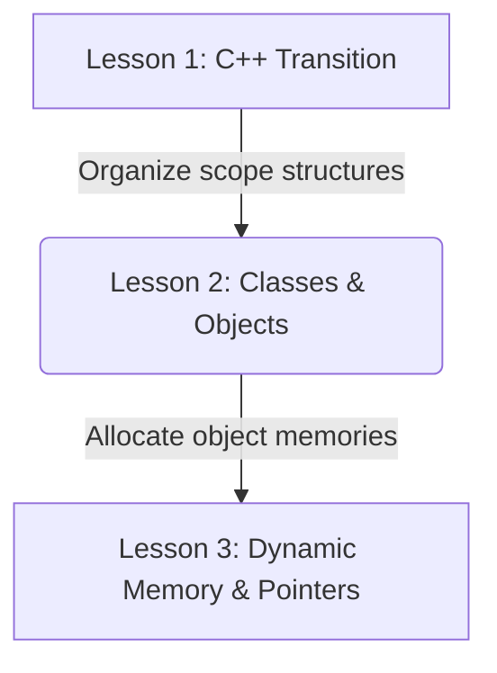

# Lesson 2: Classes, Objects, and Constructors — Constructor Overloading

---

```yaml
lesson_id: "CPP-OOP-002"
subject: "C++"
course: "C++ Object-Oriented Programming"
module: "Object Oriented Basics"
difficulty: "⭐⭐"
time_breakdown:
  reading: "15 min"
  exercise: "20 min"
  quiz: "10 min"
  revision: "5 min"
version: "1.0"
last_updated: "2026-07-17"
status: "Published"
author: "Rajasekar"
reviewed_by: "Admin"
prerequisites:
  - "CPP-OOP-001 (Transitioning to C++)"
tags:
  - "Classes"
  - "Objects"
  - "Constructors"
  - "OOP"
```

---

## 1. Overview [id: overview]
This lesson explores the core of Object-Oriented Programming in C++. You will learn how to declare class blueprints, instantiate objects in memory, and implement multiple constructor variations using constructor overloading.

## 2. Knowledge Connections [id: connections]


## 3. Learning Outcomes [id: outcomes]
- **Knowledge (What you will understand)**:
  - The logical difference between a class (blueprint) and an object (instance).
  - The execution stages of Default, Parameterized, and Copy Constructors.
- **Skills (What you can do)**:
  - Define custom classes, instantiate objects, overload constructors, and configure initializer lists.
- **Outcome (Professional application)**:
  - Build maintainable object models for custom data types and business entities.

## 4. Concept & Internals Deep-Dive [id: concept]
A **Class** is a user-defined data type that acts as a blueprint containing attributes (member variables) and methods (member functions). An **Object** is a physical instance of a class allocated in memory.

### Constructors
A constructor is a special member function that runs automatically when an object is instantiated.
- It has the exact same name as the class.
- It does not have a return type (not even `void`).
- **Constructor Overloading**: You can define multiple constructors with different argument profiles to instantiate objects under different initial conditions.

```cpp
#include <iostream>
#include <string>

class Student {
public:
    std::string name;
    int rollNumber;

    // 1. Default Constructor
    Student() {
        name = "Unknown";
        rollNumber = 0;
        std::cout << "Default Constructor called" << std::endl;
    }

    // 2. Parameterized Constructor
    Student(std::string n, int r) : name(n), rollNumber(r) { // Initializer list syntax
        std::cout << "Parameterized Constructor called" << std::endl;
    }
};
```

### Initializer List Syntax
Prefer initializing variables using the syntax: `Constructor(...) : var1(val1), var2(val2) {}`. This assigns values directly when memory is allocated, avoiding double-initialization overhead.

## 5. Professional Box: Industry Usage [id: industry_usage]
> [!NOTE]
> **Game Engines Development at Epic Games**:
> Epic's Unreal Engine utilizes overloaded constructors extensively. Game actors (like player characters) can be spawned with default settings (for level editors) or loaded from network stream parameters (for active multiplayer game states). Initializer lists prevent actor load lag.

## 6. Visual Learning & Architecture [id: visuals]
Here is the console output showing constructor execution sequences:

```text
┌────────────────────────────────────────────────────────┐
│                        CONSOLE                         │
├────────────────────────────────────────────────────────┤
│ $ g++ school.cpp -o school                             │
│ $ ./school                                             │
│ Instantiating student A...                             │
│ Default Constructor called                             │
│                                                        │
│ Instantiating student B...                             │
│ Parameterized Constructor called                       │
└────────────────────────────────────────────────────────┘
```

## 7. Terminology [id: terminology]
- **Default Constructor**: A constructor requiring no arguments, called automatically.
- **Parameterized Constructor**: A constructor accepting arguments to initialize fields.
- **Member Initializer List**: Suffix list syntax setting class fields at birth.

## 8. Installation & Configuration [id: setup]
Verify compiler capabilities to support modern C++11 initializer standards:
```bash
g++ -std=c++11 main.cpp -o main
```

## 9. Commands & Command Syntax [id: commands]
```cpp
ClassName objectName;                // Calls Default Constructor
ClassName objectName(arg1, arg2);    // Calls Parameterized Constructor
```

## 10. Practical Code Examples [id: examples]

### Easy
Basic Class and Object instantiation:
```cpp
#include <iostream>

class Box {
public:
    double length;
};

int main() {
    Box b; // Instantiate object
    b.length = 12.5;
    std::cout << "Box length: " << b.length << std::endl;
    return 0;
}
```

### Medium
Constructor Overloading in action:
```cpp
#include <iostream>

class Counter {
public:
    int count;

    Counter() : count(0) {} // Default constructor
    Counter(int start) : count(start) {} // Parameterized constructor
};

int main() {
    Counter c1;     // count is 0
    Counter c2(10); // count is 10
    std::cout << "C1: " << c1.count << ", C2: " << c2.count << std::endl;
    return 0;
}
```

### Advanced
Copy Constructor implementation preventing shallow copy problems:
```cpp
#include <iostream>

class Image {
private:
    int* data;
public:
    Image(int val) {
        data = new int(val);
    }
    // Copy Constructor - allocates new dynamic memory (Deep Copy)
    Image(const Image& other) {
        data = new int(*other.data);
        std::cout << "Copy Constructor executed" << std::endl;
    }
    ~Image() {
        delete data; // Destructor clearing memory
    }
    void print() { std::cout << "Value: " << *data << std::endl; }
};

int main() {
    Image img1(42);
    Image img2 = img1; // Triggers Copy Constructor
    img2.print();
    return 0;
}
```

## 11. Common Errors & Troubleshooting [id: errors]

### Beginner Errors
- **Error**: `error: no matching function for call to 'Student::Student()'`
  - *Fix*: You declared a parameterized constructor, which causes C++ to disable the automatic default constructor. You must explicitly write a default constructor `Student() {}` to resolve this error.

### Intermediate Errors
- **Error**: `error: class has private constructors`
  - *Fix*: Constructors must be placed under the `public:` access specifier to allow instantiation from external functions like `main()`.

### Professional Errors
- **Error**: Shallow copy double-free crash errors.
  - *Fix*: If your class manages dynamic raw pointers, implement a custom Copy Constructor and Copy Assignment Operator to allocate unique memory blocks for each copy.

## 12. Comparison Tables [id: comparisons]
| Parameter | Default Constructor | Parameterized Constructor | Copy Constructor |
|---|---|---|---|
| Arguments | None | One or more | Ref to same class (`const ClassName&`) |
| Call trigger | `Class obj;` | `Class obj(10);` | `Class obj2 = obj1;` |
| Primary use | Zero-initialize attributes | Load custom values at birth | Duplicate existing objects |

## 13. Best Practices & Professional Tips [id: best_practices]
- **Always use Initializer Lists**: They avoid unnecessary variable constructor calls, optimizing initialization execution speed.
- If your class handles dynamic raw pointers, follow the **Rule of Three**: implement a Destructor, Copy Constructor, and Copy Assignment Operator.

## 14. Interview Preparation [id: interview]

### Fresher Questions
1. **Question**: What is a constructor in C++?
   * **Ideal Answer**: A constructor is a special member function of a class that is automatically called when an object of that class is created. It initializes member variables and has no return type.

### 2 Years Experience Questions
2. **Question**: What is constructor overloading?
   * **Ideal Answer**: It is the practice of defining multiple constructors in a class with different parameter signatures. This allows objects to be initialized in different ways depending on the arguments passed.

### 5 Years Experience Questions
3. **Question**: Why are initializer lists preferred over body assignments?
   * **Ideal Answer**: Member variables initialized in the constructor body are first default-constructed and then copy-assigned. Using initializer lists calls the copy constructor directly, initializing fields in a single step and avoiding assignment overhead.

### Architect Level Questions
4. **Question**: Describe what a Copy Constructor is, and how to write one that avoids shallow copy double-free issues.
   * **Ideal Answer**: A copy constructor initializes an object using another object of the same class. If the class manages raw pointers to dynamic memory (on the heap), a default copy constructor copies only the pointer address (shallow copy), leading to both objects pointing to the same memory and causing double-free crashes during destruction. A custom copy constructor must allocate a new memory block and copy the actual data (deep copy): `ClassName(const ClassName& other) { ptr = new Type(*other.ptr); }`.

## 15. Ingestion Exercises [id: exercises]

### MCQ
- Which constructor is called by `User u1 = u2;`?
  - A) Default
  - B) Parameterized
  - C) Copy (Correct)

### Coding Challenge
- Write a class `Product` containing a parameterized constructor initializing `price` and `id`.

### Predict the Output
- What is printed if a constructor has no public/private specifiers declared in class?
  - Output: Compilation fails (default class access is private).

### Debugging Task
- Resolve the compiler error:
  ```cpp
  class Point {
      int x;
      Point(int val) : x(val) {}
  };
  int main() { Point p(5); }
  ```
  - Answer: Add `public:` above constructor definition.

### Scenario Question
- A developer wants to restrict object instantiation to static factory methods. How should they declare the constructor?
  - Answer: Put the constructor under the `private:` section.

### Hands-on Lab
- Build a class tracking counter variables, overload the constructors, and print count values.

## 16. Graded Assignments [id: assignments]
Write a class `Vector2D` representing x and y coords. Implement default, parameterized, and copy constructors. Print messages in each constructor, instantiate all three cases, and capture the console log.

## 17. Mini Projects [id: projects]
- **Mini Scale**: Class model calculating geometry surfaces.
- **Small Scale**: Object-oriented bank account ledger tracker.

## 18. Topic Cheat Sheet [id: cheatsheet]
- **Standard Syntax**: `ClassName() : member(val) {}`
- **Aliases**: None.
- **Shortcut**: None.
- **Warning**: Do not define circular constructor dependencies.

## 19. AI Generated Content [id: ai_notes]
- **AI Summary**: Learn class design, object instantiations, constructor profiles, and copy safety.
- **AI Flashcards**:
  - Q: Does a constructor return any values?
  - A: No, not even void.

## 20. References [id: references]
- [C++ Constructors and Member Initializers](https://en.cppreference.com/w/cpp/language/initializer_list)
